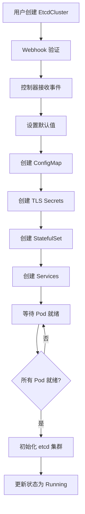

# ETCD Operator 技术规范文档

## 📋 文档概述

本文档定义了 ETCD Kubernetes Operator 的技术实现规范，包括 API 设计、控制器逻辑、业务流程和技术约束。

## 🔧 API 设计规范

### EtcdCluster CRD

#### 核心字段结构
```go
type EtcdClusterSpec struct {
    // 基础配置
    Size        int32  `json:"size,omitempty"`        // 集群大小 (1,3,5,7,9)
    Version     string `json:"version,omitempty"`     // etcd 版本
    Repository  string `json:"repository,omitempty"`  // 镜像仓库
    
    // 存储配置
    Storage     EtcdStorageSpec   `json:"storage,omitempty"`
    
    // 安全配置
    Security    EtcdSecuritySpec  `json:"security,omitempty"`
    
    // 资源配置
    Resources   EtcdResourceSpec  `json:"resources,omitempty"`
}

type EtcdClusterStatus struct {
    Phase           EtcdClusterPhase    `json:"phase,omitempty"`
    Conditions      []metav1.Condition  `json:"conditions,omitempty"`
    Members         []EtcdMember        `json:"members,omitempty"`
    ReadyReplicas   int32               `json:"readyReplicas,omitempty"`
    LeaderID        string              `json:"leaderID,omitempty"`
    ClientEndpoints []string            `json:"clientEndpoints,omitempty"`
}
```

#### 验证规则
```go
// +kubebuilder:validation:Minimum=1
// +kubebuilder:validation:Maximum=9
// +kubebuilder:validation:Enum=1;3;5;7;9
Size int32 `json:"size,omitempty"`

// +kubebuilder:validation:Pattern=^3\.[0-9]+\.[0-9]+$
Version string `json:"version,omitempty"`
```

#### 状态机定义
```
Creating → Running → Scaling → Running
    ↓         ↓         ↓         ↓
  Failed ←  Failed ←  Failed ←  Failed
    ↓
  Recovering → Running
```

### EtcdBackup CRD

#### 核心字段结构
```go
type EtcdBackupSpec struct {
    ClusterName     string                  `json:"clusterName"`
    StorageType     EtcdBackupStorageType   `json:"storageType"`
    Schedule        string                  `json:"schedule,omitempty"`
    S3              *EtcdS3BackupSpec       `json:"s3,omitempty"`
    RetentionPolicy EtcdRetentionPolicy     `json:"retentionPolicy,omitempty"`
    Compression     bool                    `json:"compression,omitempty"`
}
```

#### 支持的存储类型
- **S3**: AWS S3 和兼容存储
- **GCS**: Google Cloud Storage (预留)
- **Local**: 本地存储 (预留)

### EtcdRestore CRD

#### 核心字段结构
```go
type EtcdRestoreSpec struct {
    BackupName      string           `json:"backupName"`
    ClusterName     string           `json:"clusterName"`
    RestoreType     EtcdRestoreType  `json:"restoreType,omitempty"`
    ClusterTemplate *EtcdClusterSpec `json:"clusterTemplate,omitempty"`
}
```

#### 恢复类型
- **Replace**: 替换现有集群数据
- **New**: 从备份创建新集群

## 🎛️ 控制器设计规范

### EtcdCluster 控制器架构

#### Reconcile 循环设计
```go
func (r *EtcdClusterReconciler) Reconcile(ctx context.Context, req ctrl.Request) (ctrl.Result, error) {
    // 1. 获取 EtcdCluster 实例
    // 2. 检查删除标记，处理清理逻辑
    // 3. 确保 Finalizer 存在
    // 4. 状态机处理
    // 5. 更新状态和事件
    // 6. 返回重新调度间隔
}
```

#### 状态处理函数
```go
// 状态处理函数映射
switch cluster.Status.Phase {
case "":
    return r.handleInitialization(ctx, cluster)
case EtcdClusterPhaseCreating:
    return r.handleCreating(ctx, cluster)
case EtcdClusterPhaseRunning:
    return r.handleRunning(ctx, cluster)
case EtcdClusterPhaseScaling:
    return r.handleScaling(ctx, cluster)
case EtcdClusterPhaseFailed:
    return r.handleFailed(ctx, cluster)
}
```

#### 资源管理策略
```go
func (r *EtcdClusterReconciler) ensureResources(ctx context.Context, cluster *EtcdCluster) error {
    // 1. 确保 ConfigMap (etcd 配置)
    // 2. 确保 TLS Secrets (如果启用)
    // 3. 确保 StatefulSet (etcd 实例)
    // 4. 确保 Services (客户端和对等服务)
    // 5. 确保 PodDisruptionBudget (高可用保证)
}
```

### 扩缩容逻辑设计

#### 扩容流程
1. **更新 StatefulSet 副本数**
2. **等待新 Pod 就绪**
3. **将新成员添加到 etcd 集群**
4. **验证集群健康状态**
5. **更新集群状态**

#### 缩容流程
1. **从 etcd 集群移除成员**
2. **更新 StatefulSet 副本数**
3. **清理孤立的 PVC (可选)**
4. **验证集群健康状态**
5. **更新集群状态**

## 🔄 业务流程设计

### 集群生命周期管理

#### 集群创建流程


#### 集群删除流程
```mermaid
graph TD
    A[用户删除 EtcdCluster] --> B[设置删除时间戳]
    B --> C[控制器处理删除]
    C --> D[创建最终备份]
    D --> E[停止 etcd 集群]
    E --> F[删除 StatefulSet]
    F --> G[删除 Services]
    G --> H[删除 ConfigMap]
    H --> I[删除 TLS Secrets]
    I --> J[清理 PVC (可选)]
    J --> K[移除 Finalizer]
    K --> L[删除完成]
```

### 备份恢复工作流程

#### 自动备份流程
```mermaid
graph TD
    A[CronJob 触发] --> B[创建 EtcdBackup]
    B --> C[备份控制器处理]
    C --> D[连接到 etcd 集群]
    D --> E[创建数据快照]
    E --> F[压缩快照 (可选)]
    F --> G[加密快照 (可选)]
    G --> H[上传到存储后端]
    H --> I[更新备份状态]
    I --> J[清理过期备份]
```

## 🔒 安全性规范

### TLS 配置
```go
type TLSConfig struct {
    // 客户端 TLS
    ClientCertFile string
    ClientKeyFile  string
    ClientCAFile   string
    
    // 对等 TLS
    PeerCertFile   string
    PeerKeyFile    string
    PeerCAFile     string
    
    // 证书自动轮换
    AutoRotate     bool
    RotationPeriod time.Duration
}
```

### RBAC 权限
```yaml
rules:
- apiGroups: [""]
  resources: ["pods", "services", "configmaps", "secrets", "persistentvolumeclaims"]
  verbs: ["get", "list", "watch", "create", "update", "patch", "delete"]
- apiGroups: ["apps"]
  resources: ["statefulsets"]
  verbs: ["get", "list", "watch", "create", "update", "patch", "delete"]
- apiGroups: ["etcd.etcd.io"]
  resources: ["etcdclusters", "etcdbackups", "etcdrestores"]
  verbs: ["get", "list", "watch", "create", "update", "patch", "delete"]
```

## ⚡ 性能规范

### 资源配置
```go
// 默认资源配置
DefaultResources := corev1.ResourceRequirements{
    Requests: corev1.ResourceList{
        corev1.ResourceCPU:    resource.MustParse("100m"),
        corev1.ResourceMemory: resource.MustParse("128Mi"),
    },
    Limits: corev1.ResourceList{
        corev1.ResourceCPU:    resource.MustParse("1000m"),
        corev1.ResourceMemory: resource.MustParse("1Gi"),
    },
}
```

### 性能监控指标
- **延迟指标**: 读写延迟、网络延迟
- **吞吐量指标**: QPS、带宽使用
- **存储指标**: 磁盘使用率、I/O 性能
- **集群指标**: 成员健康、leader 选举

## 🛠️ 故障处理规范

### 故障检测机制
```go
type HealthChecker struct {
    client     clientv3.Client
    timeout    time.Duration
    interval   time.Duration
}

func (h *HealthChecker) CheckClusterHealth(ctx context.Context, endpoints []string) (*HealthStatus, error) {
    // 1. 连接检查
    // 2. 健康检查
    // 3. 成员状态检查
    // 4. 数据一致性检查
}
```

### 自动恢复策略
```go
type RecoveryStrategy struct {
    MaxRetries      int           // 最大重试次数
    RetryInterval   time.Duration // 重试间隔
    BackoffFactor   float64       // 退避因子
    MaxBackoff      time.Duration // 最大退避时间
}
```

## 📊 监控集成

### Prometheus 指标
```go
var (
    clusterSizeGauge = prometheus.NewGaugeVec(
        prometheus.GaugeOpts{
            Name: "etcd_cluster_size",
            Help: "Size of the etcd cluster",
        },
        []string{"cluster", "namespace"},
    )
    
    clusterHealthGauge = prometheus.NewGaugeVec(
        prometheus.GaugeOpts{
            Name: "etcd_cluster_health",
            Help: "Health status of the etcd cluster",
        },
        []string{"cluster", "namespace"},
    )
)
```

### 告警规则
```yaml
groups:
- name: etcd-cluster
  rules:
  - alert: EtcdClusterDown
    expr: etcd_cluster_health == 0
    for: 5m
    labels:
      severity: critical
    annotations:
      summary: "Etcd cluster is down"
```

## 🧪 测试规范

### 测试层次
1. **单元测试**: 覆盖率 > 80%
2. **集成测试**: 组件间交互测试
3. **端到端测试**: 完整场景测试
4. **性能测试**: 压力测试和基准测试

### 测试环境
- **Kind**: 本地开发测试
- **CI/CD**: 自动化测试流水线
- **Staging**: 预生产环境测试

---

**文档版本**: v1.0 | **最后更新**: 2025-07-21
