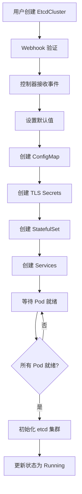
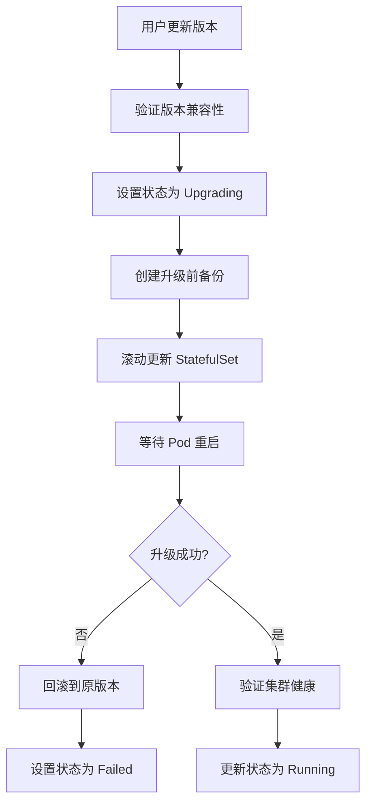

# ETCD Operator 功能规范文档

## 文档概述

本文档详细定义了 ETCD Kubernetes Operator 的功能规范，包括 API 设计、控制器逻辑、业务流程和技术实现细节。

## 1. API 设计规范

### 1.1 EtcdCluster CRD 设计

#### 1.1.1 完整的 API 结构

```go
type EtcdClusterSpec struct {
    // 集群基础配置
    Size        int32  `json:"size,omitempty"`                    // 集群节点数量 (1,3,5,7)
    Version     string `json:"version,omitempty"`                 // etcd 版本
    Repository  string `json:"repository,omitempty"`              // 镜像仓库
    
    // 存储配置
    Storage     EtcdStorageSpec     `json:"storage,omitempty"`     // 存储配置
    
    // 安全配置
    Security    EtcdSecuritySpec    `json:"security,omitempty"`    // 安全配置
    
    // 网络配置
    Network     EtcdNetworkSpec     `json:"network,omitempty"`     // 网络配置
    
    // 备份配置
    Backup      EtcdBackupSpec      `json:"backup,omitempty"`      // 备份配置
    
    // 监控配置
    Monitoring  EtcdMonitoringSpec  `json:"monitoring,omitempty"`  // 监控配置
    
    // 资源配置
    Resources   EtcdResourceSpec    `json:"resources,omitempty"`   // 资源限制
    
    // 高级配置
    Advanced    EtcdAdvancedSpec    `json:"advanced,omitempty"`    // 高级配置
}

type EtcdClusterStatus struct {
    // 集群状态
    Phase           EtcdClusterPhase    `json:"phase,omitempty"`           // 集群阶段
    Conditions      []metav1.Condition  `json:"conditions,omitempty"`      // 状态条件
    
    // 成员信息
    Members         []EtcdMember        `json:"members,omitempty"`         // 成员列表
    ReadyReplicas   int32               `json:"readyReplicas,omitempty"`   // 就绪副本数
    
    // 集群信息
    LeaderID        string              `json:"leaderID,omitempty"`        // Leader ID
    ClusterID       string              `json:"clusterID,omitempty"`       // 集群 ID
    
    // 服务端点
    ClientEndpoints []string            `json:"clientEndpoints,omitempty"` // 客户端端点
    
    // 状态统计
    LastBackupTime  *metav1.Time        `json:"lastBackupTime,omitempty"`  // 最后备份时间
    LastUpdateTime  *metav1.Time        `json:"lastUpdateTime,omitempty"`  // 最后更新时间
    
    // 观察到的版本
    ObservedGeneration int64            `json:"observedGeneration,omitempty"` // 观察到的代数
}
```

#### 1.1.2 详细字段定义

```go
// 存储配置
type EtcdStorageSpec struct {
    StorageClassName *string             `json:"storageClassName,omitempty"` // 存储类名
    Size             resource.Quantity   `json:"size,omitempty"`             // 存储大小
    VolumeClaimTemplate *corev1.PersistentVolumeClaimTemplate `json:"volumeClaimTemplate,omitempty"` // PVC 模板
}

// 安全配置
type EtcdSecuritySpec struct {
    TLS         EtcdTLSSpec         `json:"tls,omitempty"`         // TLS 配置
    Auth        EtcdAuthSpec        `json:"auth,omitempty"`        // 认证配置
    RBAC        EtcdRBACSpec        `json:"rbac,omitempty"`        // RBAC 配置
}

type EtcdTLSSpec struct {
    Enabled             bool   `json:"enabled,omitempty"`             // 启用 TLS
    ClientTLSEnabled    bool   `json:"clientTLSEnabled,omitempty"`    // 客户端 TLS
    PeerTLSEnabled      bool   `json:"peerTLSEnabled,omitempty"`      // 对等 TLS
    CertificateSecret   string `json:"certificateSecret,omitempty"`   // 证书 Secret
    CASecret            string `json:"caSecret,omitempty"`            // CA Secret
    AutoTLS             bool   `json:"autoTLS,omitempty"`             // 自动 TLS
}

// 网络配置
type EtcdNetworkSpec struct {
    ClientPort      int32                   `json:"clientPort,omitempty"`      // 客户端端口
    PeerPort        int32                   `json:"peerPort,omitempty"`        // 对等端口
    ServiceType     corev1.ServiceType      `json:"serviceType,omitempty"`     // 服务类型
    LoadBalancer    EtcdLoadBalancerSpec    `json:"loadBalancer,omitempty"`    // 负载均衡
    NetworkPolicy   EtcdNetworkPolicySpec   `json:"networkPolicy,omitempty"`   // 网络策略
}

// 资源配置
type EtcdResourceSpec struct {
    Requests    corev1.ResourceList `json:"requests,omitempty"`    // 资源请求
    Limits      corev1.ResourceList `json:"limits,omitempty"`      // 资源限制
}

// 高级配置
type EtcdAdvancedSpec struct {
    PodTemplate         EtcdPodTemplateSpec     `json:"podTemplate,omitempty"`         // Pod 模板
    ServiceAccount      string                  `json:"serviceAccount,omitempty"`      // 服务账户
    NodeSelector        map[string]string       `json:"nodeSelector,omitempty"`        // 节点选择器
    Tolerations         []corev1.Toleration     `json:"tolerations,omitempty"`         // 容忍度
    Affinity            *corev1.Affinity        `json:"affinity,omitempty"`            // 亲和性
    PriorityClassName   string                  `json:"priorityClassName,omitempty"`   // 优先级类
    
    // etcd 特定配置
    EtcdConfig          map[string]string       `json:"etcdConfig,omitempty"`          // etcd 配置
    InitialClusterState string                  `json:"initialClusterState,omitempty"` // 初始集群状态
    DataDir             string                  `json:"dataDir,omitempty"`             // 数据目录
}
```

#### 1.1.3 状态定义

```go
type EtcdClusterPhase string

const (
    EtcdClusterPhaseCreating    EtcdClusterPhase = "Creating"    // 创建中
    EtcdClusterPhaseRunning     EtcdClusterPhase = "Running"     // 运行中
    EtcdClusterPhaseScaling     EtcdClusterPhase = "Scaling"     // 扩缩容中
    EtcdClusterPhaseUpgrading   EtcdClusterPhase = "Upgrading"   // 升级中
    EtcdClusterPhaseFailed      EtcdClusterPhase = "Failed"      // 失败
    EtcdClusterPhaseDeleting    EtcdClusterPhase = "Deleting"    // 删除中
)

type EtcdMember struct {
    Name        string  `json:"name,omitempty"`        // 成员名称
    ID          string  `json:"id,omitempty"`          // 成员 ID
    PeerURL     string  `json:"peerURL,omitempty"`     // 对等 URL
    ClientURL   string  `json:"clientURL,omitempty"`   // 客户端 URL
    Ready       bool    `json:"ready,omitempty"`       // 就绪状态
    Role        string  `json:"role,omitempty"`        // 角色 (leader/follower)
}
```

### 1.2 EtcdBackup CRD 设计

```go
type EtcdBackupSpec struct {
    // 备份源
    ClusterName     string                  `json:"clusterName,omitempty"`     // 集群名称
    ClusterNamespace string                 `json:"clusterNamespace,omitempty"` // 集群命名空间
    
    // 备份配置
    StorageType     EtcdBackupStorageType   `json:"storageType,omitempty"`     // 存储类型
    Schedule        string                  `json:"schedule,omitempty"`        // 调度表达式
    
    // 存储后端配置
    S3              *EtcdS3BackupSpec       `json:"s3,omitempty"`              // S3 配置
    GCS             *EtcdGCSBackupSpec      `json:"gcs,omitempty"`             // GCS 配置
    Local           *EtcdLocalBackupSpec    `json:"local,omitempty"`           // 本地配置
    
    // 备份策略
    RetentionPolicy EtcdRetentionPolicy     `json:"retentionPolicy,omitempty"` // 保留策略
    Compression     bool                    `json:"compression,omitempty"`     // 压缩
    Encryption      EtcdEncryptionSpec      `json:"encryption,omitempty"`      // 加密
}

type EtcdBackupStatus struct {
    Phase           EtcdBackupPhase     `json:"phase,omitempty"`           // 备份阶段
    Conditions      []metav1.Condition  `json:"conditions,omitempty"`      // 状态条件
    
    BackupSize      int64               `json:"backupSize,omitempty"`      // 备份大小
    StartTime       *metav1.Time        `json:"startTime,omitempty"`       // 开始时间
    CompletionTime  *metav1.Time        `json:"completionTime,omitempty"`  // 完成时间
    
    StoragePath     string              `json:"storagePath,omitempty"`     // 存储路径
    EtcdVersion     string              `json:"etcdVersion,omitempty"`     // etcd 版本
    EtcdRevision    int64               `json:"etcdRevision,omitempty"`    // etcd 修订版本
}
```

### 1.3 EtcdRestore CRD 设计

```go
type EtcdRestoreSpec struct {
    // 恢复源
    BackupName      string                  `json:"backupName,omitempty"`      // 备份名称
    BackupNamespace string                  `json:"backupNamespace,omitempty"` // 备份命名空间
    
    // 目标集群
    ClusterName     string                  `json:"clusterName,omitempty"`     // 目标集群名称
    ClusterTemplate EtcdClusterSpec         `json:"clusterTemplate,omitempty"` // 集群模板
    
    // 恢复配置
    RestoreType     EtcdRestoreType         `json:"restoreType,omitempty"`     // 恢复类型
    DataDir         string                  `json:"dataDir,omitempty"`         // 数据目录
    
    // 高级选项
    SkipHashCheck   bool                    `json:"skipHashCheck,omitempty"`   // 跳过哈希检查
    WalDir          string                  `json:"walDir,omitempty"`          // WAL 目录
}

type EtcdRestoreStatus struct {
    Phase           EtcdRestorePhase    `json:"phase,omitempty"`           // 恢复阶段
    Conditions      []metav1.Condition  `json:"conditions,omitempty"`      // 状态条件
    
    StartTime       *metav1.Time        `json:"startTime,omitempty"`       // 开始时间
    CompletionTime  *metav1.Time        `json:"completionTime,omitempty"`  // 完成时间
    
    RestoredCluster string              `json:"restoredCluster,omitempty"` // 恢复的集群
    RestoredSize    int64               `json:"restoredSize,omitempty"`    // 恢复大小
}
```

## 2. 验证规则设计

### 2.1 EtcdCluster 验证规则

```go
// +kubebuilder:validation:Minimum=1
// +kubebuilder:validation:Maximum=9
// +kubebuilder:validation:Enum=1;3;5;7;9
Size int32 `json:"size,omitempty"`

// +kubebuilder:validation:Pattern=^3\.[0-9]+\.[0-9]+$
Version string `json:"version,omitempty"`

// +kubebuilder:validation:MinLength=1
// +kubebuilder:validation:MaxLength=253
Repository string `json:"repository,omitempty"`
```

### 2.2 Webhook 验证逻辑

```go
func (r *EtcdCluster) ValidateCreate() error {
    // 验证集群大小必须是奇数
    if r.Spec.Size%2 == 0 {
        return fmt.Errorf("cluster size must be odd number")
    }
    
    // 验证版本格式
    if !isValidEtcdVersion(r.Spec.Version) {
        return fmt.Errorf("invalid etcd version format")
    }
    
    // 验证存储配置
    if err := r.validateStorage(); err != nil {
        return err
    }
    
    return nil
}

func (r *EtcdCluster) ValidateUpdate(old runtime.Object) error {
    oldCluster := old.(*EtcdCluster)
    
    // 不允许缩小集群到小于 3 个节点
    if r.Spec.Size < 3 && oldCluster.Spec.Size >= 3 {
        return fmt.Errorf("cannot scale cluster below 3 members")
    }
    
    // 版本只能升级，不能降级
    if isVersionDowngrade(oldCluster.Spec.Version, r.Spec.Version) {
        return fmt.Errorf("version downgrade is not allowed")
    }
    
    return nil
}
```

## 3. 控制器设计规范

### 3.1 EtcdCluster 控制器架构

#### 3.1.1 Reconcile 循环设计

```go
func (r *EtcdClusterReconciler) Reconcile(ctx context.Context, req ctrl.Request) (ctrl.Result, error) {
    log := r.Log.WithValues("etcdcluster", req.NamespacedName)

    // 1. 获取 EtcdCluster 实例
    cluster := &etcdv1alpha1.EtcdCluster{}
    if err := r.Get(ctx, req.NamespacedName, cluster); err != nil {
        if errors.IsNotFound(err) {
            return ctrl.Result{}, nil
        }
        return ctrl.Result{}, err
    }

    // 2. 检查删除标记
    if cluster.DeletionTimestamp != nil {
        return r.handleDeletion(ctx, cluster)
    }

    // 3. 确保 Finalizer
    if !controllerutil.ContainsFinalizer(cluster, etcdFinalizer) {
        controllerutil.AddFinalizer(cluster, etcdFinalizer)
        return ctrl.Result{}, r.Update(ctx, cluster)
    }

    // 4. 状态机处理
    switch cluster.Status.Phase {
    case "":
        return r.handleInitialization(ctx, cluster)
    case etcdv1alpha1.EtcdClusterPhaseCreating:
        return r.handleCreating(ctx, cluster)
    case etcdv1alpha1.EtcdClusterPhaseRunning:
        return r.handleRunning(ctx, cluster)
    case etcdv1alpha1.EtcdClusterPhaseScaling:
        return r.handleScaling(ctx, cluster)
    case etcdv1alpha1.EtcdClusterPhaseUpgrading:
        return r.handleUpgrading(ctx, cluster)
    case etcdv1alpha1.EtcdClusterPhaseFailed:
        return r.handleFailed(ctx, cluster)
    default:
        return r.handleUnknown(ctx, cluster)
    }
}
```

#### 3.1.2 状态机转换逻辑

```go
// 状态转换图
// "" -> Creating -> Running -> (Scaling/Upgrading) -> Running
//                     ↓           ↓         ↓
//                   Failed <- Failed <- Failed
//                     ↓
//                  Running (自动恢复)

func (r *EtcdClusterReconciler) handleInitialization(ctx context.Context, cluster *etcdv1alpha1.EtcdCluster) (ctrl.Result, error) {
    // 验证规范
    if err := r.validateClusterSpec(cluster); err != nil {
        return r.updateStatusWithError(ctx, cluster, etcdv1alpha1.EtcdClusterPhaseFailed, err)
    }

    // 设置默认值
    r.setDefaults(cluster)

    // 转换到创建状态
    cluster.Status.Phase = etcdv1alpha1.EtcdClusterPhaseCreating
    cluster.Status.ObservedGeneration = cluster.Generation

    return ctrl.Result{}, r.Status().Update(ctx, cluster)
}

func (r *EtcdClusterReconciler) handleCreating(ctx context.Context, cluster *etcdv1alpha1.EtcdCluster) (ctrl.Result, error) {
    // 1. 创建必要的 Kubernetes 资源
    if err := r.ensureResources(ctx, cluster); err != nil {
        return r.updateStatusWithError(ctx, cluster, etcdv1alpha1.EtcdClusterPhaseFailed, err)
    }

    // 2. 检查 etcd 集群状态
    ready, err := r.checkClusterReady(ctx, cluster)
    if err != nil {
        return r.updateStatusWithError(ctx, cluster, etcdv1alpha1.EtcdClusterPhaseFailed, err)
    }

    if ready {
        // 转换到运行状态
        cluster.Status.Phase = etcdv1alpha1.EtcdClusterPhaseRunning
        r.updateClusterStatus(ctx, cluster)
        return ctrl.Result{}, r.Status().Update(ctx, cluster)
    }

    // 继续等待
    return ctrl.Result{RequeueAfter: time.Second * 30}, nil
}

func (r *EtcdClusterReconciler) handleRunning(ctx context.Context, cluster *etcdv1alpha1.EtcdCluster) (ctrl.Result, error) {
    // 1. 检查是否需要扩缩容
    if r.needsScaling(cluster) {
        cluster.Status.Phase = etcdv1alpha1.EtcdClusterPhaseScaling
        return ctrl.Result{}, r.Status().Update(ctx, cluster)
    }

    // 2. 检查是否需要升级
    if r.needsUpgrade(cluster) {
        cluster.Status.Phase = etcdv1alpha1.EtcdClusterPhaseUpgrading
        return ctrl.Result{}, r.Status().Update(ctx, cluster)
    }

    // 3. 健康检查
    if err := r.performHealthCheck(ctx, cluster); err != nil {
        return r.updateStatusWithError(ctx, cluster, etcdv1alpha1.EtcdClusterPhaseFailed, err)
    }

    // 4. 更新状态
    r.updateClusterStatus(ctx, cluster)

    // 定期重新调度
    return ctrl.Result{RequeueAfter: time.Minute * 5}, r.Status().Update(ctx, cluster)
}
```

#### 3.1.3 资源管理逻辑

```go
func (r *EtcdClusterReconciler) ensureResources(ctx context.Context, cluster *etcdv1alpha1.EtcdCluster) error {
    // 1. 确保 ConfigMap
    if err := r.ensureConfigMap(ctx, cluster); err != nil {
        return fmt.Errorf("failed to ensure ConfigMap: %w", err)
    }

    // 2. 确保 TLS Secrets
    if cluster.Spec.Security.TLS.Enabled {
        if err := r.ensureTLSSecrets(ctx, cluster); err != nil {
            return fmt.Errorf("failed to ensure TLS secrets: %w", err)
        }
    }

    // 3. 确保 StatefulSet
    if err := r.ensureStatefulSet(ctx, cluster); err != nil {
        return fmt.Errorf("failed to ensure StatefulSet: %w", err)
    }

    // 4. 确保 Services
    if err := r.ensureServices(ctx, cluster); err != nil {
        return fmt.Errorf("failed to ensure Services: %w", err)
    }

    // 5. 确保 PodDisruptionBudget
    if err := r.ensurePodDisruptionBudget(ctx, cluster); err != nil {
        return fmt.Errorf("failed to ensure PodDisruptionBudget: %w", err)
    }

    return nil
}

func (r *EtcdClusterReconciler) ensureStatefulSet(ctx context.Context, cluster *etcdv1alpha1.EtcdCluster) error {
    desired := r.buildStatefulSet(cluster)

    existing := &appsv1.StatefulSet{}
    err := r.Get(ctx, types.NamespacedName{
        Name:      desired.Name,
        Namespace: desired.Namespace,
    }, existing)

    if errors.IsNotFound(err) {
        // 创建新的 StatefulSet
        if err := ctrl.SetControllerReference(cluster, desired, r.Scheme); err != nil {
            return err
        }
        return r.Create(ctx, desired)
    } else if err != nil {
        return err
    }

    // 更新现有的 StatefulSet
    if r.needsStatefulSetUpdate(existing, desired) {
        existing.Spec = desired.Spec
        return r.Update(ctx, existing)
    }

    return nil
}
```

### 3.2 扩缩容逻辑设计

#### 3.2.1 扩容流程

```go
func (r *EtcdClusterReconciler) handleScaling(ctx context.Context, cluster *etcdv1alpha1.EtcdCluster) (ctrl.Result, error) {
    currentSize := cluster.Status.ReadyReplicas
    desiredSize := cluster.Spec.Size

    if currentSize < desiredSize {
        return r.handleScaleUp(ctx, cluster)
    } else if currentSize > desiredSize {
        return r.handleScaleDown(ctx, cluster)
    }

    // 扩缩容完成
    cluster.Status.Phase = etcdv1alpha1.EtcdClusterPhaseRunning
    return ctrl.Result{}, r.Status().Update(ctx, cluster)
}

func (r *EtcdClusterReconciler) handleScaleUp(ctx context.Context, cluster *etcdv1alpha1.EtcdCluster) (ctrl.Result, error) {
    // 1. 更新 StatefulSet 副本数
    sts := &appsv1.StatefulSet{}
    if err := r.Get(ctx, types.NamespacedName{
        Name:      cluster.Name,
        Namespace: cluster.Namespace,
    }, sts); err != nil {
        return ctrl.Result{}, err
    }

    if *sts.Spec.Replicas < cluster.Spec.Size {
        *sts.Spec.Replicas = cluster.Spec.Size
        if err := r.Update(ctx, sts); err != nil {
            return ctrl.Result{}, err
        }
    }

    // 2. 等待新成员就绪
    ready, err := r.waitForNewMembers(ctx, cluster)
    if err != nil {
        return ctrl.Result{}, err
    }

    if !ready {
        return ctrl.Result{RequeueAfter: time.Second * 30}, nil
    }

    // 3. 将新成员添加到 etcd 集群
    if err := r.addMembersToEtcdCluster(ctx, cluster); err != nil {
        return ctrl.Result{}, err
    }

    return ctrl.Result{RequeueAfter: time.Second * 10}, nil
}

func (r *EtcdClusterReconciler) handleScaleDown(ctx context.Context, cluster *etcdv1alpha1.EtcdCluster) (ctrl.Result, error) {
    // 1. 从 etcd 集群中移除成员
    if err := r.removeMembersFromEtcdCluster(ctx, cluster); err != nil {
        return ctrl.Result{}, err
    }

    // 2. 更新 StatefulSet 副本数
    sts := &appsv1.StatefulSet{}
    if err := r.Get(ctx, types.NamespacedName{
        Name:      cluster.Name,
        Namespace: cluster.Namespace,
    }, sts); err != nil {
        return ctrl.Result{}, err
    }

    if *sts.Spec.Replicas > cluster.Spec.Size {
        *sts.Spec.Replicas = cluster.Spec.Size
        if err := r.Update(ctx, sts); err != nil {
            return ctrl.Result{}, err
        }
    }

    // 3. 清理 PVC (可选)
    if cluster.Spec.Advanced.CleanupPVCOnScaleDown {
        if err := r.cleanupOrphanedPVCs(ctx, cluster); err != nil {
            return ctrl.Result{}, err
        }
    }

    return ctrl.Result{RequeueAfter: time.Second * 10}, nil
}
```

### 3.3 备份控制器设计

#### 3.3.1 备份流程

```go
func (r *EtcdBackupReconciler) Reconcile(ctx context.Context, req ctrl.Request) (ctrl.Result, error) {
    backup := &etcdv1alpha1.EtcdBackup{}
    if err := r.Get(ctx, req.NamespacedName, backup); err != nil {
        return ctrl.Result{}, client.IgnoreNotFound(err)
    }

    switch backup.Status.Phase {
    case "":
        return r.handleBackupInitialization(ctx, backup)
    case etcdv1alpha1.EtcdBackupPhaseRunning:
        return r.handleBackupRunning(ctx, backup)
    case etcdv1alpha1.EtcdBackupPhaseCompleted:
        return r.handleBackupCompleted(ctx, backup)
    case etcdv1alpha1.EtcdBackupPhaseFailed:
        return r.handleBackupFailed(ctx, backup)
    }

    return ctrl.Result{}, nil
}

func (r *EtcdBackupReconciler) handleBackupRunning(ctx context.Context, backup *etcdv1alpha1.EtcdBackup) (ctrl.Result, error) {
    // 1. 创建备份 Job
    job := r.buildBackupJob(backup)
    if err := r.Create(ctx, job); err != nil && !errors.IsAlreadyExists(err) {
        return ctrl.Result{}, err
    }

    // 2. 检查 Job 状态
    if err := r.Get(ctx, types.NamespacedName{
        Name:      job.Name,
        Namespace: job.Namespace,
    }, job); err != nil {
        return ctrl.Result{}, err
    }

    if job.Status.Succeeded > 0 {
        backup.Status.Phase = etcdv1alpha1.EtcdBackupPhaseCompleted
        backup.Status.CompletionTime = &metav1.Time{Time: time.Now()}
        return ctrl.Result{}, r.Status().Update(ctx, backup)
    }

    if job.Status.Failed > 0 {
        backup.Status.Phase = etcdv1alpha1.EtcdBackupPhaseFailed
        return ctrl.Result{}, r.Status().Update(ctx, backup)
    }

    return ctrl.Result{RequeueAfter: time.Second * 30}, nil
}

## 4. 业务流程设计

### 4.1 集群生命周期管理

#### 4.1.1 集群创建流程



#### 4.1.2 集群删除流程

```mermaid
graph TD
    A[用户删除 EtcdCluster] --> B[设置删除时间戳]
    B --> C[控制器处理删除]
    C --> D[创建最终备份]
    D --> E[停止 etcd 集群]
    E --> F[删除 StatefulSet]
    F --> G[删除 Services]
    G --> H[删除 ConfigMap]
    H --> I[删除 TLS Secrets]
    I --> J[清理 PVC (可选)]
    J --> K[移除 Finalizer]
    K --> L[删除完成]
```

#### 4.1.3 集群升级流程



### 4.2 备份恢复工作流程

#### 4.2.1 自动备份流程

```mermaid
graph TD
    A[CronJob 触发] --> B[创建 EtcdBackup]
    B --> C[备份控制器处理]
    C --> D[连接到 etcd 集群]
    D --> E[创建数据快照]
    E --> F[压缩快照 (可选)]
    F --> G[加密快照 (可选)]
    G --> H[上传到存储后端]
    H --> I[更新备份状态]
    I --> J[清理过期备份]
```

#### 4.2.2 恢复流程

```mermaid
graph TD
    A[用户创建 EtcdRestore] --> B[验证备份存在]
    B --> C[下载备份文件]
    C --> D[验证备份完整性]
    D --> E[解密备份 (如需要)]
    E --> F[解压备份 (如需要)]
    F --> G[创建新集群]
    G --> H[恢复数据到新集群]
    H --> I[验证恢复结果]
    I --> J[更新恢复状态]
```

## 5. 技术规范

### 5.1 安全性规范

#### 5.1.1 TLS 配置

```go
type TLSConfig struct {
    // 客户端 TLS
    ClientCertFile string
    ClientKeyFile  string
    ClientCAFile   string

    // 对等 TLS
    PeerCertFile   string
    PeerKeyFile    string
    PeerCAFile     string

    // 证书自动轮换
    AutoRotate     bool
    RotationPeriod time.Duration
}

func (r *EtcdClusterReconciler) ensureTLSSecrets(ctx context.Context, cluster *etcdv1alpha1.EtcdCluster) error {
    if cluster.Spec.Security.TLS.AutoTLS {
        return r.generateTLSCertificates(ctx, cluster)
    }

    return r.validateExistingTLSSecrets(ctx, cluster)
}
```

#### 5.1.2 RBAC 配置

```yaml
apiVersion: rbac.authorization.k8s.io/v1
kind: Role
metadata:
  name: etcd-operator
rules:
- apiGroups: [""]
  resources: ["pods", "services", "configmaps", "secrets", "persistentvolumeclaims"]
  verbs: ["get", "list", "watch", "create", "update", "patch", "delete"]
- apiGroups: ["apps"]
  resources: ["statefulsets"]
  verbs: ["get", "list", "watch", "create", "update", "patch", "delete"]
- apiGroups: ["etcd.etcd.io"]
  resources: ["etcdclusters", "etcdbackups", "etcdrestores"]
  verbs: ["get", "list", "watch", "create", "update", "patch", "delete"]
```

### 5.2 性能规范

#### 5.2.1 资源配置

```go
type ResourceRequirements struct {
    // CPU 配置
    CPURequest    resource.Quantity  // 默认: 100m
    CPULimit      resource.Quantity  // 默认: 1000m

    // 内存配置
    MemoryRequest resource.Quantity  // 默认: 128Mi
    MemoryLimit   resource.Quantity  // 默认: 1Gi

    // 存储配置
    StorageSize   resource.Quantity  // 默认: 10Gi
    StorageClass  string             // 默认: 使用集群默认
}

func (r *EtcdClusterReconciler) setResourceDefaults(cluster *etcdv1alpha1.EtcdCluster) {
    if cluster.Spec.Resources.Requests == nil {
        cluster.Spec.Resources.Requests = corev1.ResourceList{
            corev1.ResourceCPU:    resource.MustParse("100m"),
            corev1.ResourceMemory: resource.MustParse("128Mi"),
        }
    }

    if cluster.Spec.Resources.Limits == nil {
        cluster.Spec.Resources.Limits = corev1.ResourceList{
            corev1.ResourceCPU:    resource.MustParse("1000m"),
            corev1.ResourceMemory: resource.MustParse("1Gi"),
        }
    }
}
```

#### 5.2.2 性能监控

```go
type PerformanceMetrics struct {
    // 延迟指标
    ReadLatency   time.Duration
    WriteLatency  time.Duration

    // 吞吐量指标
    ReadThroughput  int64
    WriteThroughput int64

    // 存储指标
    StorageUsage    int64
    StorageCapacity int64

    // 网络指标
    NetworkIn       int64
    NetworkOut      int64
}

func (r *EtcdClusterReconciler) collectMetrics(ctx context.Context, cluster *etcdv1alpha1.EtcdCluster) (*PerformanceMetrics, error) {
    // 连接到 etcd 集群
    client, err := r.getEtcdClient(ctx, cluster)
    if err != nil {
        return nil, err
    }
    defer client.Close()

    // 收集性能指标
    metrics := &PerformanceMetrics{}

    // 获取延迟指标
    start := time.Now()
    _, err = client.Get(ctx, "health-check")
    metrics.ReadLatency = time.Since(start)

    // 获取存储使用情况
    status, err := client.Status(ctx, cluster.Status.ClientEndpoints[0])
    if err == nil {
        metrics.StorageUsage = status.DbSize
    }

    return metrics, nil
}
```

### 5.3 故障处理规范

#### 5.3.1 故障检测机制

```go
type HealthChecker struct {
    client     clientv3.Client
    timeout    time.Duration
    interval   time.Duration
}

func (h *HealthChecker) CheckClusterHealth(ctx context.Context, endpoints []string) (*HealthStatus, error) {
    status := &HealthStatus{
        Healthy:   true,
        Members:   make(map[string]MemberHealth),
        Timestamp: time.Now(),
    }

    for _, endpoint := range endpoints {
        memberHealth, err := h.checkMemberHealth(ctx, endpoint)
        if err != nil {
            status.Healthy = false
            status.Members[endpoint] = MemberHealth{
                Healthy: false,
                Error:   err.Error(),
            }
            continue
        }

        status.Members[endpoint] = *memberHealth
    }

    return status, nil
}

func (h *HealthChecker) checkMemberHealth(ctx context.Context, endpoint string) (*MemberHealth, error) {
    // 连接检查
    client, err := clientv3.New(clientv3.Config{
        Endpoints:   []string{endpoint},
        DialTimeout: h.timeout,
    })
    if err != nil {
        return nil, fmt.Errorf("failed to connect: %w", err)
    }
    defer client.Close()

    // 健康检查
    ctx, cancel := context.WithTimeout(ctx, h.timeout)
    defer cancel()

    _, err = client.Get(ctx, "health")
    if err != nil {
        return nil, fmt.Errorf("health check failed: %w", err)
    }

    // 获取成员状态
    resp, err := client.MemberList(ctx)
    if err != nil {
        return nil, fmt.Errorf("failed to get member list: %w", err)
    }

    return &MemberHealth{
        Healthy:     true,
        MemberCount: len(resp.Members),
        LeaderID:    fmt.Sprintf("%x", resp.Header.MemberId),
    }, nil
}
```

#### 5.3.2 自动恢复策略

```go
type RecoveryStrategy struct {
    MaxRetries      int
    RetryInterval   time.Duration
    BackoffFactor   float64
    MaxBackoff      time.Duration
}

func (r *EtcdClusterReconciler) handleFailed(ctx context.Context, cluster *etcdv1alpha1.EtcdCluster) (ctrl.Result, error) {
    // 获取失败原因
    failureReason := r.getFailureReason(cluster)

    switch failureReason {
    case "PodFailure":
        return r.handlePodFailure(ctx, cluster)
    case "NetworkPartition":
        return r.handleNetworkPartition(ctx, cluster)
    case "DataCorruption":
        return r.handleDataCorruption(ctx, cluster)
    case "QuorumLoss":
        return r.handleQuorumLoss(ctx, cluster)
    default:
        return r.handleGenericFailure(ctx, cluster)
    }
}

func (r *EtcdClusterReconciler) handleQuorumLoss(ctx context.Context, cluster *etcdv1alpha1.EtcdCluster) (ctrl.Result, error) {
    // 1. 检查是否有可用的备份
    latestBackup, err := r.findLatestBackup(ctx, cluster)
    if err != nil {
        return ctrl.Result{}, err
    }

    if latestBackup == nil {
        // 没有备份，无法自动恢复
        r.recordEvent(cluster, "Warning", "NoBackupFound", "Cannot recover from quorum loss: no backup available")
        return ctrl.Result{RequeueAfter: time.Hour}, nil
    }

    // 2. 自动创建恢复任务
    restore := &etcdv1alpha1.EtcdRestore{
        ObjectMeta: metav1.ObjectMeta{
            Name:      fmt.Sprintf("%s-auto-restore-%d", cluster.Name, time.Now().Unix()),
            Namespace: cluster.Namespace,
        },
        Spec: etcdv1alpha1.EtcdRestoreSpec{
            BackupName:      latestBackup.Name,
            BackupNamespace: latestBackup.Namespace,
            ClusterName:     cluster.Name,
            RestoreType:     etcdv1alpha1.RestoreTypeReplace,
        },
    }

    if err := r.Create(ctx, restore); err != nil {
        return ctrl.Result{}, err
    }

    r.recordEvent(cluster, "Normal", "AutoRecoveryStarted", "Started automatic recovery from backup")
    return ctrl.Result{RequeueAfter: time.Minute * 5}, nil
}
```

## 6. 实现优先级规范

### 6.1 P0 (必须实现) - 基础功能

#### 6.1.1 核心 CRD 实现
- [x] EtcdCluster CRD 基础结构
- [ ] 基础字段定义和验证
- [ ] 状态管理和条件更新

#### 6.1.2 基础控制器功能
- [ ] 集群创建和删除
- [ ] StatefulSet 管理
- [ ] Service 管理
- [ ] ConfigMap 管理
- [ ] 基础健康检查

#### 6.1.3 基础生命周期管理
```go
// P0 实现范围
type P0Implementation struct {
    // 集群管理
    CreateCluster   bool  // 创建 3 节点集群
    DeleteCluster   bool  // 安全删除集群
    BasicHealth     bool  // 基础健康检查

    // 资源管理
    StatefulSetMgmt bool  // StatefulSet 管理
    ServiceMgmt     bool  // Service 管理
    ConfigMapMgmt   bool  // ConfigMap 管理

    // 状态管理
    StatusUpdate    bool  // 状态更新
    EventRecording  bool  // 事件记录
}
```

### 6.2 P1 (重要功能) - 高级特性

#### 6.2.1 扩缩容功能
```go
// P1 实现范围
type P1Implementation struct {
    // 扩缩容
    ScaleUp         bool  // 集群扩容
    ScaleDown       bool  // 集群缩容
    MemberMgmt      bool  // 成员管理

    // 备份恢复
    BasicBackup     bool  // 基础备份功能
    BasicRestore    bool  // 基础恢复功能
    S3Storage       bool  // S3 存储支持

    // 安全特性
    TLSSupport      bool  // TLS 支持
    AutoTLS         bool  // 自动 TLS 证书
    BasicAuth       bool  // 基础认证
}
```

### 6.3 P2 (可选功能) - 高级特性

#### 6.3.1 高级监控和优化
```go
// P2 实现范围
type P2Implementation struct {
    // 高级监控
    PrometheusMetrics bool  // Prometheus 指标
    GrafanaDashboard  bool  // Grafana 仪表板
    AlertRules        bool  // 告警规则

    // 性能优化
    ResourceTuning    bool  // 资源调优
    AffinityRules     bool  // 亲和性规则
    PriorityClass     bool  // 优先级类

    // 多存储后端
    GCSStorage        bool  // GCS 存储
    LocalStorage      bool  // 本地存储
    EncryptedBackup   bool  // 加密备份

    // 高级特性
    MultiCluster      bool  // 多集群支持
    CrossRegion       bool  // 跨区域部署
    DisasterRecovery  bool  // 灾难恢复
}
```

## 7. 开发指导原则

### 7.1 代码组织原则
1. **单一职责**: 每个控制器只负责一种资源类型
2. **错误处理**: 所有错误都要适当处理和记录
3. **幂等性**: 所有操作都必须是幂等的
4. **可测试性**: 所有业务逻辑都要有对应的测试

### 7.2 性能考虑
1. **资源使用**: 合理设置资源请求和限制
2. **并发控制**: 使用适当的并发控制机制
3. **缓存策略**: 合理使用客户端缓存
4. **批量操作**: 尽可能使用批量操作

### 7.3 安全考虑
1. **最小权限**: 使用最小必要权限
2. **数据加密**: 敏感数据必须加密存储
3. **网络安全**: 使用网络策略限制访问
4. **审计日志**: 记录所有重要操作

---

**下一步**: 基于此规范开始实现具体的 Go 代码
```
```
```
