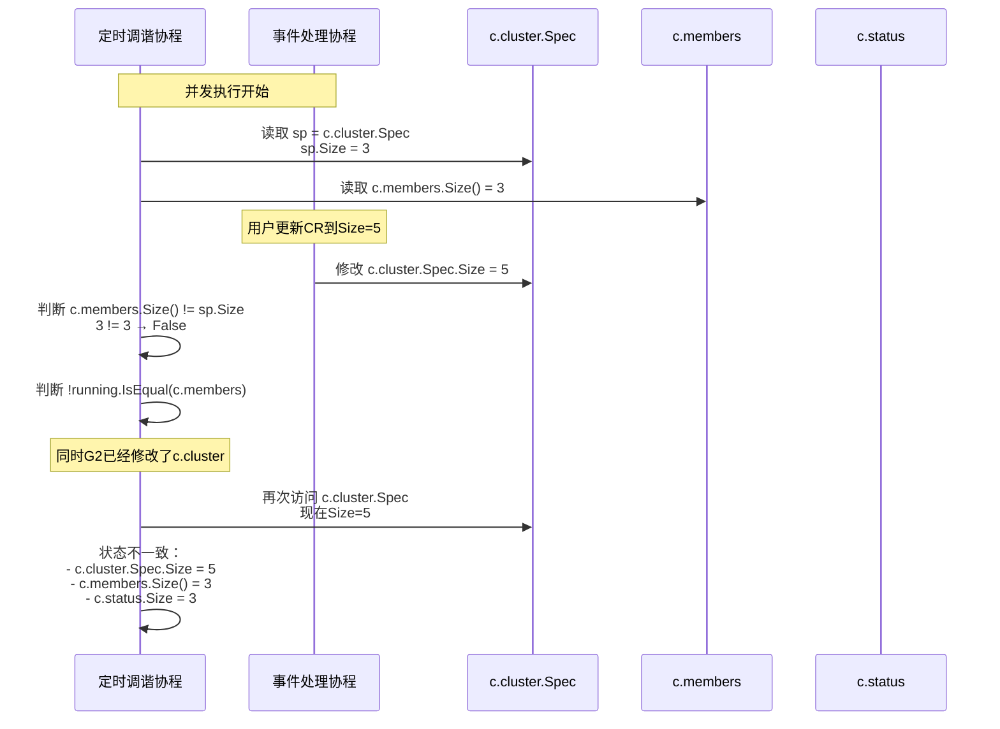
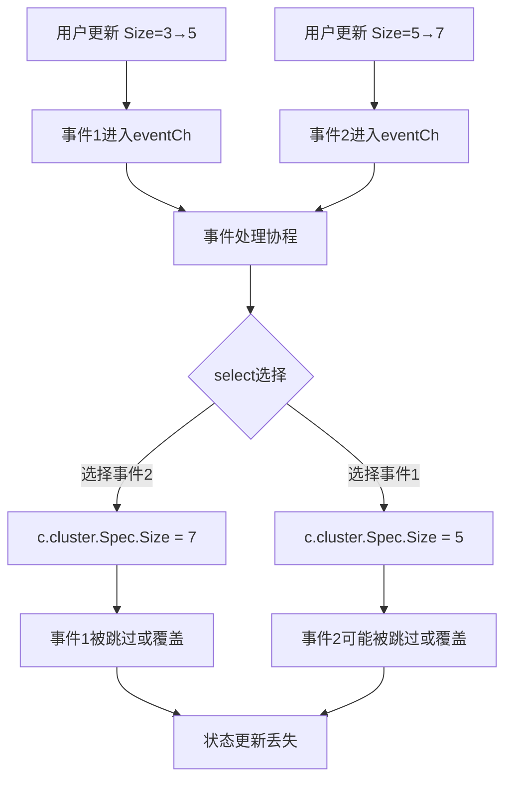
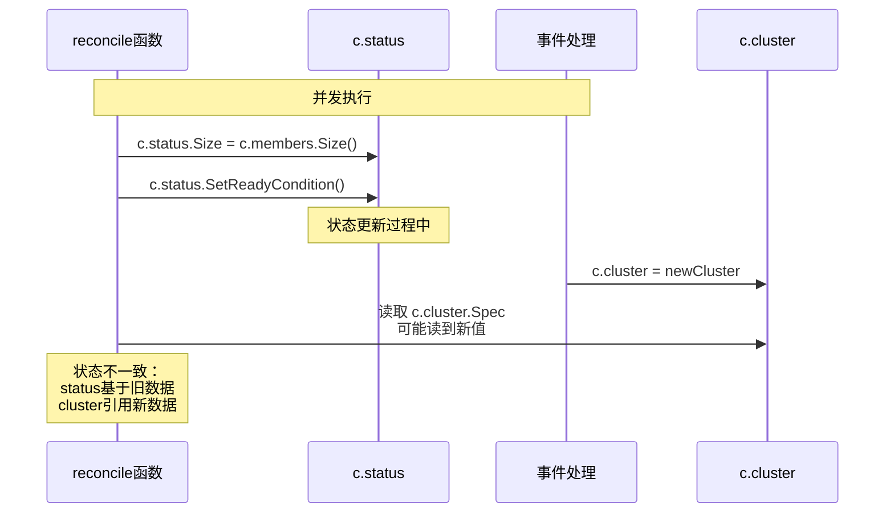

# ETCD Operator 并发安全问题详细分析

## 概述

本文档通过具体的代码执行场景和数据竞争示意图，详细分析ETCD Operator中真实存在的并发安全问题。

## 关键共享数据字段

在`Cluster`结构体中，以下字段被多个goroutine并发访问：

```go
type Cluster struct {
    // 共享状态字段（无锁保护）
    cluster *etcdv1alpha1.EtcdCluster  // 集群规格
    status  etcdv1alpha1.ClusterStatus  // 集群状态
    members etcd.MemberSet             // 成员集合
    // ...
}
```

## 并发访问场景分析

### 场景1：CR更新与定时调谐并发执行

#### 时间线详细分析

**初始状态**：
- `c.cluster.Spec.Size = 3`
- `c.members.Size() = 3`
- `c.status.Size = 3`

**执行序列**：

```
时间T0: 用户执行 kubectl edit etcdcluster my-cluster --size=5
时间T1: Controller收到CR变更事件，调用Reconcile()
时间T2: Reconcile调用c.Update(newCluster)
时间T3: 定时调谐5秒间隔到达，开始新一轮reconcile
时间T4: 事件处理goroutine开始执行
时间T5: 两个goroutine同时访问共享数据
```

#### 详细代码执行路径

**Goroutine A (定时调谐)**:
```go
// 位置: cluster.go:346
case <-time.After(reconcileInterval):
    // 代码行346-377
    start := time.Now()

    // 代码行351
    running, pending, err := c.pollPods()  // 获取当前运行中的Pod

    // 代码行377: 关键问题点
    rerr = c.reconcile(running)  // 调用reconcile，访问c.cluster.Spec

    // reconcile内部 (reconcile.go:32-53)
    sp := c.cluster.Spec  // 读取集群规格，此时可能已经被修改
    running := podsToMemberSet(pods, c.isSecureClient())

    // 关键判断 (reconcile.go:42)
    if !running.IsEqual(c.members) || c.members.Size() != sp.Size {
        // sp.Size可能已经是5，但c.members.Size()还是3
        return c.reconcileMembers(running)  // 开始扩容操作
    }
```

**Goroutine B (事件处理)**:
```go
// 位置: cluster.go:336
case event := <-c.eventCh:
    // 代码行338-345
    switch event.typ {
    case eventModifyCluster:
        if isSpecEqual(event.cluster.Spec, c.cluster.Spec) {
            break
        }
        // 代码行343: 关键修改点
        c.cluster = event.cluster  // 将c.cluster.Spec.Size从3改为5

        // 此时：c.cluster.Spec.Size = 5
        // 但：c.members.Size() = 3 (尚未更新)
        // 且：c.status.Size = 3 (尚未更新)
        c.logger.Info("cluster spec updated")
    }
```

#### 数据竞争时序图



#### 具体的数据不一致问题

在上述场景中，可能发生以下情况：

1. **状态不一致**：
   - `c.cluster.Spec.Size = 5` (新值)
   - `c.members.Size() = 3` (旧值)
   - `c.status.Size = 3` (旧值)

2. **错误的业务决策**：
   ```go
   // reconcile.go:42 的判断可能基于混合状态
   if !running.IsEqual(c.members) || c.members.Size() != sp.Size {
       // 如果这里读取到 sp.Size = 5, c.members.Size() = 3
       // 会触发扩容操作，但扩容的目标和当前状态不匹配
   }
   ```

### 场景2：连续快速CR更新的竞争条件

#### 执行序列

```
时间T0: 用户将Size从3改为5
时间T1: 第一个Update事件发送到eventCh
时间T2: 用户立即将Size从5改为7
时间T3: 第二个Update事件发送到eventCh
时间T4: 事件处理协程开始处理第一个事件
时间T5: 在处理第一个事件时，第二个事件到达
```

#### 代码执行路径

```go
// 事件处理协程处理连续事件
func (c *Cluster) run() {
    for {
        select {
        case event1 := <-c.eventCh:  // T4: 处理第一个事件 (Size=5)
            c.cluster = event1.cluster  // c.cluster.Spec.Size = 5
            // 还没有完成处理...

        case event2 := <-c.eventCh:  // T5: 第二个事件到达 (Size=7)
            // 在select的随机选择中，可能先处理第二个事件
            c.cluster = event2.cluster  // c.cluster.Spec.Size = 7
            // 第一个事件的状态被覆盖
        }
    }
}
```

#### 数据丢失风险



### 场景3：状态更新与读取的竞争

#### 代码位置分析

```go
// reconcile.go:37-38 - 状态更新
defer func() {
    c.status.Size = c.members.Size()  // 更新状态大小
}()

// reconcile.go:51 - 条件设置
c.status.SetReadyCondition()  // 设置就绪条件

// 同时在事件处理中：
c.cluster = event.cluster  // 修改集群规格
```

#### 竞争条件



## 内存可见性问题

### Goroutine调度导致的可见性问题

```go
// Goroutine A (定时调谐)
for {
    // 读取字段到CPU缓存
    currentSpec := c.cluster.Spec
    currentMembers := c.members

    // 执行一些计算
    time.Sleep(100 * time.Millisecond)

    // 此时可能发生上下文切换
    // Goroutine B修改了原始数据

    // 继续执行，但使用的是缓存的过期数据
    if currentMembers.Size() != currentSpec.Size {
        // 基于过期数据做决策
    }
}

// Goroutine B (事件处理)
c.cluster = newCluster  // 修改数据，但可能对其他goroutine不可见
```

### CPU缓存一致性

现代CPU的多级缓存可能导致：
- Goroutine A读取数据到L1缓存
- Goroutine B修改主内存中的数据
- Goroutine A继续使用L1缓存中的过期数据
- 直到缓存一致性协议同步，才会有可见的数据

## 具体的损害场景

### 场景1：集群规模状态混乱

```
期望状态：Size=5
实际状态：
- c.cluster.Spec.Size = 5 (正确)
- c.members.Size() = 3 (错误，应该正在扩容)
- c.status.Size = 3 (错误，没有同步)

结果：集群显示正在运行，但实际只有3个成员而不是5个
```

### 场景2：重复的扩缩容操作

```
时间线：
T0: Size=3，状态正常
T1: 用户更新到Size=5
T2: 定时调谐检测到差异，开始扩容
T3: 用户又更新到Size=3
T4: 事件处理更新c.cluster.Spec.Size=3
T5: 定时调谐基于混合状态，可能同时进行扩容和缩容

结果：集群成员数量混乱，可能创建不必要的Pod
```

### 场景3：状态更新丢失

```
连续更新：
Update1: Size=3→5
Update2: Size=5→7
Update3: Size=7→9

可能的结果：
- 只有Update3被应用
- Update1和Update2的事件被跳过
- 集群直接从3变到9，跳过中间状态
```

## 锁机制缺失的具体影响

### 1. 数据竞争

多个goroutine同时读写共享数据，没有同步机制：
```go
// 没有锁保护
c.cluster = newCluster     // 写操作
sp := c.cluster.Spec        // 并发的读操作
c.members.Add(newMember)    // 并发的修改操作
```

### 2. 状态不一致

相关字段的更新不是原子的：
```go
// 问题：三个字段的更新不是原子的
c.cluster = newCluster           // 操作1
c.members.Add(newMember)        // 操作2
c.status.Size = c.members.Size() // 操作3
// 在操作1和操作2之间，其他goroutine可能读到不一致的状态
```

### 3. 操作顺序问题

没有内存屏障保证操作顺序：
```go
// 编译器或CPU可能重排序
c.status.SetReadyCondition()    // 可能被重排序到前面
c.cluster = newCluster          // 可能被重排序到后面
```

## 修复方案建议

### 1. 添加读写锁

```go
type Cluster struct {
    mu sync.RWMutex
    cluster *etcdv1alpha1.EtcdCluster
    status  etcdv1alpha1.ClusterStatus
    members etcd.MemberSet
    // ...
}

func (c *Cluster) run() {
    for {
        select {
        case event := <-c.eventCh:
            c.mu.Lock()
            c.cluster = event.cluster
            c.mu.Unlock()
        case <-time.After(reconcileInterval):
            c.mu.RLock()
            rerr = c.reconcile(running)
            c.mu.RUnlock()
        }
    }
}
```

### 2. 原子性状态更新

```go
func (c *Cluster) updateClusterState(newCluster *etcdv1alpha1.EtcdCluster) {
    c.mu.Lock()
    defer c.mu.Unlock()

    // 原子性更新所有相关状态
    c.cluster = newCluster
    // 同步更新其他相关字段...
}
```

### 3. 事件队列处理

```go
func (c *Cluster) processEvents() {
    for event := range c.eventCh {
        c.mu.Lock()
        // 处理事件，确保状态一致性
        c.handleClusterUpdate(event.cluster)
        c.mu.Unlock()
    }
}
```

## 总结

ETCD Operator确实存在真实的并发安全问题：

1. **数据竞争**：多个goroutine同时访问共享数据
2. **状态不一致**：相关字段的更新不是原子的
3. **操作丢失**：快速连续的更新可能丢失
4. **内存可见性**：没有同步机制保证数据可见性

这些问题在真实的高并发环境中会导致：
- 集群状态混乱
- 操作结果不可预测
- 系统稳定性问题
- 调试困难

需要通过适当的锁机制和同步原语来解决这些并发安全问题。