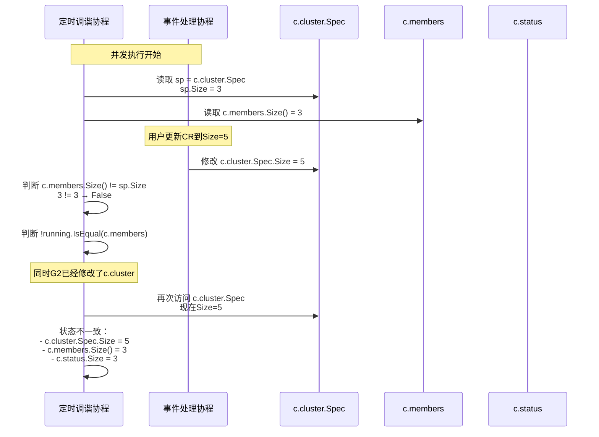
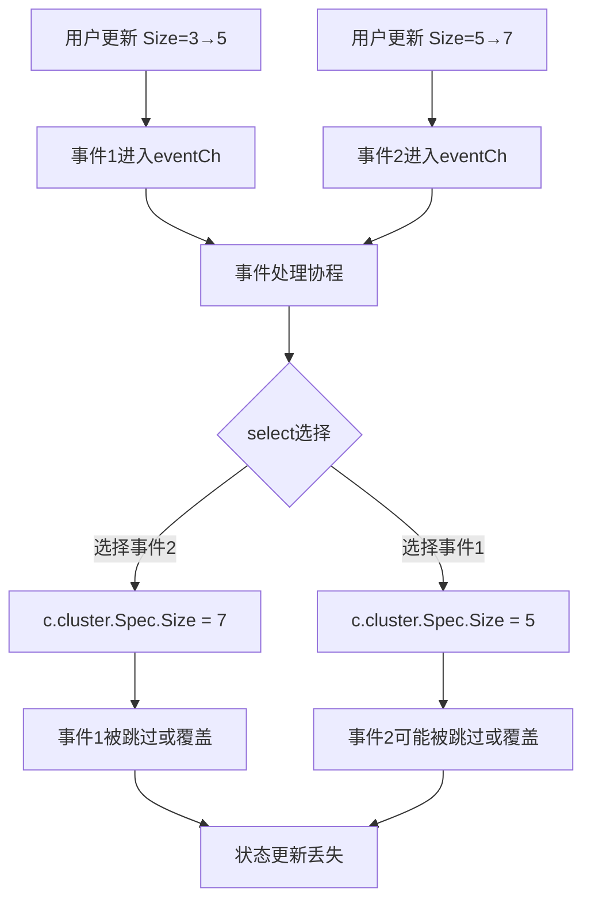
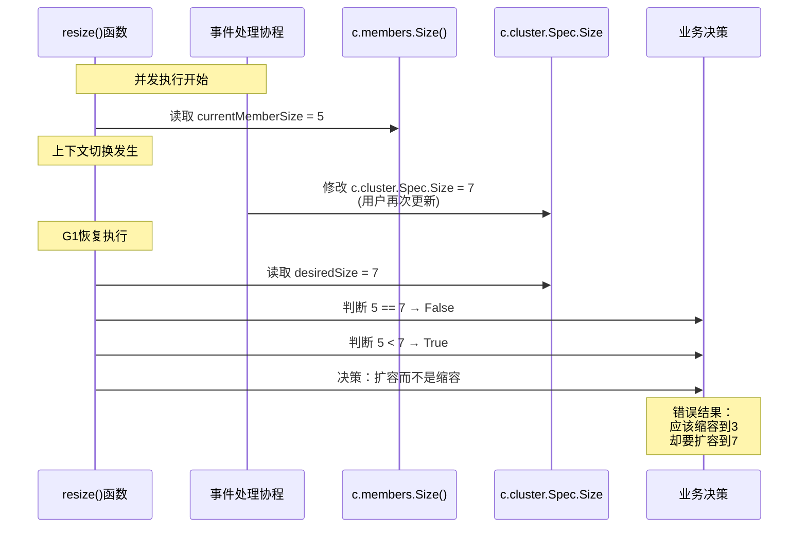

# ETCD Operator 并发安全问题详细分析

## 概述

本文档通过具体的代码执行场景和数据竞争示意图，详细分析ETCD Operator中真实存在的并发安全问题。

## 关键共享数据字段

在`Cluster`结构体中，以下字段被多个goroutine并发访问：

```go
type Cluster struct {
    // 共享状态字段（无锁保护）
    cluster *etcdv1alpha1.EtcdCluster  // 集群规格
    status  etcdv1alpha1.ClusterStatus  // 集群状态
    members etcd.MemberSet             // 成员集合
    // ...
}
```

## 并发访问场景分析

### 场景1：CR更新与定时调谐并发执行

#### 时间线详细分析

**初始状态**：
- `c.cluster.Spec.Size = 3`
- `c.members.Size() = 3`
- `c.status.Size = 3`

**执行序列**：

```
时间T0: 用户执行 kubectl edit etcdcluster my-cluster --size=5
时间T1: Controller收到CR变更事件，调用Reconcile()
时间T2: Reconcile调用c.Update(newCluster)
时间T3: 定时调谐5秒间隔到达，开始新一轮reconcile
时间T4: 事件处理goroutine开始执行
时间T5: 两个goroutine同时访问共享数据
```

#### 详细代码执行路径

**Goroutine A (定时调谐)**:
```go
// 位置: cluster.go:346
case <-time.After(reconcileInterval):
    // 代码行346-377
    start := time.Now()

    // 代码行351
    running, pending, err := c.pollPods()  // 获取当前运行中的Pod

    // 代码行377: 关键问题点
    rerr = c.reconcile(running)  // 调用reconcile，访问c.cluster.Spec

    // reconcile内部 (reconcile.go:32-53)
    sp := c.cluster.Spec  // 读取集群规格，此时可能已经被修改
    running := podsToMemberSet(pods, c.isSecureClient())

    // 关键判断 (reconcile.go:42)
    if !running.IsEqual(c.members) || c.members.Size() != sp.Size {
        // sp.Size可能已经是5，但c.members.Size()还是3
        return c.reconcileMembers(running)  // 开始扩容操作
    }
```

**Goroutine B (事件处理)**:
```go
// 位置: cluster.go:336
case event := <-c.eventCh:
    // 代码行338-345
    switch event.typ {
    case eventModifyCluster:
        if isSpecEqual(event.cluster.Spec, c.cluster.Spec) {
            break
        }
        // 代码行343: 关键修改点
        c.cluster = event.cluster  // 将c.cluster.Spec.Size从3改为5

        // 此时：c.cluster.Spec.Size = 5
        // 但：c.members.Size() = 3 (尚未更新)
        // 且：c.status.Size = 3 (尚未更新)
        c.logger.Info("cluster spec updated")
    }
```

#### 数据竞争时序图



#### 场景1的正确理解

需要澄清的是，上述场景中的**状态不一致实际上是正常的reconcile触发条件**：

- `c.cluster.Spec.Size = 5` (新值，用户期望)
- `c.members.Size() = 3` (当前实际状态)
- `c.status.Size = 3` (当前实际状态)

这种不一致正是reconcile机制要解决的问题。当用户修改CR时，operator应该检测到期望状态与实际状态的差异，然后执行相应的调整操作。

**真正的问题在于后续的操作执行过程中可能出现的竞态条件**，这将在后面的场景中详细分析。

### 场景2：连续快速CR更新的竞争条件

#### 执行序列

```
时间T0: 用户将Size从3改为5
时间T1: 第一个Update事件发送到eventCh
时间T2: 用户立即将Size从5改为7
时间T3: 第二个Update事件发送到eventCh
时间T4: 事件处理协程开始处理第一个事件
时间T5: 在处理第一个事件时，第二个事件到达
```

#### 代码执行路径

```go
// 事件处理协程处理连续事件
func (c *Cluster) run() {
    for {
        select {
        case event1 := <-c.eventCh:  // T4: 处理第一个事件 (Size=5)
            c.cluster = event1.cluster  // c.cluster.Spec.Size = 5
            // 还没有完成处理...

        case event2 := <-c.eventCh:  // T5: 第二个事件到达 (Size=7)
            // 在select的随机选择中，可能先处理第二个事件
            c.cluster = event2.cluster  // c.cluster.Spec.Size = 7
            // 第一个事件的状态被覆盖
        }
    }
}
```

#### 数据丢失风险



### 场景3：resize()函数中的决策竞态条件

#### 问题描述

这是最严重的并发安全问题，发生在resize()函数的关键判断点：

```go
// reconcile.go:99-101
func (c *Cluster) resize() error {
    if c.members.Size() == c.cluster.Spec.Size {  // 读取操作1和读取操作2
        return nil
    }
    // ...
}
```

#### 详细竞态场景

**初始状态**：
- `c.cluster.Spec.Size = 3` (用户想要缩容)
- `c.members.Size() = 5` (当前有5个成员)

**执行序列**：
```
时间T0: 用户执行 kubectl edit etcdcluster my-cluster --size=3
时间T1: Controller收到CR变更事件，调用c.Update()
时间T2: 定时调谐开始，检测到需要调整，调用resize()
时间T3: resize()开始执行判断逻辑
时间T4: 事件处理goroutine同时修改c.cluster
```

#### 代码执行路径分析

**Goroutine A (定时调谐)**:
```go
// 进入resize()函数
func (c *Cluster) resize() error {
    // 时间T3: 读取c.members.Size()
    currentMemberSize := c.members.Size()  // currentMemberSize = 5

    // 时间T4: 此时发生上下文切换！
    // Goroutine B开始执行并修改c.cluster.Spec.Size = 7

    // 时间T5: Goroutine A恢复执行
    // 读取c.cluster.Spec.Size
    desiredSize := c.cluster.Spec.Size  // desiredSize = 7 (不是期望的3!)

    // 关键判断：基于不一致的数据做决策
    if currentMemberSize == desiredSize {  // 5 == 7 → False
        return nil
    }

    // 错误的决策：应该缩容到3，但却决定扩容到7
    if currentMemberSize < desiredSize {  // 5 < 7 → True
        return c.addOneMember()  // 开始扩容操作！
    }

    return c.removeOneMember()
}
```

**Goroutine B (事件处理)**:
```go
// cluster.go:343 - 在resize()执行过程中
case event := <-c.eventCh:
    // 时间T4: 用户再次更新CR，这次Size改为7
    c.cluster = event.cluster  // c.cluster.Spec.Size = 7
```

#### 竞态条件时序图



### 场景4：addOneMember()中的状态不一致竞态

#### 问题描述

在addOneMember()函数中，多个步骤基于的状态可能不一致：

```go
// reconcile.go:112-129
func (c *Cluster) addOneMember() error {
    c.status.SetScalingUpCondition(c.members.Size(), c.cluster.Spec.Size)
    // ...
    resp, err := etcd.AddMember(c.members.ClientURLs(), c.tlsConfig, []string{newMember.PeerURL()})
    newMember.ID = resp.Member.ID
    c.members.Add(newMember)
}
```

#### 竞态场景

**执行序列**：
```
时间T1: addOneMember()开始，设置扩容条件 Scaling(3→5)
时间T2: 事件处理goroutine修改c.cluster.Spec.Size = 3
时间T3: etcd.AddMember()执行，向etcd集群添加成员
时间T4: 但此时目标已经变为3，不应该添加成员
```

#### 数据流图

```mermaid
graph TD
    A[addOneMember开始] --> B[读取c.members.Size=3]
    B --> C[读取c.cluster.Spec.Size=5]
    C --> D[SetScalingUpCondition 3→5]

    D --> E{上下文切换}
    E -->|事件处理| F[修改c.cluster.Spec.Size=3]

    F --> G[恢复addOneMember]
    G --> H[etcd.AddMember执行]
    H --> I[添加新成员到etcd集群]

    I --> J[c.members.Add(newMember)]
    J --> K[结果：集群有6个成员<br/>但期望是3个]

    style E fill:#ffeb3b
    style K fill:#f44336
```

### 场景5：reconcileMembers逻辑错误的并发放大

#### 问题描述

reconcileMembers中的逻辑错误在并发环境下更容易暴露问题：

```go
// reconcile.go:84-86 - 错误的逻辑
if L.Size() == c.members.Size() {
    return c.resize()
}
```

#### 并发场景分析

**时间线**：
```
时间T1: L.Size() = 3, c.members.Size() = 3 (所有成员正常运行)
时间T2: 判断 3 == 3，进入resize()
时间T3: resize()读取 c.cluster.Spec.Size
时间T4: 同时事件处理修改 c.cluster.Spec.Size
时间T5: resize()基于过期数据做错误决策
```

#### 执行流程图

```mermaid
graph TD
    A[开始reconcileMembers] --> B[计算L和members]
    B --> C{L.Size == members.Size?}

    C -->|是| D[调用resize()]
    C -->|否| E[检查法定人数]

    D --> F[resize()读取spec]
    F --> G{并发修改spec}
    G -->|spec被修改| H[基于过期数据决策]
    H --> I[错误的扩缩容操作]

    E --> J{L.Size < quorum?}
    J -->|是| K[返回法定人数错误]
    J -->|否| L[移除死亡成员]

    style G fill:#ff9800
    style H fill:#f44336
    style I fill:#f44336
```

## 内存可见性问题

### Goroutine调度导致的可见性问题

```go
// Goroutine A (定时调谐)
for {
    // 读取字段到CPU缓存
    currentSpec := c.cluster.Spec
    currentMembers := c.members

    // 执行一些计算
    time.Sleep(100 * time.Millisecond)

    // 此时可能发生上下文切换
    // Goroutine B修改了原始数据

    // 继续执行，但使用的是缓存的过期数据
    if currentMembers.Size() != currentSpec.Size {
        // 基于过期数据做决策
    }
}

// Goroutine B (事件处理)
c.cluster = newCluster  // 修改数据，但可能对其他goroutine不可见
```

### CPU缓存一致性

现代CPU的多级缓存可能导致：
- Goroutine A读取数据到L1缓存
- Goroutine B修改主内存中的数据
- Goroutine A继续使用L1缓存中的过期数据
- 直到缓存一致性协议同步，才会有可见的数据

## 具体的损害场景

### 场景1：集群规模状态混乱

```
期望状态：Size=5
实际状态：
- c.cluster.Spec.Size = 5 (正确)
- c.members.Size() = 3 (错误，应该正在扩容)
- c.status.Size = 3 (错误，没有同步)

结果：集群显示正在运行，但实际只有3个成员而不是5个
```

### 场景2：重复的扩缩容操作

```
时间线：
T0: Size=3，状态正常
T1: 用户更新到Size=5
T2: 定时调谐检测到差异，开始扩容
T3: 用户又更新到Size=3
T4: 事件处理更新c.cluster.Spec.Size=3
T5: 定时调谐基于混合状态，可能同时进行扩容和缩容

结果：集群成员数量混乱，可能创建不必要的Pod
```

### 场景3：状态更新丢失

```
连续更新：
Update1: Size=3→5
Update2: Size=5→7
Update3: Size=7→9

可能的结果：
- 只有Update3被应用
- Update1和Update2的事件被跳过
- 集群直接从3变到9，跳过中间状态
```

## 锁机制缺失的具体影响

### 1. 数据竞争

多个goroutine同时读写共享数据，没有同步机制：
```go
// 没有锁保护
c.cluster = newCluster     // 写操作
sp := c.cluster.Spec        // 并发的读操作
c.members.Add(newMember)    // 并发的修改操作
```

### 2. 状态不一致

相关字段的更新不是原子的：
```go
// 问题：三个字段的更新不是原子的
c.cluster = newCluster           // 操作1
c.members.Add(newMember)        // 操作2
c.status.Size = c.members.Size() // 操作3
// 在操作1和操作2之间，其他goroutine可能读到不一致的状态
```

### 3. 操作顺序问题

没有内存屏障保证操作顺序：
```go
// 编译器或CPU可能重排序
c.status.SetReadyCondition()    // 可能被重排序到前面
c.cluster = newCluster          // 可能被重排序到后面
```

## 修复方案建议

### 1. 添加读写锁

```go
type Cluster struct {
    mu sync.RWMutex
    cluster *etcdv1alpha1.EtcdCluster
    status  etcdv1alpha1.ClusterStatus
    members etcd.MemberSet
    // ...
}

func (c *Cluster) run() {
    for {
        select {
        case event := <-c.eventCh:
            c.mu.Lock()
            c.cluster = event.cluster
            c.mu.Unlock()
        case <-time.After(reconcileInterval):
            c.mu.RLock()
            rerr = c.reconcile(running)
            c.mu.RUnlock()
        }
    }
}
```

### 2. 原子性状态更新

```go
func (c *Cluster) updateClusterState(newCluster *etcdv1alpha1.EtcdCluster) {
    c.mu.Lock()
    defer c.mu.Unlock()

    // 原子性更新所有相关状态
    c.cluster = newCluster
    // 同步更新其他相关字段...
}
```

### 3. 事件队列处理

```go
func (c *Cluster) processEvents() {
    for event := range c.eventCh {
        c.mu.Lock()
        // 处理事件，确保状态一致性
        c.handleClusterUpdate(event.cluster)
        c.mu.Unlock()
    }
}
```

## 总结：真正的并发安全问题

基于以上详细分析，ETCD Operator确实存在真实的并发安全问题，但与我最初的理解不同：

### 关键发现

1. **状态不一致本身不是问题**：当用户修改CR时，期望状态与实际状态的不一致正是reconcile机制要解决的正常情况

2. **真正的并发安全问题是**：
   - **决策与执行之间的竞态**：resize()等函数在读取状态和执行操作之间，状态可能被修改
   - **多步骤操作的非原子性**：addOneMember()等函数中的多个步骤基于的状态可能不一致
   - **逻辑错误的并发放大**：reconcileMembers中的错误逻辑在并发环境下更容易暴露问题

### 最严重的风险场景

1. **resize()决策竞态**：可能导致应该缩容时却在扩容
2. **状态更新丢失**：快速连续的CR更新可能导致中间状态丢失
3. **etcd操作与状态不同步**：向etcd集群添加/删除成员时，目标可能已经改变

### 实际影响

这些并发安全问题在真实环境中会导致：
- 集群成员数量与期望不符
- 不必要的etcd操作（添加/删除成员）
- 状态混乱和操作结果不可预测
- 系统稳定性问题

### 修复优先级

1. **高优先级**：resize()函数的决策竞态（场景3）
2. **中优先级**：addOneMember()的状态不一致（场景4）
3. **低优先级**：连续更新的状态丢失（场景2）

需要通过适当的锁机制、原子操作和状态同步来解决这些真正的并发安全问题。