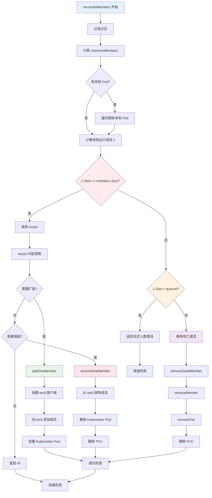
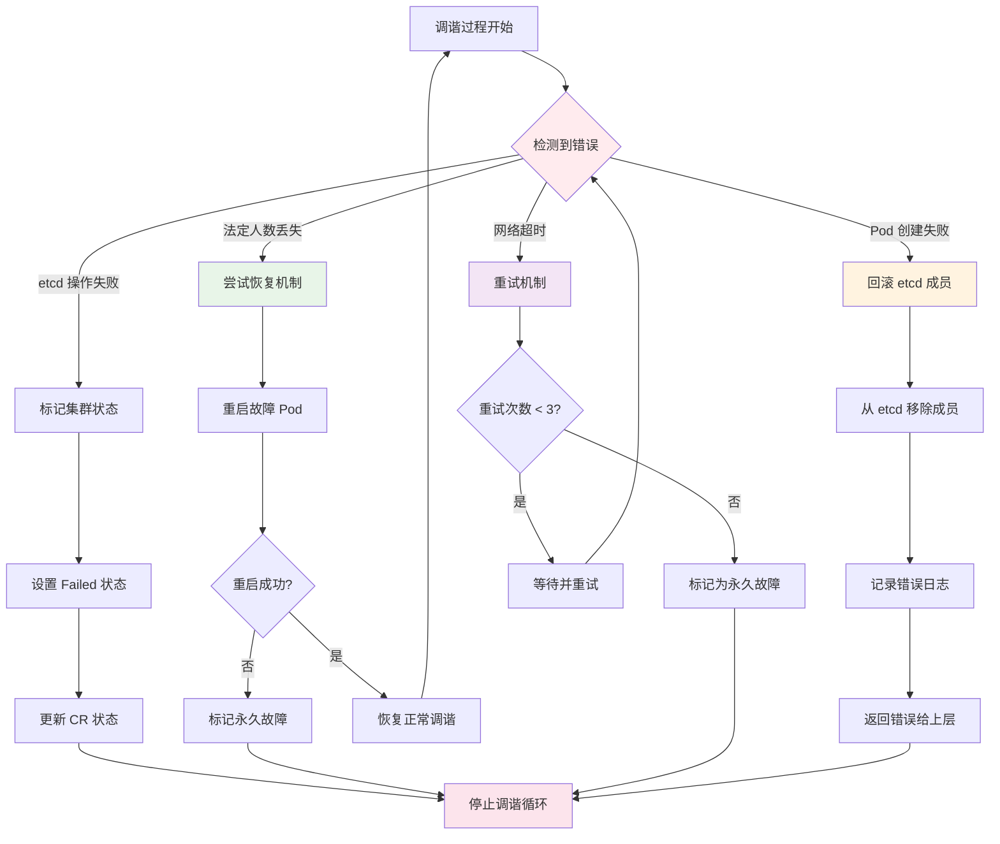
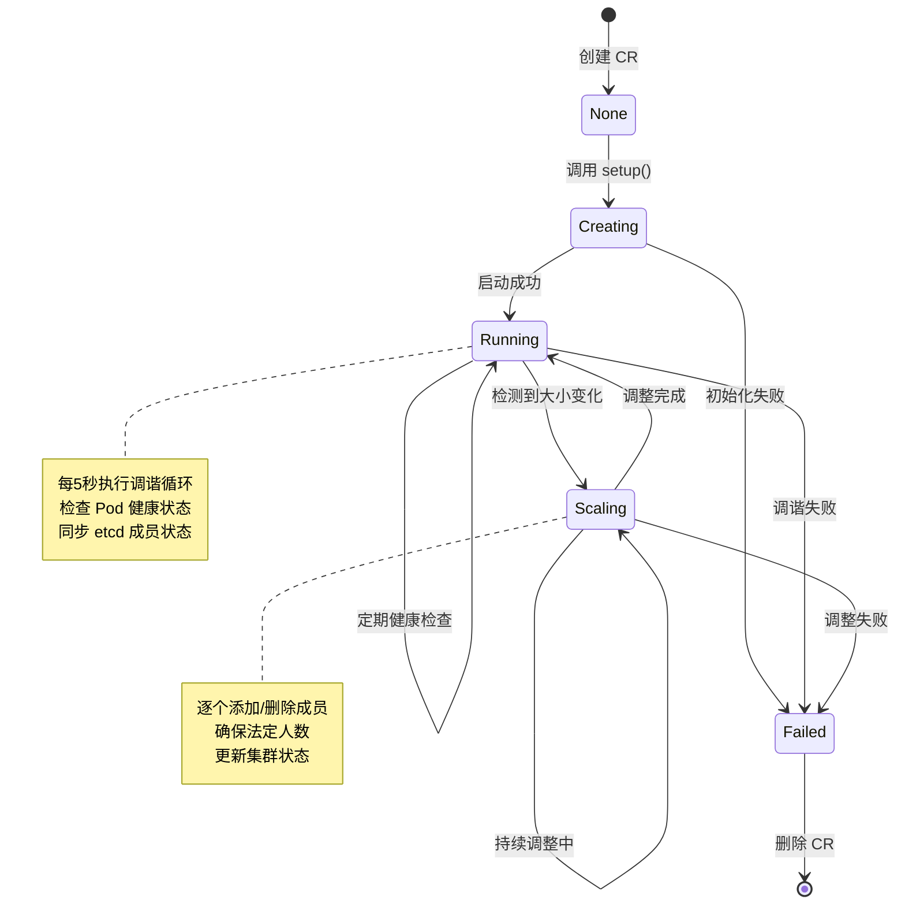

# ETCD Operator 调谐机制深度分析

## 概述

ETCD Operator 采用双层调谐架构来管理 etcd 集群的生命周期。本文将深入分析当前实现的调谐流程、识别关键风险问题，并提供具体的修复方案。

## 双层调谐架构设计

### 1. 架构概览

```
┌─────────────────────────────────────────────────────────────┐
│                    Kubernetes Controller Layer                │
│              (internal/controller/etcdcluster_controller.go)  │
├─────────────────────────────────────────────────────────────┤
│                         etcd Cluster Layer                   │
│              (pkg/cluster/cluster.go + reconcile.go)           │
└─────────────────────────────────────────────────────────────┘
```

### 2. 各层职责划分

#### Kubernetes Controller 层
- **触发条件**: EtcdCluster CR 变化
- **主要职责**:
  - 管理 CR 的生命周期（创建/更新/删除）
  - 验证集群规格参数
  - 创建和管理 `cluster.Cluster` 实例
  - 处理 finalizer 和资源清理

#### etcd Cluster 层
- **触发条件**: 每 5 秒定时调谐 + 集群变更事件
- **主要职责**:
  - 管理 etcd 集群的实际状态
  - 处理成员增删操作
  - 监控 Pod 健康状态
  - 维护集群状态同步

## 详细调谐流程分析

### 1. 主控制器调谐流程

#### 1.1 入口点：`EtcdClusterReconciler.Reconcile()`

**位置**: `internal/controller/etcdcluster_controller.go:65-137`

```go
func (r *EtcdClusterReconciler) Reconcile(ctx context.Context, req ctrl.Request) (ctrl.Result, error) {
    // 1. 获取 EtcdCluster 实例
    etcdCluster := &etcdv1alpha1.EtcdCluster{}
    if err := r.Get(ctx, req.NamespacedName, etcdCluster); err != nil {
        // 处理资源不存在的情况
        return ctrl.Result{}, nil
    }

    // 2. 处理删除逻辑
    if etcdCluster.DeletionTimestamp != nil {
        return r.handleDeletion(ctx, etcdCluster, logger)
    }

    // 3. 添加 finalizer
    if !controllerutil.ContainsFinalizer(etcdCluster, etcdFinalizer) {
        controllerutil.AddFinalizer(etcdCluster, etcdFinalizer)
        return ctrl.Result{Requeue: true}, nil
    }

    // 4. 设置默认值和验证规格
    etcdCluster.SetDefaults()
    if err := r.validateClusterSpec(etcdCluster.Spec); err != nil {
        return ctrl.Result{}, err
    }

    // 5. 创建或更新集群实例
    if existingCluster, exists := r.clusters[clusterKey]; exists {
        existingCluster.Update(etcdCluster)
    } else {
        newCluster := cluster.New(config, etcdCluster, logger)
        r.clusters[clusterKey] = newCluster
    }

    return ctrl.Result{}, nil
}
```

**关键特点**：
- 主控制器**不直接操作** etcd 集群
- 通过创建 `cluster.Cluster` 实例来间接管理
- 采用事件驱动模式，响应 CR 变化

### 2. etcd 集群调谐流程

#### 2.1 集群实例启动：`cluster.New()`

**位置**: `pkg/cluster/cluster.go:96-125`

```go
func New(config Config, cl *etcdv1alpha1.EtcdCluster, logger logr.Logger) *Cluster {
    c := &Cluster{
        logger:  logger.WithValues("cluster-name", cl.Name),
        config:  config,
        cluster: cl,
        eventCh: make(chan *clusterEvent, 100),
        stopCh:  make(chan struct{}),
        status:  *cl.Status.DeepCopy(),
    }

    // 启动集群管理协程
    go func() {
        if err := c.setup(); err != nil {
            // 处理初始化失败
            return
        }
        c.run()  // 进入主调谐循环
    }()

    return c
}
```

#### 2.2 主调谐循环：`cluster.run()`

**位置**: `pkg/cluster/cluster.go:322-401`

```go
func (c *Cluster) run() {
    c.status.SetPhase(etcdv1alpha1.ClusterPhaseRunning)
    if err := c.updateCRStatus(); err != nil {
        c.logger.Error(err, "failed to update cluster phase to running")
        return
    }

    for {
        select {
        case <-c.stopCh:
            return  // 收到停止信号，退出循环
        case event := <-c.eventCh:
            // 处理集群更新事件
            if event.typ == eventModifyCluster {
                if !isSpecEqual(event.cluster.Spec, c.cluster.Spec) {
                    c.cluster = event.cluster
                }
            }
        case <-time.After(reconcileInterval):
            // 定期调谐逻辑（每 5 秒）
            start := time.Now()

            // 1. 轮询 Pod 状态
            running, pending, err := c.pollPods()
            if err != nil {
                c.logger.Error(err, "failed to poll pods")
                continue
            }

            // 2. 处理 pending 状态的 Pod
            if len(pending) > 0 {
                c.logger.Info("skip reconciliation: pods are pending")
                continue
            }

            // 3. 检查是否有运行中的 Pod
            if len(running) == 0 {
                c.logger.Info("all etcd pods are dead")
                break
            }

            // 4. 更新成员信息
            if c.members == nil {
                c.members = podsToMemberSet(running, c.isSecureClient())
            }

            // 5. 执行协调逻辑
            rerr = c.reconcile(running)
            if rerr != nil {
                c.logger.Error(rerr, "failed to reconcile")
                break
            }

            // 6. 更新状态
            c.updateMemberStatus(running)
            if err := c.updateCRStatus(); err != nil {
                c.logger.Error(err, "periodic update CR status failed")
            }
        }
    }
}
```

#### 2.3 核心调谐逻辑：`cluster.reconcile()`

**位置**: `pkg/cluster/reconcile.go:32-53`

```go
func (c *Cluster) reconcile(pods []*corev1.Pod) error {
    c.logger.Info("Start reconciling")
    defer c.logger.Info("Finish reconciling")

    defer func() {
        c.status.Size = c.members.Size()  // 更新状态中的集群大小
    }()

    sp := c.cluster.Spec
    running := podsToMemberSet(pods, c.isSecureClient())

    // 关键判断：是否需要调谐
    if !running.IsEqual(c.members) || c.members.Size() != sp.Size {
        return c.reconcileMembers(running)
    }

    c.status.SetReadyCondition()
    return nil
}
```

**触发调谐的条件**：
1. 运行中的 Pod 集合与内存中的成员集合不一致
2. 成员数量与期望的集群大小不一致

#### 2.4 成员调谐逻辑：`cluster.reconcileMembers()`

**位置**: `pkg/cluster/reconcile.go:64-95`

```go
func (c *Cluster) reconcileMembers(running etcd.MemberSet) error {
    c.logger.Info("running members", "members", running.String())
    c.logger.Info("cluster membership", "members", c.members.String())

    // 步骤 1: 清理未知 Pod
    unknownMembers := running.Diff(c.members)
    if unknownMembers.Size() > 0 {
        c.logger.Info("removing unexpected pods", "members", unknownMembers.String())
        for _, m := range unknownMembers {
            // 🔴 重大风险：只删除 Pod，没有从 etcd 集群移除成员
            if err := c.removePod(m.Name); err != nil {
                return err
            }
        }
    }

    // 步骤 2: 计算实际有效的运行成员
    L := running.Diff(unknownMembers)

    // 🔴 重大逻辑错误：这个条件判断完全错误
    if L.Size() == c.members.Size() {
        return c.resize()  // 错误：为什么所有成员都在运行时要调整大小？
    }

    // 步骤 3: 检查法定人数
    if L.Size() < c.members.Size()/2+1 {
        return etcd.ErrLostQuorum
    }

    // 步骤 4: 移除死亡成员
    c.logger.Info("removing one dead member")
    return c.removeDeadMember(c.members.Diff(L).PickOne())
}
```

## 关键风险问题分析

### 1. 重大逻辑错误

#### 问题描述
**位置**: `pkg/cluster/reconcile.go:84-86`

```go
// 🔴 错误的逻辑
if L.Size() == c.members.Size() {
    return c.resize()
}
```

**问题分析**：
- `L` 表示实际运行且属于成员集合的 Pod
- `c.members.Size()` 表示内存中的成员总数
- 当 `L.Size() == c.members.Size()` 时，说明所有成员都在正常运行
- 但代码却调用 `resize()`，这是完全错误的逻辑

**风险影响**：
- 导致不必要的成员增删操作
- 可能破坏集群稳定性
- 造成资源浪费

#### 修复方案

```go
// ✅ 正确的逻辑应该是
if L.Size() == c.members.Size() {
    // 所有成员都在正常运行，检查是否需要调整到期望大小
    if c.members.Size() == c.cluster.Spec.Size {
        return nil  // 集群状态正常，无需操作
    }
    return c.resize()  // 只有在数量不匹配时才调整
}
```

### 2. 状态同步机制缺陷

#### 问题描述
**位置**: `pkg/cluster/cluster.go:103` 和 `pkg/cluster/reconcile.go:37`

```go
// 🔴 问题：c.members 与实际 etcd 集群状态可能不同步
c.members = podsToMemberSet(running, c.isSecureClient())

// 🔴 问题：依赖内存状态，可能不准确
c.status.Size = c.members.Size()
```

**问题分析**：
- `c.members` 仅从 Kubernetes Pod 状态推断，没有直接查询 etcd 集群
- 可能出现 Pod 存在但 etcd 成员已经丢失的情况
- 没有定期从 etcd 集群同步真实成员信息

**风险影响**：
- 状态不一致导致错误的调谐决策
- 无法检测 etcd 集群内部的成员变化
- 故障恢复能力不足

#### 修复方案

```go
// ✅ 定期从 etcd 集群同步成员状态
func (c *Cluster) syncMembersFromEtcd() error {
    clientURLs := c.members.ClientURLs()
    if len(clientURLs) == 0 {
        return fmt.Errorf("no available client URLs")
    }

    resp, err := etcd.ListMembers(clientURLs, c.tlsConfig)
    if err != nil {
        return fmt.Errorf("failed to list members from etcd: %v", err)
    }

    // 根据 etcd 返回的成员信息更新 c.members
    return c.updateMembersFromEtcdResponse(resp)
}
```

### 3. 并发安全问题

#### 问题描述
**位置**: `pkg/cluster/cluster.go:332-390` 和 `pkg/cluster/cluster.go:212-217`

```go
// 🔴 问题：多个 goroutine 同时访问共享状态，没有锁保护
func (c *Cluster) run() {
    for {
        select {
        case <-time.After(reconcileInterval):
            // 定期调谐，访问 c.members 和 c.status
            rerr = c.reconcile(running)
        case event := <-c.eventCh:
            // 事件处理，可能修改 c.cluster
            c.cluster = event.cluster
        }
    }
}

func (c *Cluster) Update(cl *etcdv1alpha1.EtcdCluster) {
    c.send(&clusterEvent{
        typ:     eventModifyCluster,
        cluster: cl,
    })
}
```

**问题分析**：
- `run()` 方法的定时调谐和 `Update()` 方法的事件处理并发执行
- 没有互斥锁保护 `c.members`、`c.status`、`c.cluster` 等共享状态
- 可能导致数据竞争和状态不一致

**风险影响**：
- 数据竞争导致不可预测的行为
- 状态更新丢失
- 系统稳定性问题

#### 修复方案

```go
// ✅ 添加互斥锁保护共享状态
type Cluster struct {
    logger logr.Logger
    config Config
    cluster *etcdv1alpha1.EtcdCluster
    status etcdv1alpha1.ClusterStatus
    members etcd.MemberSet
    mu sync.RWMutex  // 添加读写锁
}

func (c *Cluster) run() {
    for {
        select {
        case <-time.After(reconcileInterval):
            c.mu.Lock()
            rerr = c.reconcile(running)
            c.mu.Unlock()
        case event := <-c.eventCh:
            c.mu.Lock()
            c.cluster = event.cluster
            c.mu.Unlock()
        }
    }
}
```

### 4. 错误处理机制缺陷

#### 问题描述
**位置**: `pkg/cluster/reconcile.go:73-76`

```go
// 🔴 问题：只删除 Pod，没有从 etcd 集群移除成员
for _, m := range unknownMembers {
    if err := c.removePod(m.Name); err != nil {
        return err
    }
}
```

**问题分析**：
- 当发现未知 Pod 时，只删除了 Kubernetes 中的 Pod
- 没有检查这些 Pod 是否对应 etcd 集群中的成员
- 可能导致 etcd 集群中存在孤立的成员记录

**风险影响**：
- etcd 集群状态不一致
- 影响集群的法定人数计算
- 可能导致后续操作失败

#### 修复方案

```go
// ✅ 先检查 etcd 成员状态，再决定操作
for _, m := range unknownMembers {
    // 检查该成员是否在 etcd 集群中存在
    if c.isMemberInEtcdCluster(m) {
        // 先从 etcd 集群移除成员，再删除 Pod
        if err := c.removeMemberFromEtcd(m); err != nil {
            return err
        }
    }

    if err := c.removePod(m.Name); err != nil {
        return err
    }
}
```

### 5. 法定人数处理不当

#### 问题描述
**位置**: `pkg/cluster/reconcile.go:88-90`

```go
// 🔴 问题：法定人数丢失时直接返回错误，没有恢复机制
if L.Size() < c.members.Size()/2+1 {
    return etcd.ErrLostQuorum
}
```

**问题分析**：
- 当检测到法定人数丢失时，直接返回错误
- 没有尝试恢复机制
- 没有区分临时网络分区和永久故障

**风险影响**：
- 集群无法自动恢复
- 需要手动干预
- 影响系统可用性

#### 修复方案

```go
// ✅ 实现分级的故障处理
func (c *Cluster) handleQuorumLoss(L etcd.MemberSet) error {
    quorumSize := c.members.Size()/2 + 1

    if L.Size() < quorumSize {
        // 记录详细的故障信息
        c.logger.Info("quorum lost",
            "healthy", L.Size(),
            "required", quorumSize,
            "total", c.members.Size())

        // 尝试重启故障的 Pod
        if err := c.restartDeadPods(c.members.Diff(L)); err != nil {
            return fmt.Errorf("failed to restart dead pods: %v", err)
        }

        // 等待一段时间再次检查
        return &QuorumLossError{Message: "quorum lost, attempting recovery"}
    }

    return nil
}
```

## 完整的调谐流程重构建议

### 1. 状态同步机制

```go
// 建议的调谐流程
func (c *Cluster) reconcile(pods []*corev1.Pod) error {
    c.mu.Lock()
    defer c.mu.Unlock()

    // 1. 从 Kubernetes 获取当前 Pod 状态
    runningPods := podsToMemberSet(pods, c.isSecureClient())

    // 2. 从 etcd 集群获取真实成员状态
    etcdMembers, err := c.syncMembersFromEtcd()
    if err != nil {
        c.logger.Warn("failed to sync from etcd, using cached members", "error", err)
        etcdMembers = c.members
    }

    // 3. 状态一致性检查
    if !c.validateStateConsistency(runningPods, etcdMembers) {
        return c.repairInconsistentState(runningPods, etcdMembers)
    }

    // 4. 检查是否需要调整集群大小
    if etcdMembers.Size() != c.cluster.Spec.Size {
        return c.adjustClusterSize(etcdMembers, c.cluster.Spec.Size)
    }

    // 5. 检查 Pod 健康状态
    unhealthyPods := c.identifyUnhealthyPods(runningPods)
    if len(unhealthyPods) > 0 {
        return c.handleUnhealthyPods(unhealthyPods)
    }

    // 6. 更新状态
    c.updateStatus(runningPods, etcdMembers)

    return nil
}
```

### 2. 分步调谐策略

```go
// 建议的调谐步骤
func (c *Cluster) stepByStepReconcile() error {
    // 步骤 1: 状态同步
    if err := c.syncState(); err != nil {
        return err
    }

    // 步骤 2: 健康检查
    if err := c.healthCheck(); err != nil {
        return c.handleHealthIssues(err)
    }

    // 步骤 3: 规模调整
    if err := c.checkAndResize(); err != nil {
        return err
    }

    // 步骤 4: 成员修复
    if err := c.repairMembers(); err != nil {
        return err
    }

    // 步骤 5: 状态更新
    return c.updateCRStatus()
}
```

## 调谐流程图解

### 1. 整体调谐架构流程图

```mermaid
graph TB
    A[Kubernetes User] -->|创建/更新 EtcdCluster CR| B[Kubernetes Controller]
    B -->|Reconcile 调用| C{检查 CR 状态}
    C -->|删除操作| D[处理 Finalizer]
    C -->|创建操作| E[验证集群规格]
    C -->|更新操作| F[更新集群实例]

    E --> G[创建 Cluster 实例]
    F --> G
    G --> H[启动后台调谐协程]

    H --> I[cluster.setup()]
    I --> J[cluster.run()]

    J --> K{5秒定时调谐}
    K -->|有 pending Pod| L[跳过调谐]
    K -->|无运行 Pod| M[标记故障]
    K -->|正常运行| N[执行 reconcile]

    N --> O{需要调谐?}
    O -->|是| P[reconcileMembers]
    O -->|否| Q[标记就绪]

    P --> R[清理未知 Pod]
    R --> S{所有成员都在运行?}
    S -->|是| T[检查集群大小]
    S -->|否| U[检查法定人数]

    T -->|大小匹配| Q
    T -->|大小不匹配| V[resize 调整]

    U -->|法定人数不足| W[返回错误]
    U -->|法定人数正常| X[移除死亡成员]

    V --> Y[添加/删除成员]
    X --> Y

    Y --> Z[更新 CR 状态]
    Q --> Z
    L --> Z
    M --> Z

    style A fill:#e1f5fe
    style B fill:#f3e5f5
    style G fill:#e8f5e8
    style P fill:#fff3e0
    style Z fill:#fce4ec
```

### 2. reconcileMembers 详细流程图



### 3. 调谐时序图

```mermaid
sequenceDiagram
    participant K8s as Kubernetes API
    participant CR as EtcdCluster CR
    participant CTRL as EtcdClusterReconciler
    participant CLUSTER as Cluster Instance
    member ETCD as etcd Cluster
    participant POD as Kubernetes Pods

    Note over K8s,POD: 初始化阶段
    K8s->>CR: 用户创建 EtcdCluster
    CR->>CTRL: 触发 Reconcile
    CTRL->>CTRL: 验证规格
    CTRL->>CLUSTER: 创建 Cluster 实例
    CLUSTER->>CLUSTER: 启动后台协程
    CLUSTER->>CLUSTER: setup() 初始化
    CLUSTER->>POD: 创建种子 Pod
    CLUSTER->>K8s: 创建 Service

    Note over K8s,POD: 定时调谐阶段 (每5秒)
    loop 5秒间隔
        CLUSTER->>POD: pollPods() 轮询状态
        POD-->>CLUSTER: 返回 running/pending Pods

        alt 有 pending Pods
            CLUSTER->>CLUSTER: 跳过本次调谐
        else 无运行 Pods
            CLUSTER->>CLUSTER: 标记集群故障
        else 正常运行
            CLUSTER->>CLUSTER: reconcile() 调谐

            alt 需要调谐
                CLUSTER->>CLUSTER: reconcileMembers()

                Note over CLUSTER,ETCD: 清理未知 Pod
                CLUSTER->>POD: 删除未知 Pod

                Note over CLUSTER,ETCD: 检查成员状态
                CLUSTER->>ETCD: 间接判断状态

                alt 需要调整大小
                    CLUSTER->>ETCD: add/remove member
                    ETCD-->>CLUSTER: 操作结果
                    CLUSTER->>POD: 创建/删除 Pod
                else 需要移除死亡成员
                    CLUSTER->>ETCD: remove member
                    CLUSTER->>POD: delete pod
                end

            else 状态正常
                CLUSTER->>CLUSTER: SetReadyCondition()
            end

            CLUSTER->>K8s: updateCRStatus()
        end
    end

    Note over K8s,POD: 集群更新阶段
    K8s->>CR: 用户更新 EtcdCluster
    CR->>CTRL: 触发 Reconcile
    CTRL->>CLUSTER: Update() 发送事件
    CLUSTER->>CLUSTER: 处理更新事件
    CLUSTER->>CLUSTER: 更新内存状态
```

### 4. 错误处理流程图



### 5. 状态转换图



## 调谐流程详细步骤说明

基于以上图解，ETCD Operator 的调谐过程可以分为以下关键步骤：

### 步骤 1：初始化阶段 (代码位置：`cluster.go:96-125`)
1. **创建 Cluster 实例**
2. **启动后台协程**
3. **执行 `setup()` 初始化**
4. **进入 `run()` 主循环**

### 步骤 2：定时调谐检查 (代码位置：`cluster.go:346-364`)
1. **轮询 Pod 状态** (`pollPods()`)
2. **处理 pending Pod** (跳过调谐)
3. **检查运行状态** (无运行 Pod 则标记故障)
4. **更新成员信息**

### 步骤 3：核心调谐决策 (代码位置：`reconcile.go:40-44`)
```go
// 关键判断逻辑
if !running.IsEqual(c.members) || c.members.Size() != sp.Size {
    return c.reconcileMembers(running)
}
```

### 步骤 4：成员调谐执行 (代码位置：`reconcile.go:64-95`)
1. **清理未知 Pod** (风险点：只删除 Pod，未处理 etcd 成员)
2. **计算有效成员** (L = running.Diff(unknownMembers))
3. **判断调谐方向** (⚠️ 逻辑错误点：第84行)
4. **检查法定人数** (不足则返回错误)
5. **执行具体操作** (添加/删除成员)

### 步骤 5：状态更新同步 (代码位置：`cluster.go:384-387`)
1. **更新成员状态**
2. **同步 CR 状态**
3. **记录调谐完成**

### 关键决策点说明

1. **调谐触发条件**：运行中 Pod 集合 ≠ 成员集合 OR 成员数量 ≠ 期望大小
2. **成员分类处理**：
   - `unknownMembers`: running 有而 members 没有的 → 删除
   - `L`: 过滤后的有效运行成员
   - `deadMembers`: members 有而 L 没有的 → 移除
3. **法定人数检查**：`L.Size() < members.Size()/2 + 1`

这些图解清晰地展示了当前调谐实现的完整流程和关键问题点。

## 总结

当前 ETCD Operator 的调谐实现存在多个关键问题：

1. **核心逻辑错误**: `reconcileMembers` 中的条件判断错误
2. **状态同步缺陷**: 依赖内存状态，没有与 etcd 集群同步
3. **并发安全问题**: 多个 goroutine 访问共享状态没有锁保护
4. **错误处理不足**: 没有完善的故障恢复机制
5. **法定人数处理**: 检测到问题但没有恢复策略

**建议的修复优先级**：
1. **高优先级**: 修复核心逻辑错误和并发安全问题
2. **中优先级**: 实现状态同步机制和错误处理
3. **低优先级**: 优化调谐策略和性能

通过系统性地解决这些问题，可以显著提高 ETCD Operator 的稳定性和可靠性。