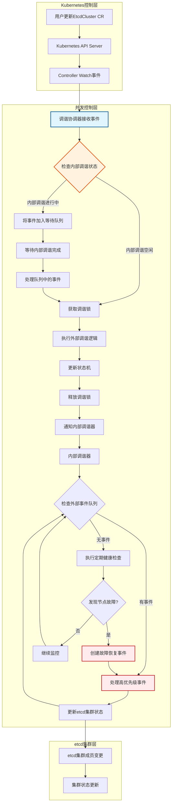
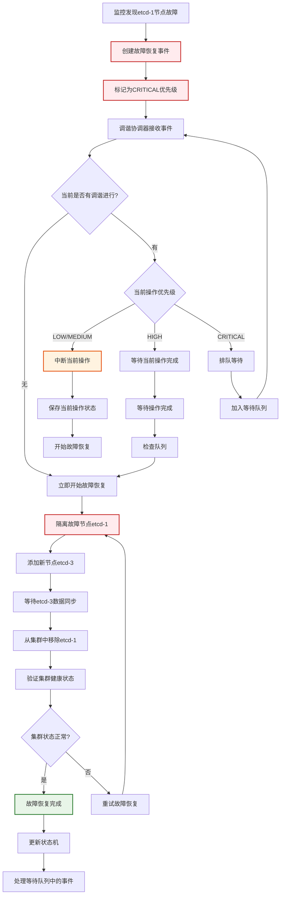
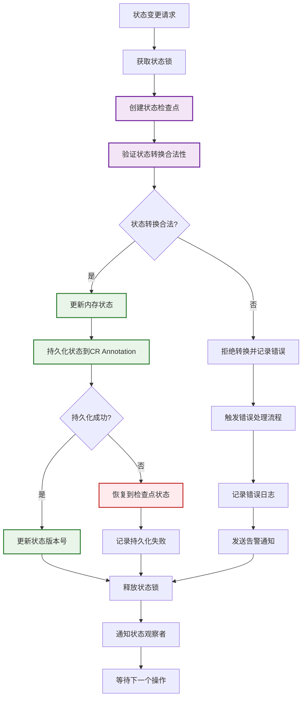
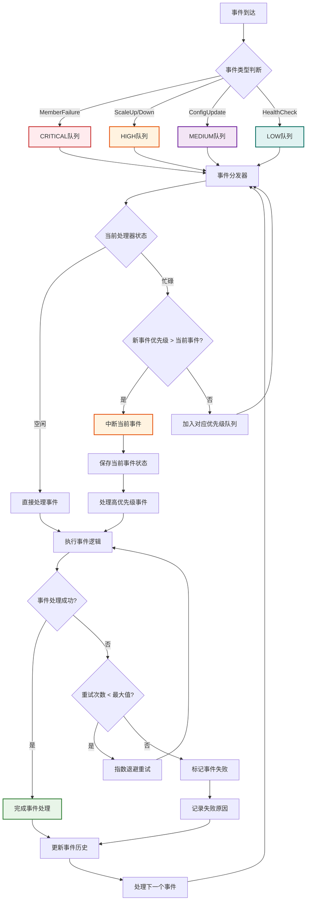
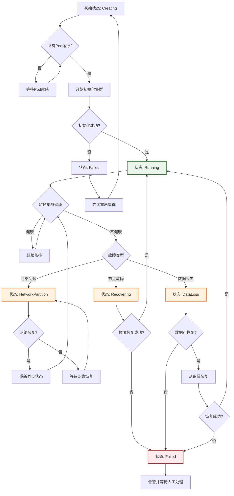

# 双调谐并发控制流程图

## 1. 整体架构流程



## 2. 故障恢复优先级处理流程



## 3. 扩缩容操作并发处理流程

```mermaid
flowchart TD
    A[用户请求扩容: Size=3→5] --> B[Controller接收CR变更]
    B --> C[调谐协调器处理]

    C --> D{获取调谐锁}
    D -->|成功| E[开始扩容操作]
    D -->|失败| F[加入等待队列]

    E --> G[创建扩容事件(HIGH优先级)]
    G --> H[计算需要添加的节点]
    H --> I[添加etcd-3, etcd-4]

    I --> J[等待新节点启动]
    J --> K{新节点都就绪?}
    K -->|否| L[等待并重试检查]
    K -->|是| M[将新节点加入etcd集群]

    M --> N[等待数据同步完成]
    N --> O[验证集群成员数]

    O --> P{成员数=5?}
    P -->|是| Q[扩容完成]
    P -->|否| R[重试添加成员]

    Q --> S[更新CR状态]
    S --> T[释放调谐锁]
    T --> U[处理等待队列]

    L --> K
    R --> M

    F --> C

    style A fill:#e3f2fd,stroke:#1565c0,stroke-width:2px
    style G fill:#fff3e0,stroke:#e65100,stroke-width:2px
    style Q fill:#e8f5e8,stroke:#2e7d32,stroke-width:2px
```

## 4. 状态同步与一致性保证流程



## 5. 控制器崩溃恢复流程

```mermaid
flowchart TD
    A[原控制器运行中] --> B[执行扩容操作]
    B --> C[已添加etcd-3, etcd-4]
    C --> D[准备添加etcd-5]

    D --> E[保存操作状态到CR]
    E --> F[状态: "扩容进行中, 待添加etcd-5"]

    F --> G[控制器崩溃]
    G --> H[进程终止]

    H --> I[新控制器启动]
    I --> J[检查CR中的持久化状态]
    J --> K[发现未完成的扩容操作]

    K --> L[验证当前etcd集群状态]
    L --> M[实际成员: etcd-0,1,2,3,4]

    M --> N[对比期望状态]
    N --> O[期望: 5节点, 实际: 5节点]

    O --> P[发现状态不一致]
    P --> Q[继续添加etcd-5]

    Q --> R[等待etcd-5就绪]
    R --> S[完成扩容操作]

    S --> T[更新CR状态为完成]
    T --> U[清理临时状态]

    U --> V[恢复正常监控]

    style E fill:#fff3e0,stroke:#e65100,stroke-width:2px
    style F fill:#fff3e0,stroke:#e65100,stroke-width:2px
    style G fill:#ffebee,stroke:#c62828,stroke-width:2px
    style K fill:#fff3e0,stroke:#e65100,stroke-width:2px
    style S fill:#e8f5e8,stroke:#2e7d32,stroke-width:2px
```

## 6. 多事件并发处理时序图

```mermaid
sequenceDiagram
    participant 用户 as 用户/管理员
    participant K8s as Kubernetes API
    participant 协调器 as 调谐协调器
    participant 队列 as 事件队列
    participant 处理器 as 事件处理器
    participant 集群 as etcd集群

    Note over 用户,集群: 初始状态: 3节点集群正常运行

    用户->>K8s: 请求扩容到5节点
    K8s->>协调器: CR变更事件
    协调器->>协调器: 获取调谐锁成功

    Note over 协调器: 开始扩容操作<br/>优先级: HIGH

    协调器->>队列: 创建扩容事件
    队列->>处理器: 开始处理扩容

    处理器->>集群: 添加etcd-3
    处理器->>集群: 添加etcd-4

    Note over 处理器: 等待新节点就绪...

    同时, 监控组件->>监控组件: 发现etcd-1故障
    监控组件->>协调器: 故障恢复事件<br/>优先级: CRITICAL

    协调器->>处理器: 中断当前扩容操作
    处理器->>队列: 保存扩容进度<br/>"已添加etcd-3,4"

    协调器->>协调器: 开始故障恢复
    协调器->>处理器: 处理故障恢复

    处理器->>集群: 隔离故障节点etcd-1
    处理器->>集群: 添加etcd-5替换etcd-1

    Note over 集群: etcd-5加入并同步数据

    处理器->>集群: 移除etcd-1成员
    处理器->>协调器: 故障恢复完成

    协调器->>队列: 恢复中断的扩容操作
    队列->>处理器: 继续扩容

    处理器->>处理器: 检查etcd-3,4状态
    处理器->>集群: 等待etcd-3,4完全就绪

    Note over 集群: 集群现在有5个健康节点:<br/>etcd-0,2,3,4,5

    处理器->>协调器: 扩容操作完成
    协调器->>K8s: 更新CR状态

    Note over 协调器,集群: 最终状态:<br/>5节点集群正常运行<br/>故障节点已替换
```

## 7. 事件队列优先级处理流程



## 8. 状态机转换流程



这些流程图详细展示了双调谐并发控制的各个方面，包括：

1. **整体架构**：展示了从用户操作到etcd集群变更的完整流程
2. **故障恢复优先级**：说明了故障恢复如何中断其他操作
3. **扩缩容操作**：展示了扩缩容的完整生命周期
4. **状态同步**：保证了三种状态的一致性
5. **崩溃恢复**：确保控制器重启后能恢复未完成的操作
6. **多事件处理**：展示了多个事件如何协调处理
7. **事件队列**：说明了优先级队列的工作机制
8. **状态机**：展示了集群状态的各种转换

每个流程图都基于实际的业务场景，使用了丰富的颜色标注来区分不同类型的状态和操作，便于理解整个系统的工作原理。