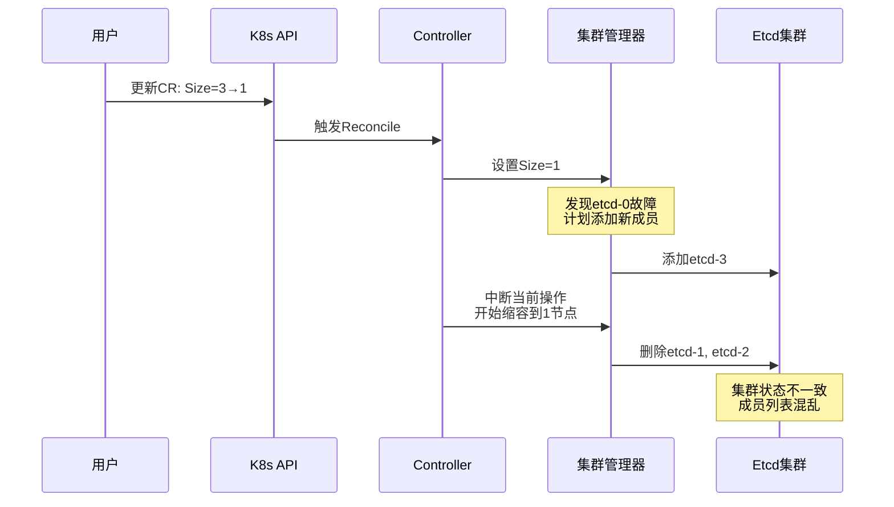
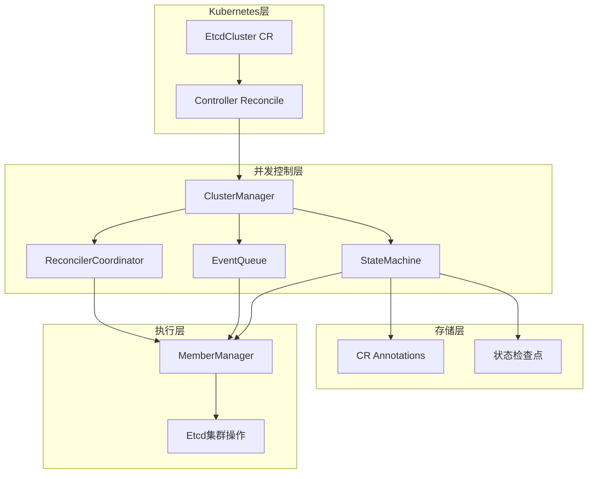
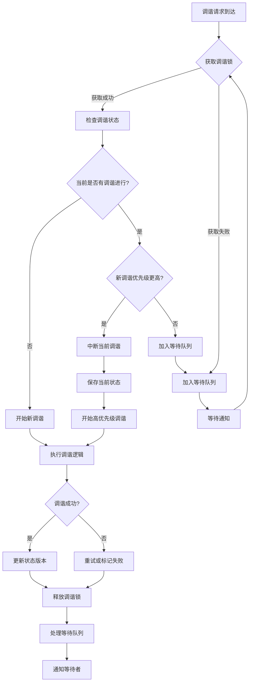
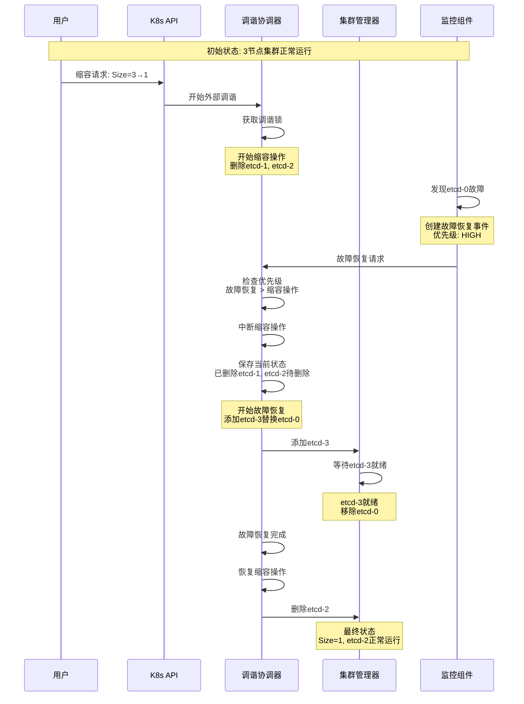
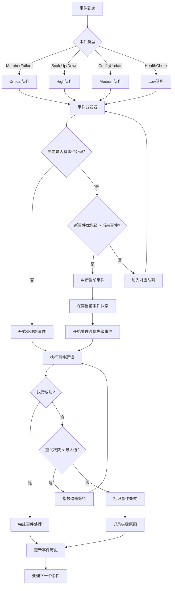
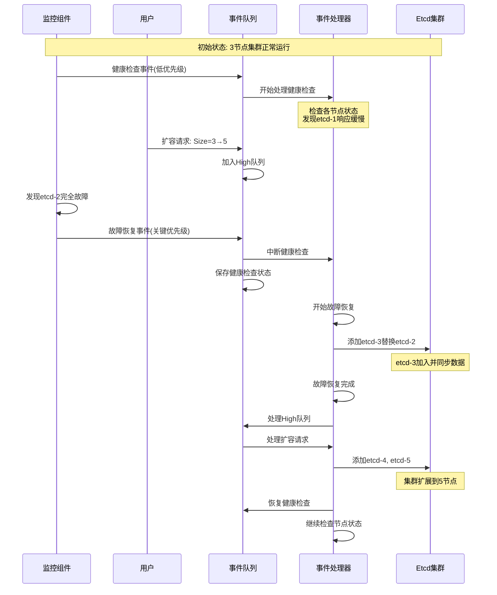
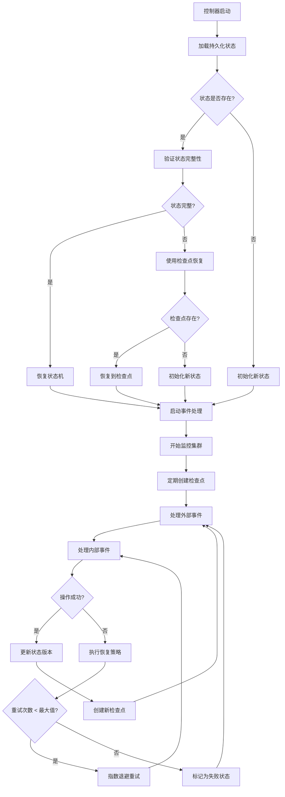
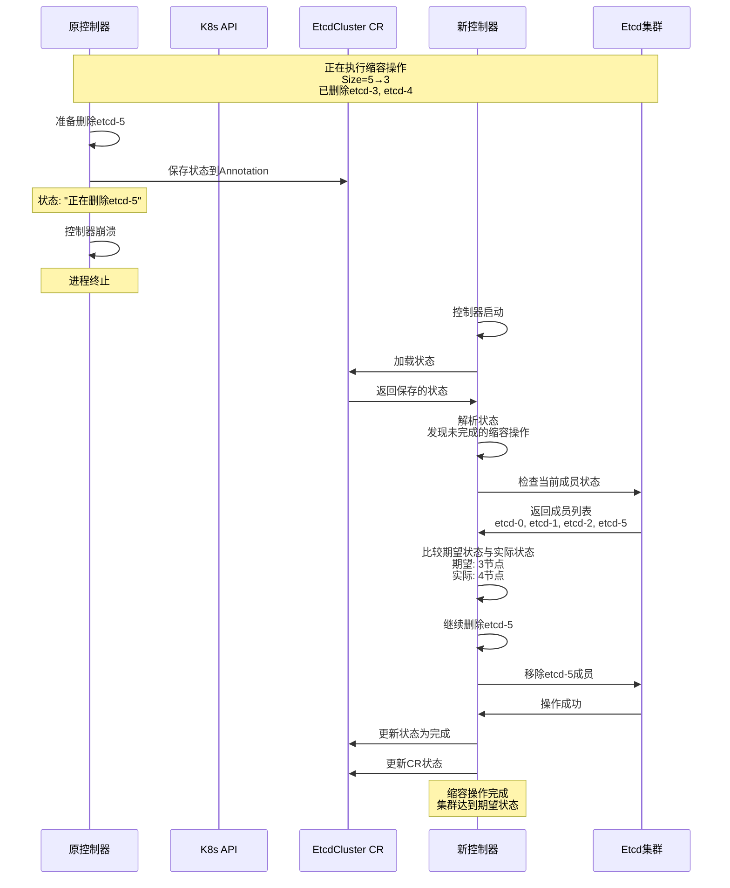
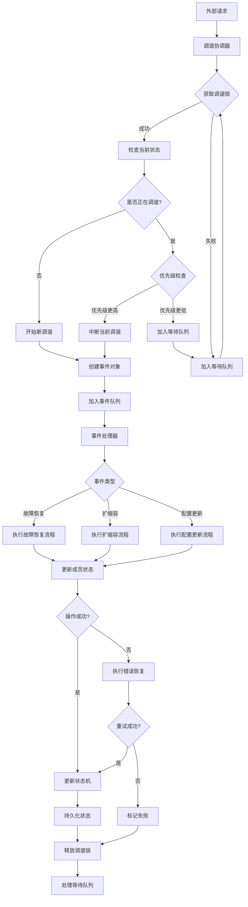
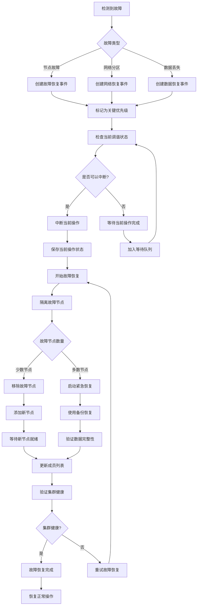

# Etcd Operator 双调谐并发控制设计方案

> 本文详细分析了etcd operator在实现自动扩缩容和故障恢复过程中遇到的并发控制问题，并提出了一套完整的解决方案。

## 问题背景

### 当前困境

在构建生产级etcd operator时，我们面临一个经典的分布式系统设计挑战：**如何同时处理外部资源变化和内部集群状态管理，而不产生竞态条件？**

当前实现的etcd operator采用了**双调谐模式**：

1. **外部调谐**：Kubernetes Controller监听EtcdCluster CR的变化，处理扩缩容请求
2. **内部调谐**：每个etcd集群实例运行独立的goroutine，定期检查成员健康状态并执行故障恢复

这种设计看似合理，但在实际运行中暴露了严重的并发问题。

### 核心问题分析

#### 问题1：双重调谐竞态条件

```go
// 外部Controller调谐（由Kubernetes触发）
func (r *EtcdClusterReconciler) Reconcile(ctx context.Context, req ctrl.Request) {
    // 用户将集群大小从3调整为1
    etcdCluster.Spec.Size = 1

    // 立即更新内部集群实例
    cluster := &Cluster{Size: 1}
    r.clusters.Store(key, cluster)
}

// 内部集群调谐（每5秒执行）
func (c *Cluster) run() {
    for {
        select {
        case <-time.After(5 * time.Second):
            // 发现实际有3个节点在运行，其中1个故障
            // 计划执行故障恢复，添加新节点
            c.recoverFailure()
        }
    }
}
```

**场景描述**：
- 用户要求缩容到1个节点
- 内部调谐正在处理3节点集群的故障恢复
- 两个操作同时对etcd成员进行管理，导致集群状态混乱

#### 问题2：事件处理乱序



#### 问题3：状态不一致

**内存状态 vs CR状态 vs 实际集群状态**

```go
// 三种状态可能不一致：
// 1. c.status.Size = 1 (内存中的状态)
// 2. c.cluster.Status.Size = 3 (CR中记录的状态)
// 3. 实际etcd集群有2个正常运行节点 + 1个故障节点
```

## 解决方案总览

### 设计目标

1. **串行化处理**：同一时间只有一个调谐操作执行
2. **优先级管理**：故障恢复优先于扩缩容操作
3. **最终一致性**：确保三种状态最终达成一致
4. **容错能力**：控制器重启后能够恢复正确状态

### 核心架构



## 详细设计

### 1. 调谐协调器 (ReconcilerCoordinator)

#### 核心数据结构

```go
type ReconcilerCoordinator struct {
    // 调谐状态锁
    reconcileMutex sync.Mutex

    // 当前调谐状态
    currentState ReconcileState

    // 等待队列
    pendingQueue []*ReconcileEvent

    // 状态版本号
    stateVersion int64

    // 通知通道
    notifyCh chan struct{}
}

type ReconcileState struct {
    // 外部调谐是否进行中
    ExternalReconciling bool

    // 内部调谐是否进行中
    InternalReconciling bool

    // 当前调谐的类型
    CurrentType ReconcileType

    // 开始时间
    StartTime time.Time

    // 状态版本
    Version int64
}

type ReconcileType string

const (
    ReconcileTypeExternal  ReconcileType = "external"  // 外部CR变化触发
    ReconcileTypeInternal  ReconcileType = "internal"  // 内部健康检查触发
    ReconcileTypeRecovery  ReconcileType = "recovery"  // 故障恢复触发
)
```

#### 工作流程



#### 实际场景：故障恢复中断扩缩容



### 2. 优先级事件队列 (EventQueue)

#### 事件优先级定义

```go
type EventType string
type Priority int

const (
    PriorityCritical Priority = iota + 1  // 关键：故障恢复
    PriorityHigh                         // 高：扩缩容
    PriorityMedium                       // 中：配置更新
    PriorityLow                          // 低：状态检查
)

var eventPriority = map[EventType]Priority{
    EventTypeMemberFailure: PriorityCritical,  // 成员故障 - 最高优先级
    EventTypeQuorumLoss:   PriorityCritical,  // 法定人数丢失 - 最高优先级
    EventTypeScaleDown:    PriorityHigh,      // 缩容 - 高优先级
    EventTypeScaleUp:      PriorityHigh,      // 扩容 - 高优先级
    EventTypeConfigUpdate: PriorityMedium,    // 配置更新 - 中优先级
    EventTypeHealthCheck:  PriorityLow,       // 健康检查 - 低优先级
}
```

#### 队列实现

```go
type EventQueue struct {
    // 分优先级队列
    criticalQueue []*ReconcileEvent  // 关键事件
    highQueue     []*ReconcileEvent  // 高优先级事件
    mediumQueue   []*ReconcileEvent  // 中优先级事件
    lowQueue      []*ReconcileEvent  // 低优先级事件

    // 队列锁
    queueMutex sync.RWMutex

    // 当前处理的事件
    currentEvent *ReconcileEvent

    // 事件历史
    eventHistory map[string]*EventRecord

    // 统计信息
    stats EventQueueStats
}

type ReconcileEvent struct {
    // 事件标识
    EventID string

    // 事件类型
    Type EventType

    // 优先级
    Priority Priority

    // 事件数据
    Data interface{}

    // 重试配置
    MaxRetries int
    RetryCount int

    // 时间戳
    CreatedAt time.Time
    ExpiresAt time.Time

    // 回调函数
    Callback func(*ReconcileEvent) error
}
```

#### 事件处理流程



#### 实际场景：多事件并发处理



### 3. 状态机与容错机制

#### 状态机设计

```go
type ClusterState struct {
    // 状态版本
    Version int64

    // 集群规格
    Spec ClusterSpec

    // 当前状态
    Status ClusterStatus

    // 成员信息
    Members map[string]MemberInfo

    // 正在进行的操作
    CurrentOperation *OperationInfo

    // 上次操作结果
    LastOperationResult *OperationResult

    // 检查点信息
    Checkpoint *CheckpointInfo
}

type StateMachine struct {
    // 当前状态
    currentState *ClusterState

    // 状态锁
    stateLock sync.RWMutex

    // 状态存储
    stateStore StateStore

    // 状态转换规则
    transitions map[StateType]map[EventType]StateType

    // 重试管理器
    retryManager *RetryManager
}
```

#### 状态持久化

```go
// 基于CR Annotation的状态存储
type CRStateStore struct {
    client  client.Client
    cluster *v1alpha1.EtcdCluster
}

func (s *CRStateStore) Save(state *ClusterState) error {
    // 1. 序列化状态
    stateData, err := json.Marshal(state)
    if err != nil {
        return err
    }

    // 2. 更新CR Annotations
    annotations := s.cluster.GetAnnotations()
    if annotations == nil {
        annotations = make(map[string]string)
    }

    annotations["etcd.cluster.state"] = string(stateData)
    annotations["etcd.cluster.version"] = fmt.Sprintf("%d", state.Version)
    annotations["etcd.cluster.timestamp"] = time.Now().Format(time.RFC3339)

    // 3. 更新CR
    s.cluster.SetAnnotations(annotations)
    return s.client.Update(context.Background(), s.cluster)
}

func (s *CRStateStore) Load() (*ClusterState, error) {
    annotations := s.cluster.GetAnnotations()
    stateData, exists := annotations["etcd.cluster.state"]
    if !exists {
        return nil, fmt.Errorf("no state found")
    }

    var state ClusterState
    err := json.Unmarshal([]byte(stateData), &state)
    if err != nil {
        return nil, err
    }

    return &state, nil
}
```

#### 容错恢复流程



#### 实际场景：控制器崩溃恢复



### 4. 完整工作流程

#### 正常操作流程



#### 故障处理流程



## 关键技术点

### 1. 状态版本控制

```go
type VersionedState struct {
    Version    int64                    `json:"version"`
    Timestamp  time.Time                `json:"timestamp"`
    Data       *ClusterState            `json:"data"`
    Checksum   string                   `json:"checksum"`
    Signatures map[string]string        `json:"signatures"`
}

func (vs *VersionedState) Validate() bool {
    // 验证版本连续性
    if vs.Version <= 0 {
        return false
    }

    // 验证时间戳合理性
    if vs.Timestamp.After(time.Now()) {
        return false
    }

    // 验证数据完整性
    calculatedChecksum := calculateChecksum(vs.Data)
    if vs.Checksum != calculatedChecksum {
        return false
    }

    return true
}
```

### 2. 指数退避重试

```go
type RetryManager struct {
    maxRetries    int
    baseDelay     time.Duration
    maxDelay      time.Duration
    multiplier    float64
    jitter        float64
}

func (rm *RetryManager) NextDelay(attempt int) time.Duration {
    if attempt >= rm.maxRetries {
        return 0 // 不再重试
    }

    // 计算指数退避
    delay := time.Duration(float64(rm.baseDelay) *
        math.Pow(rm.multiplier, float64(attempt)))

    // 限制最大延迟
    if delay > rm.maxDelay {
        delay = rm.maxDelay
    }

    // 添加抖动
    jitter := time.Duration(float64(delay) * rm.jitter *
        (rand.Float64()*2 - 1))

    return delay + jitter
}
```

### 3. 分布式锁机制

```go
type DistributedLock struct {
    lockName    string
    holder      string
    ttl         time.Duration
    client      client.Client
    cluster     *v1alpha1.EtcdCluster
}

func (dl *DistributedLock) Acquire() (bool, error) {
    // 1. 检查锁是否已被持有
    annotations := dl.cluster.GetAnnotations()
    if annotations != nil {
        if holder, exists := annotations[dl.lockName]; exists {
            // 检查TTL是否已过期
            if timestamp, exists := annotations[dl.lockName+".timestamp"]; exists {
                lockTime, err := time.Parse(time.RFC3339, timestamp)
                if err == nil && time.Since(lockTime) < dl.ttl {
                    return false, nil // 锁仍有效
                }
            }
        }
    }

    // 2. 获取锁
    if annotations == nil {
        annotations = make(map[string]string)
    }

    annotations[dl.lockName] = dl.holder
    annotations[dl.lockName+".timestamp"] = time.Now().Format(time.RFC3339)

    dl.cluster.SetAnnotations(annotations)
    err := dl.client.Update(context.Background(), dl.cluster)
    if err != nil {
        return false, err
    }

    return true, nil
}

func (dl *DistributedLock) Release() error {
    annotations := dl.cluster.GetAnnotations()
    if annotations == nil {
        return nil
    }

    // 验证锁持有者
    if holder, exists := annotations[dl.lockName]; exists && holder == dl.holder {
        delete(annotations, dl.lockName)
        delete(annotations, dl.lockName+".timestamp")

        dl.cluster.SetAnnotations(annotations)
        return dl.client.Update(context.Background(), dl.cluster)
    }

    return nil
}
```

## 性能优化

### 1. 批量事件处理

```go
type EventBatchProcessor struct {
    batchSize    int
    batchTimeout time.Duration
    currentBatch []*ReconcileEvent
    batchTimer   *time.Timer
}

func (ebp *EventBatchProcessor) AddEvent(event *ReconcileEvent) {
    ebp.currentBatch = append(ebp.currentBatch, event)

    if len(ebp.currentBatch) >= ebp.batchSize {
        ebp.processBatch()
    } else {
        ebp.resetBatchTimer()
    }
}

func (ebp *EventBatchProcessor) processBatch() {
    if len(ebp.currentBatch) == 0 {
        return
    }

    // 按优先级排序
    sort.Slice(ebp.currentBatch, func(i, j int) bool {
        return ebp.currentBatch[i].Priority > ebp.currentBatch[j].Priority
    })

    // 批量处理
    for _, event := range ebp.currentBatch {
        ebp.processEvent(event)
    }

    ebp.currentBatch = ebp.currentBatch[:0]
}
```

### 2. 状态缓存优化

```go
type StateCache struct {
    cache       map[string]*CachedState
    ttl         time.Duration
    mutex       sync.RWMutex
    hitCounter  int64
    missCounter int64
}

type CachedState struct {
    State      *ClusterState
    Expiration time.Time
    AccessTime time.Time
}

func (sc *StateCache) Get(key string) (*ClusterState, bool) {
    sc.mutex.RLock()
    defer sc.mutex.RUnlock()

    cached, exists := sc.cache[key]
    if !exists {
        sc.missCounter++
        return nil, false
    }

    if time.Now().After(cached.Expiration) {
        sc.missCounter++
        delete(sc.cache, key)
        return nil, false
    }

    sc.hitCounter++
    cached.AccessTime = time.Now()
    return cached.State, true
}

func (sc *StateCache) Put(key string, state *ClusterState) {
    sc.mutex.Lock()
    defer sc.mutex.Unlock()

    sc.cache[key] = &CachedState{
        State:      state,
        Expiration: time.Now().Add(sc.ttl),
        AccessTime: time.Now(),
    }
}
```

## 监控与可观测性

### 1. 关键指标

```go
type Metrics struct {
    // 调谐指标
    ReconcileTotal     prometheus.Counter
    ReconcileErrors    prometheus.Counter
    ReconcileDuration  prometheus.Histogram

    // 事件队列指标
    QueueSize          prometheus.Gauge
    EventsProcessed    prometheus.Counter
    EventsFailed       prometheus.Counter
    EventLatency       prometheus.Histogram

    // 状态机指标
    StateTransitions   prometheus.Counter
    StateErrors        prometheus.Counter
    StateVersion       prometheus.Gauge

    // 容错指标
    RetriesTotal       prometheus.Counter
    RecoveriesTotal    prometheus.Counter
    CheckpointsTotal   prometheus.Counter
}

func (m *Metrics) Register() {
    // 注册Prometheus指标
    m.ReconcileTotal = prometheus.NewCounter(prometheus.CounterOpts{
        Name: "etcd_operator_reconcile_total",
        Help: "Total number of reconcile operations",
    })

    m.ReconcileErrors = prometheus.NewCounter(prometheus.CounterOpts{
        Name: "etcd_operator_reconcile_errors_total",
        Help: "Total number of reconcile errors",
    })

    m.ReconcileDuration = prometheus.NewHistogram(prometheus.HistogramOpts{
        Name: "etcd_operator_reconcile_duration_seconds",
        Help: "Duration of reconcile operations",
    })

    // 注册更多指标...

    prometheus.MustRegister(m.ReconcileTotal)
    prometheus.MustRegister(m.ReconcileErrors)
    prometheus.MustRegister(m.ReconcileDuration)
    // 注册更多指标...
}
```

### 2. 事件追踪

```go
type EventTracer struct {
    traceStore TraceStore
    logger     logr.Logger
}

type TraceRecord struct {
    TraceID    string    `json:"trace_id"`
    EventID    string    `json:"event_id"`
    EventType  string    `json:"event_type"`
    Timestamp  time.Time `json:"timestamp"`
    Duration   time.Duration `json:"duration"`
    Status     string    `json:"status"`
    Error      string    `json:"error,omitempty"`
    Metadata   map[string]interface{} `json:"metadata"`
}

func (et *EventTracer) StartTrace(eventType string, metadata map[string]interface{}) *TraceContext {
    traceID := uuid.New().String()
    eventID := fmt.Sprintf("%s-%d", traceID, time.Now().UnixNano())

    trace := &TraceRecord{
        TraceID:   traceID,
        EventID:   eventID,
        EventType: eventType,
        Timestamp: time.Now(),
        Status:    "started",
        Metadata:  metadata,
    }

    et.traceStore.Store(trace)

    return &TraceContext{
        traceID:    traceID,
        eventID:    eventID,
        startTime:  time.Now(),
        tracer:     et,
        metadata:   metadata,
    }
}

type TraceContext struct {
    traceID    string
    eventID    string
    startTime  time.Time
    tracer     *EventTracer
    metadata   map[string]interface{}
}

func (tc *TraceContext) Finish(err error) {
    duration := time.Since(tc.startTime)
    status := "completed"
    errorMsg := ""

    if err != nil {
        status = "failed"
        errorMsg = err.Error()
    }

    trace := &TraceRecord{
        TraceID:   tc.traceID,
        EventID:   tc.eventID,
        EventType: "operation_complete",
        Timestamp: time.Now(),
        Duration:  duration,
        Status:    status,
        Error:     errorMsg,
        Metadata:  tc.metadata,
    }

    tc.tracer.traceStore.Store(trace)
}
```

## 部署与测试

### 1. 渐进式部署策略

```yaml
# Feature Flag配置
apiVersion: v1
kind: ConfigMap
metadata:
  name: etcd-operator-config
data:
  # 并发控制模式
  CONCURRENCY_CONTROL_MODE: "coordinator"  # coordinator, legacy

  # 事件队列配置
  EVENT_QUEUE_SIZE: "100"
  EVENT_BATCH_SIZE: "10"

  # 重试配置
  MAX_RETRIES: "5"
  BASE_RETRY_DELAY: "1s"
  MAX_RETRY_DELAY: "5m"

  # 状态持久化
  STATE_PERSISTENCE_ENABLED: "true"
  CHECKPOINT_INTERVAL: "30s"

  # 监控配置
  METRICS_ENABLED: "true"
  TRACING_ENABLED: "true"
```

### 2. 测试场景

#### 测试场景1：并发扩缩容

```go
func TestConcurrentScaling(t *testing.T) {
    // 创建测试集群
    cluster := createTestCluster(3)

    // 并发执行扩缩容操作
    var wg sync.WaitGroup
    operations := []struct {
        name string
        size int
    }{
        {"scale-up-1", 5},
        {"scale-down-1", 1},
        {"scale-up-2", 7},
        {"scale-down-2", 3},
    }

    for _, op := range operations {
        wg.Add(1)
        go func(name string, size int) {
            defer wg.Done()

            // 模拟并发扩缩容
            err := cluster.UpdateSize(size)
            assert.NoError(t, err, "Operation %s failed", name)
        }(op.name, op.size)
    }

    wg.Wait()

    // 验证最终状态
    finalSize := cluster.GetSize()
    assert.Equal(t, 3, finalSize, "Final cluster size should be 3")
}
```

#### 测试场景2：故障恢复

```go
func TestFailureRecovery(t *testing.T) {
    // 创建测试集群
    cluster := createTestCluster(3)

    // 模拟节点故障
    cluster.SimulateNodeFailure("etcd-1")

    // 等待故障检测
    time.Sleep(10 * time.Second)

    // 验证故障恢复
    members := cluster.GetMembers()
    assert.Equal(t, 3, len(members), "Cluster should have 3 members after recovery")

    // 验证新节点已替换故障节点
    assert.NotContains(t, members, "etcd-1", "Failed node should be replaced")
    assert.Contains(t, members, "etcd-3", "New node should be added")
}
```

#### 测试场景3：控制器崩溃恢复

```go
func TestControllerCrashRecovery(t *testing.T) {
    // 创建测试集群
    cluster := createTestCluster(5)

    // 开始缩容操作
    go func() {
        cluster.UpdateSize(3)
    }()

    // 等待操作开始
    time.Sleep(2 * time.Second)

    // 模拟控制器崩溃
    cluster.SimulateControllerCrash()

    // 等待控制器重启
    time.Sleep(5 * time.Second)

    // 验证操作恢复
    finalSize := cluster.GetSize()
    assert.Equal(t, 3, finalSize, "Scaling operation should complete after recovery")
}
```

## 总结与展望

### 解决方案优势

1. **完全解决并发问题**：通过调谐协调器和事件队列，彻底解决了双重调谐的竞态条件
2. **高可用性**：支持控制器崩溃恢复，确保系统稳定性
3. **可观测性**：完整的监控和追踪体系，便于问题排查
4. **可扩展性**：模块化设计，便于后续功能扩展

### 实施建议

1. **分阶段实施**：先实现核心的调谐协调器，再逐步添加其他功能
2. **充分测试**：特别是并发场景和故障恢复场景
3. **监控覆盖**：确保所有关键操作都有监控指标
4. **文档完善**：为运维人员提供详细的操作手册

### 未来展望

1. **智能调度**：基于机器学习的故障预测和自动调优
2. **多集群管理**：支持跨多个Kubernetes集群的etcd集群管理
3. **自动化运维**：与CI/CD系统集成，实现完全自动化的集群管理

---

*这个方案不仅解决了当前etcd operator的并发控制问题，还为未来的功能扩展提供了坚实的基础。通过系统性的设计和实现，我们可以构建一个真正生产级的etcd集群管理解决方案。*