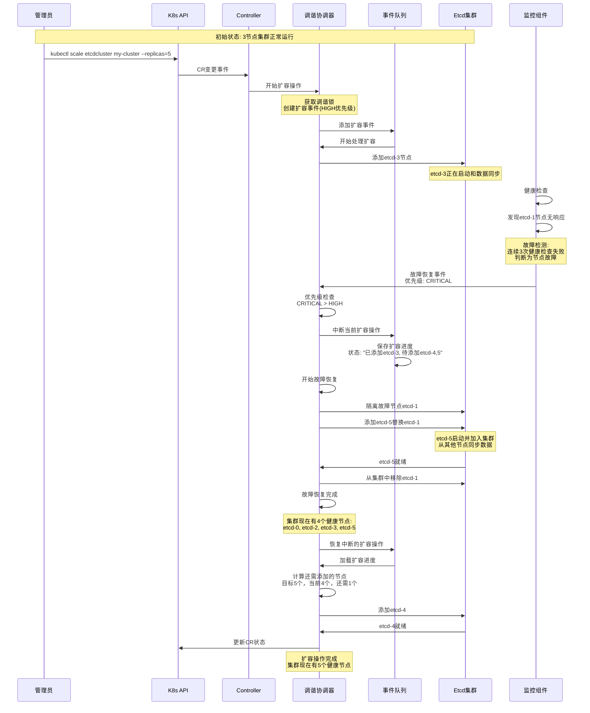
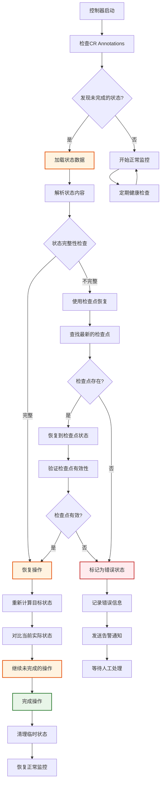
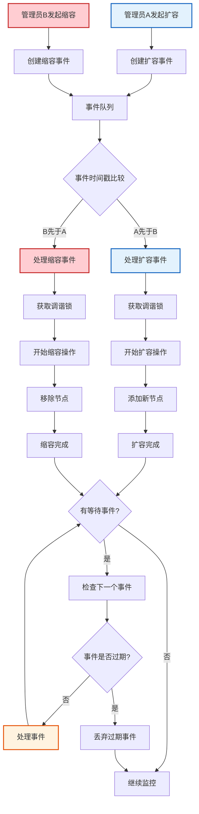
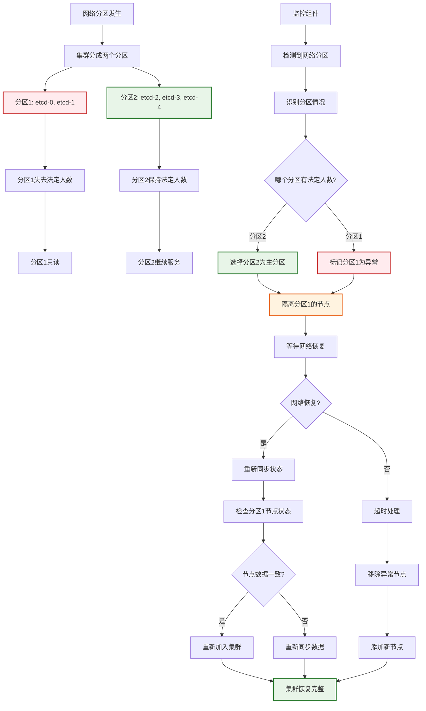
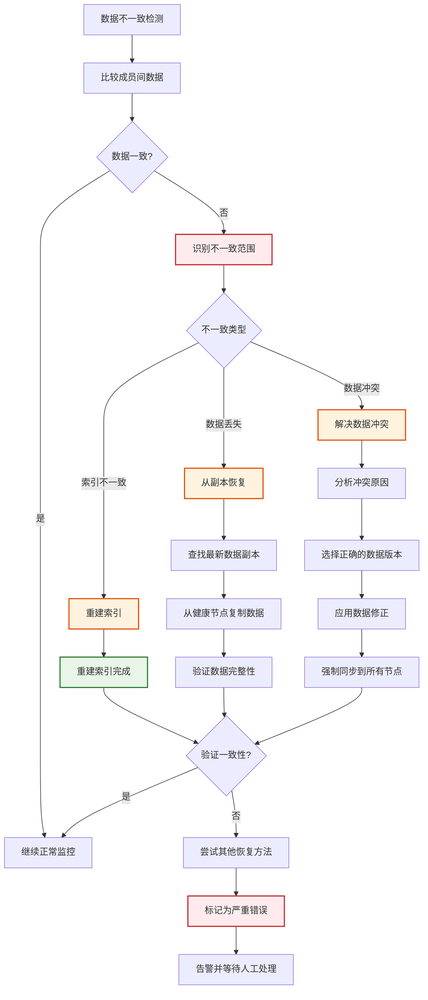
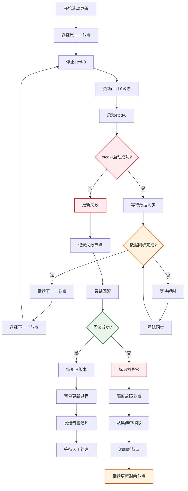

# 实际场景分析与解决方案

## 场景1：故障恢复中断扩缩容操作

### 场景描述
在生产环境中，一个常见的场景是：管理员正在执行扩容操作，突然某个节点发生故障。此时系统需要优先处理故障恢复，同时确保扩容操作不会丢失。

### 详细分析



### 关键处理逻辑

1. **优先级判断**：故障恢复(CRITICAL) > 扩容操作(HIGH)
2. **状态保存**：中断前保存当前操作进度
3. **故障恢复**：快速替换故障节点
4. **操作恢复**：基于保存的状态继续完成扩容

### 代码实现要点

```go
func (rc *ReconcilerCoordinator) handleInterruption(currentEvent, newEvent *ReconcileEvent) error {
    // 1. 检查优先级
    if newEvent.Priority <= currentEvent.Priority {
        return fmt.Errorf("new event priority is not higher")
    }

    // 2. 保存当前操作状态
    checkpoint := &OperationCheckpoint{
        EventID:     currentEvent.EventID,
        EventType:   currentEvent.Type,
        StartTime:   currentEvent.StartTime,
        Progress:    rc.getCurrentProgress(),
        State:       "interrupted",
        InterruptedBy: newEvent.EventID,
    }

    if err := rc.stateStore.SaveCheckpoint(checkpoint); err != nil {
        return fmt.Errorf("failed to save checkpoint: %w", err)
    }

    // 3. 中断当前操作
    rc.interruptCurrentOperation()

    // 4. 开始高优先级操作
    return rc.startHighPriorityOperation(newEvent)
}
```

## 场景2：控制器崩溃恢复

### 场景描述
控制器在执行关键操作时崩溃，重启后需要能够恢复未完成的操作，确保集群状态最终一致。

### 详细分析



### 实际案例分析

**场景**：控制器在缩容操作过程中崩溃
- 初始状态：5节点集群
- 目标状态：3节点集群
- 崩溃时进度：已删除etcd-3，待删除etcd-4

**状态恢复过程**：

```yaml
# CR Annotations中的状态信息
annotations:
  etcd.cluster.state: |
    {
      "version": 1234,
      "operation": "scale_down",
      "start_time": "2024-01-01T10:00:00Z",
      "target_size": 3,
      "current_size": 4,
      "completed_steps": ["remove_etcd_3"],
      "pending_steps": ["remove_etcd_4"],
      "removed_members": ["etcd-3"]
    }
  etcd.cluster.checkpoint: |
    {
      "checkpoint_id": "cp_1234",
      "operation": "scale_down",
      "timestamp": "2024-01-01T10:05:00Z",
      "progress": 50
    }
```

**恢复逻辑**：

```go
func (cm *ClusterManager) recoverFromCrash() error {
    // 1. 加载持久化状态
    state, err := cm.stateStore.Load()
    if err != nil {
        return fmt.Errorf("failed to load state: %w", err)
    }

    if state == nil || state.CurrentOperation == nil {
        // 没有未完成的操作
        return nil
    }

    // 2. 验证状态完整性
    if !cm.validateStateConsistency(state) {
        return cm.recoverFromCheckpoint()
    }

    // 3. 检查实际集群状态
    actualMembers, err := cm.getActualClusterMembers()
    if err != nil {
        return fmt.Errorf("failed to get actual members: %w", err)
    }

    // 4. 重新计算需要执行的操作
    requiredActions := cm.calculateRecoveryActions(state, actualMembers)

    // 5. 执行恢复操作
    for _, action := range requiredActions {
        if err := cm.executeAction(action); err != nil {
            return fmt.Errorf("failed to execute action %s: %w", action.Type, err)
        }
    }

    // 6. 清理临时状态
    return cm.cleanupRecoveryState()
}
```

## 场景3：并发扩缩容操作

### 场景描述
多个管理员同时操作同一个集群，或者自动化系统同时触发了多个冲突的操作。

### 详细分析



### 冲突解决策略

1. **时间戳优先**：先发生的操作先处理
2. **状态验证**：处理前验证操作是否仍然有效
3. **结果合并**：尽可能合并冲突操作

### 代码实现

```go
func (eq *EventQueue) handleConcurrentEvents(events []*ReconcileEvent) []*ReconcileEvent {
    // 1. 按时间戳排序
    sort.Slice(events, func(i, j int) bool {
        return events[i].CreatedAt.Before(events[j].CreatedAt)
    })

    var validEvents []*ReconcileEvent
    lastKnownState := eq.getLastKnownState()

    // 2. 验证每个事件的有效性
    for _, event := range events {
        if eq.isEventValid(event, lastKnownState) {
            validEvents = append(validEvents, event)
            // 更新已知状态
            lastKnownState = eq.projectState(lastKnownState, event)
        }
    }

    // 3. 尝试合并相邻事件
    mergedEvents := eq.mergeEvents(validEvents)

    return mergedEvents
}

func (eq *EventQueue) isEventValid(event *ReconcileEvent, knownState *ClusterState) bool {
    switch event.Type {
    case EventTypeScaleUp:
        // 扩容操作：只有当当前大小小于目标大小时才有效
        return knownState.Spec.Size < event.Data.(*ScaleUpData).TargetSize

    case EventTypeScaleDown:
        // 缩容操作：只有当当前大小大于目标大小时才有效
        return knownState.Spec.Size > event.Data.(*ScaleDownData).TargetSize

    default:
        return true
    }
}
```

## 场景4：网络分区故障处理

### 场景描述
etcd集群出现网络分区，部分节点无法与其他节点通信，但仍在运行。

### 详细分析



### 网络分区检测策略

```go
func (cm *ClusterManager) detectNetworkPartition() (*PartitionInfo, error) {
    members, err := cm.etcdClient.MemberList(context.Background())
    if err != nil {
        return nil, fmt.Errorf("failed to list members: %w", err)
    }

    // 检查每个成员的健康状态
    var healthyMembers []string
    var unhealthyMembers []string

    for _, member := range members {
        if cm.isMemberHealthy(member) {
            healthyMembers = append(healthyMembers, member.Name)
        } else {
            unhealthyMembers = append(unhealthyMembers, member.Name)
        }
    }

    // 检查是否形成分区
    if len(unhealthyMembers) == 0 {
        return nil, nil // 没有分区
    }

    // 验证法定人数
    if len(healthyMembers) > len(members)/2 {
        // 主分区在健康成员这边
        return &PartitionInfo{
            PrimaryPartition:   healthyMembers,
            SecondaryPartition: unhealthyMembers,
            HasQuorum:          true,
        }, nil
    }

    // 主分区在故障成员那边，需要进一步处理
    return &PartitionInfo{
        PrimaryPartition:   unhealthyMembers,
        SecondaryPartition: healthyMembers,
        HasQuorum:          false,
    }, nil
}
```

## 场景5：数据一致性问题

### 场景描述
由于并发操作或网络问题，导致etcd集群的数据出现不一致。

### 详细分析



### 数据一致性验证

```go
func (cm *ClusterManager) verifyDataConsistency() (*ConsistencyReport, error) {
    members := cm.getClusterMembers()
    report := &ConsistencyReport{
        Timestamp: time.Now(),
        Members:   make(map[string]*MemberConsistency),
    }

    // 1. 检查每个成员的revision
    revisions := make(map[string]int64)
    for _, member := range members {
        revision, err := cm.getMemberRevision(member)
        if err != nil {
            report.Members[member.Name] = &MemberConsistency{
                Healthy: false,
                Error:   err.Error(),
            }
            continue
        }
        revisions[member.Name] = revision
    }

    // 2. 检查revision是否一致
    if !cm.allRevisionsEqual(revisions) {
        report.Inconsistent = true
        report.Details = "Member revisions are not synchronized"
        return report, nil
    }

    // 3. 抽样检查key-value数据
    sampleKeys, err := cm.getSampleKeys()
    if err != nil {
        return nil, fmt.Errorf("failed to get sample keys: %w", err)
    }

    for _, key := range sampleKeys {
        keyConsistency := cm.checkKeyConsistency(key, members)
        if !keyConsistency.Consistent {
            report.Inconsistent = true
            report.InconsistentKeys = append(report.InconsistentKeys, keyConsistency)
        }
    }

    return report, nil
}
```

## 场景6：滚动更新过程中的故障

### 场景描述
在进行etcd版本滚动更新时，某个节点更新失败，导致更新过程中断。

### 详细分析



### 滚动更新策略

```go
func (cm *ClusterManager) performRollingUpdate(update *RollingUpdatePlan) error {
    for _, node := range update.Nodes {
        // 1. 备份当前节点状态
        backup, err := cm.backupNodeState(node)
        if err != nil {
            return fmt.Errorf("failed to backup node %s: %w", node.Name, err)
        }

        // 2. 执行更新
        err = cm.updateNode(node, update.TargetVersion)
        if err != nil {
            // 3. 更新失败，尝试回滚
            if rollbackErr := cm.rollbackNodeUpdate(node, backup); rollbackErr != nil {
                return fmt.Errorf("update failed for node %s: %v, rollback also failed: %w",
                    node.Name, err, rollbackErr)
            }
            return fmt.Errorf("update failed for node %s, rolled back: %w", node.Name, err)
        }

        // 4. 验证更新结果
        if err := cm.verifyNodeUpdate(node, update.TargetVersion); err != nil {
            return fmt.Errorf("verification failed for node %s: %w", node.Name, err)
        }

        // 5. 等待集群稳定
        if err := cm.waitForClusterStability(); err != nil {
            return fmt.Errorf("cluster not stable after updating node %s: %w", node.Name, err)
        }
    }

    return nil
}
```

## 总结

通过以上六个实际场景的分析，我们可以看到：

1. **故障恢复优先级**：确保故障恢复能够及时处理，避免数据丢失
2. **状态持久化**：关键时刻的状态保存对于崩溃恢复至关重要
3. **并发控制**：合理处理并发操作，避免状态混乱
4. **网络分区**：需要有明确的策略处理网络分区情况
5. **数据一致性**：建立完善的数据验证和修复机制
6. **滚动更新**：保证更新过程的可靠性，支持失败回滚

这些场景覆盖了etcd operator在生产环境中可能遇到的主要问题，通过合理的架构设计和完善的错误处理机制，可以构建一个高可用的etcd集群管理系统。