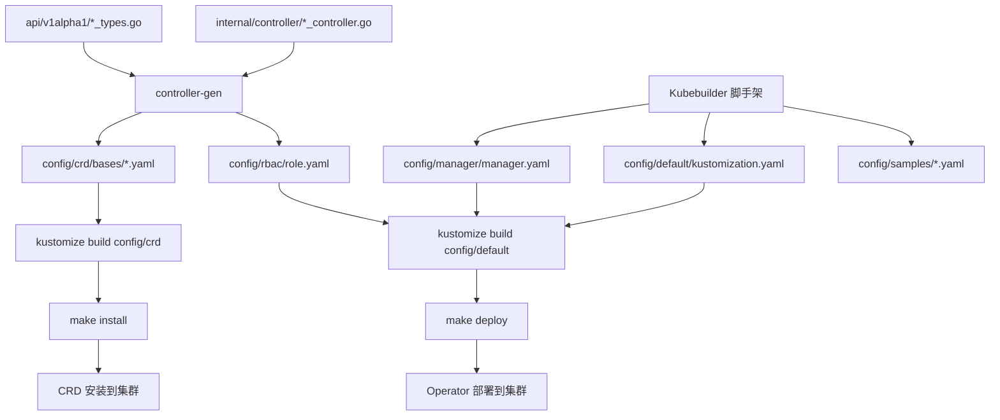

# Config 目录结构与生成机制详解

## 📋 概述

`config` 目录是 Kubebuilder 项目的核心配置目录，包含了 Kubernetes Operator 部署所需的所有 YAML 配置文件。这些文件通过 Kubebuilder 脚手架工具和 controller-gen 工具自动生成，并通过 Kustomize 进行组织和管理。

## 🏗️ 目录结构总览

```
config/
├── crd/                    # 自定义资源定义 (CRD)
│   ├── bases/             # CRD 基础定义文件
│   ├── kustomization.yaml # CRD Kustomize 配置
│   └── kustomizeconfig.yaml # CRD Kustomize 配置选项
├── default/               # 默认部署配置
│   ├── kustomization.yaml # 主 Kustomize 配置
│   ├── manager_metrics_patch.yaml # 指标服务补丁
│   └── metrics_service.yaml # 指标服务定义
├── manager/               # 控制器管理器配置
│   ├── kustomization.yaml # 管理器 Kustomize 配置
│   └── manager.yaml       # 控制器部署配置
├── prometheus/            # Prometheus 监控配置
│   ├── kustomization.yaml # Prometheus Kustomize 配置
│   └── monitor.yaml       # ServiceMonitor 定义
├── rbac/                  # 角色访问控制配置
│   ├── kustomization.yaml # RBAC Kustomize 配置
│   ├── service_account.yaml # 服务账户
│   ├── role.yaml          # 集群角色
│   ├── role_binding.yaml  # 角色绑定
│   ├── leader_election_role.yaml # 领导选举角色
│   ├── leader_election_role_binding.yaml # 领导选举角色绑定
│   └── *_editor_role.yaml # 资源编辑角色
│   └── *_viewer_role.yaml # 资源查看角色
└── samples/               # 示例配置文件
    ├── kustomization.yaml # 示例 Kustomize 配置
    └── etcd_v1alpha1_*.yaml # CRD 示例实例
```

## 🔧 各目录详细说明

### 📁 config/crd/ - 自定义资源定义

**作用**: 定义 Kubernetes 自定义资源 (Custom Resource Definitions)

**生成方式**:
```bash
# 通过 controller-gen 工具生成
make manifests
# 实际执行的命令:
$(CONTROLLER_GEN) rbac:roleName=manager-role crd webhook paths="./..." output:crd:artifacts:config=config/crd/bases
```

**文件说明**:
- `bases/etcd.etcd.io_etcdclusters.yaml` - EtcdCluster CRD 定义
- `bases/etcd.etcd.io_etcdbackups.yaml` - EtcdBackup CRD 定义  
- `bases/etcd.etcd.io_etcdrestores.yaml` - EtcdRestore CRD 定义
- `kustomization.yaml` - 定义要包含的 CRD 资源
- `kustomizeconfig.yaml` - Kustomize 配置选项

**生成源码**: 基于 `api/v1alpha1/*_types.go` 中的结构体定义和注释标记

### 📁 config/rbac/ - 角色访问控制

**作用**: 定义 Operator 运行所需的 RBAC 权限

**生成方式**:
```bash
# 通过 controller-gen 工具生成
make manifests
# 基于控制器代码中的 RBAC 注释生成
```

**文件说明**:
- `service_account.yaml` - 控制器服务账户
- `role.yaml` - 集群角色定义 (基于控制器 RBAC 注释)
- `role_binding.yaml` - 角色绑定
- `leader_election_role.yaml` - 领导选举所需角色
- `leader_election_role_binding.yaml` - 领导选举角色绑定
- `*_editor_role.yaml` - 各 CRD 的编辑权限角色
- `*_viewer_role.yaml` - 各 CRD 的查看权限角色

**生成源码**: 基于控制器文件中的 `//+kubebuilder:rbac` 注释

### 📁 config/manager/ - 控制器管理器

**作用**: 定义控制器 Pod 的部署配置

**生成方式**: Kubebuilder 脚手架生成，手动维护

**文件说明**:
- `manager.yaml` - 控制器 Deployment 和 Namespace 定义
- `kustomization.yaml` - 管理器相关资源配置

**关键配置**:
- 容器镜像: `controller:latest`
- 资源限制: CPU 500m, Memory 128Mi
- 安全上下文: 非 root 用户运行
- 健康检查: liveness 和 readiness 探针

### 📁 config/default/ - 默认部署配置

**作用**: 整合所有配置的主入口点

**生成方式**: Kubebuilder 脚手架生成，手动维护

**文件说明**:
- `kustomization.yaml` - 主 Kustomize 配置文件
- `manager_metrics_patch.yaml` - 指标服务补丁
- `metrics_service.yaml` - 指标服务定义

**功能**:
- 设置命名空间: `etcd-k8s-operator-system`
- 设置名称前缀: `etcd-k8s-operator-`
- 整合 CRD、RBAC、Manager 配置
- 可选功能开关 (Webhook、Prometheus 等)

### 📁 config/samples/ - 示例配置

**作用**: 提供 CRD 实例的示例配置

**生成方式**: Kubebuilder 脚手架生成基础模板，手动完善

**文件说明**:
- `etcd_v1alpha1_etcdcluster.yaml` - EtcdCluster 示例
- `etcd_v1alpha1_etcdbackup.yaml` - EtcdBackup 示例
- `etcd_v1alpha1_etcdrestore.yaml` - EtcdRestore 示例
- `kustomization.yaml` - 示例资源配置

### 📁 config/prometheus/ - 监控配置

**作用**: 定义 Prometheus 监控相关配置

**生成方式**: Kubebuilder 脚手架生成

**文件说明**:
- `monitor.yaml` - ServiceMonitor 定义
- `kustomization.yaml` - Prometheus 相关资源配置

## ⚙️ 生成机制详解

### 1. 初始脚手架生成

项目初始化时通过 Kubebuilder 命令生成基础结构:

```bash
# 初始化项目
kubebuilder init --domain etcd.io --repo github.com/your-org/etcd-k8s-operator

# 创建 API 和控制器
kubebuilder create api --group etcd --version v1alpha1 --kind EtcdCluster --resource --controller
kubebuilder create api --group etcd --version v1alpha1 --kind EtcdBackup --resource --controller  
kubebuilder create api --group etcd --version v1alpha1 --kind EtcdRestore --resource --controller
```

### 2. 自动生成流程

**CRD 生成**:
```bash
# 基于 API 类型定义生成 CRD
controller-gen crd paths="./api/..." output:crd:artifacts:config=config/crd/bases
```

**RBAC 生成**:
```bash
# 基于控制器 RBAC 注释生成权限配置
controller-gen rbac:roleName=manager-role paths="./internal/controller/..."
```

**代码生成**:
```bash
# 生成 DeepCopy 方法
controller-gen object:headerFile="hack/boilerplate.go.txt" paths="./api/..."
```

### 3. Makefile 集成

关键的 Makefile 目标:

```makefile
# 生成所有 manifests
.PHONY: manifests
manifests: controller-gen
	$(CONTROLLER_GEN) rbac:roleName=manager-role crd webhook paths="./..." output:crd:artifacts:config=config/crd/bases

# 生成代码
.PHONY: generate  
generate: controller-gen
	$(CONTROLLER_GEN) object:headerFile="hack/boilerplate.go.txt" paths="./..."

# 安装 CRD
.PHONY: install
install: manifests kustomize
	$(KUSTOMIZE) build config/crd | $(KUBECTL) apply -f -

# 部署 Operator
.PHONY: deploy
deploy: manifests kustomize
	cd config/manager && $(KUSTOMIZE) edit set image controller=${IMG}
	$(KUSTOMIZE) build config/default | $(KUBECTL) apply -f -
```

## 🔄 更新和维护流程

### 1. API 变更流程

当修改 `api/v1alpha1/*_types.go` 后:

```bash
# 1. 重新生成 CRD 和代码
make generate
make manifests

# 2. 更新集群中的 CRD
make install

# 3. 测试变更
kubectl apply -f config/samples/
```

### 2. 控制器权限变更

当在控制器中添加新的 RBAC 注释后:

```bash
# 重新生成 RBAC 配置
make manifests

# 重新部署以应用新权限
make deploy
```

### 3. 部署配置调整

手动编辑以下文件:
- `config/manager/manager.yaml` - 调整资源限制、镜像等
- `config/default/kustomization.yaml` - 调整命名空间、前缀等
- `config/samples/*.yaml` - 更新示例配置

## 🛠️ 工具依赖

### 必需工具

1. **controller-gen** (v0.15.0)
   - 功能: 生成 CRD、RBAC、代码
   - 安装: `make controller-gen`

2. **kustomize** (v5.4.1)  
   - 功能: 配置管理和部署
   - 安装: `make kustomize`

3. **kubectl**
   - 功能: 集群操作
   - 安装: 手动安装

### 版本管理

工具版本在 Makefile 中定义:
```makefile
KUSTOMIZE_VERSION ?= v5.4.1
CONTROLLER_TOOLS_VERSION ?= v0.15.0
```

## 📝 最佳实践

### 1. 配置管理

- **不要直接编辑** `config/crd/bases/` 下的文件，它们会被重新生成
- **使用 Kustomize** 进行配置定制，而不是直接修改基础文件
- **版本控制** 所有配置文件，包括生成的文件

### 2. 开发流程

- 修改 API 后立即运行 `make manifests generate`
- 定期运行 `make install` 保持 CRD 同步
- 使用 `config/samples/` 测试配置变更

### 3. 部署管理

- 使用 `make deploy` 进行开发环境部署
- 生产环境使用 `make build-installer` 生成完整安装包
- 通过环境变量 `IMG` 指定镜像版本

## 🔍 故障排查

### 常见问题

1. **CRD 更新失败**
   ```bash
   # 检查 CRD 语法
   kubectl apply --dry-run=client -f config/crd/bases/
   
   # 强制更新
   make uninstall && make install
   ```

2. **RBAC 权限不足**
   ```bash
   # 检查生成的权限
   cat config/rbac/role.yaml
   
   # 重新生成并部署
   make manifests deploy
   ```

3. **Kustomize 构建失败**
   ```bash
   # 验证 kustomization.yaml 语法
   kustomize build config/default --dry-run
   
   # 检查资源引用
   kustomize build config/crd
   ```

## 📚 相关文档

- [Kubebuilder 官方文档](https://book.kubebuilder.io/)
- [Controller-gen 使用指南](https://book.kubebuilder.io/reference/controller-gen.html)
- [Kustomize 官方文档](https://kustomize.io/)
- [Kubernetes CRD 文档](https://kubernetes.io/docs/concepts/extend-kubernetes/api-extension/custom-resources/)

## 🎯 实际生成命令示例

### 项目初始化命令序列

基于项目历史，以下是实际使用的 Kubebuilder 命令:

```bash
# 1. 初始化项目
kubebuilder init --domain etcd.io --repo github.com/your-org/etcd-k8s-operator

# 2. 创建 EtcdCluster API
kubebuilder create api --group etcd --version v1alpha1 --kind EtcdCluster --resource --controller

# 3. 创建 EtcdBackup API
kubebuilder create api --group etcd --version v1alpha1 --kind EtcdBackup --resource --controller

# 4. 创建 EtcdRestore API
kubebuilder create api --group etcd --version v1alpha1 --kind EtcdRestore --resource --controller
```

### 生成的文件映射关系

| 源文件 | 生成的配置文件 | 生成工具 |
|--------|---------------|----------|
| `api/v1alpha1/etcdcluster_types.go` | `config/crd/bases/etcd.etcd.io_etcdclusters.yaml` | controller-gen |
| `api/v1alpha1/etcdbackup_types.go` | `config/crd/bases/etcd.etcd.io_etcdbackups.yaml` | controller-gen |
| `api/v1alpha1/etcdrestore_types.go` | `config/crd/bases/etcd.etcd.io_etcdrestores.yaml` | controller-gen |
| `internal/controller/*_controller.go` | `config/rbac/role.yaml` | controller-gen |
| Kubebuilder 脚手架 | `config/manager/manager.yaml` | kubebuilder |
| Kubebuilder 脚手架 | `config/default/kustomization.yaml` | kubebuilder |

## 🔧 详细配置文件分析

### config/crd/bases/ 文件结构

每个 CRD 文件包含以下关键部分:

```yaml
apiVersion: apiextensions.k8s.io/v1
kind: CustomResourceDefinition
metadata:
  annotations:
    controller-gen.kubebuilder.io/version: v0.15.0  # 生成工具版本
  name: etcdclusters.etcd.etcd.io                   # CRD 名称
spec:
  group: etcd.etcd.io                               # API 组
  names:
    kind: EtcdCluster                               # 资源类型
    listKind: EtcdClusterList                       # 列表类型
    plural: etcdclusters                            # 复数形式
    shortNames: [etcd]                              # 简短名称
    singular: etcdcluster                           # 单数形式
  scope: Namespaced                                 # 作用域
  versions:                                         # API 版本
  - name: v1alpha1
    schema:                                         # OpenAPI 模式
      openAPIV3Schema: ...                          # 从 Go 结构体生成
    served: true                                    # 是否提供服务
    storage: true                                   # 是否为存储版本
```

### config/rbac/role.yaml 权限分析

基于控制器中的 RBAC 注释生成:

```go
//+kubebuilder:rbac:groups=etcd.etcd.io,resources=etcdclusters,verbs=get;list;watch;create;update;patch;delete
//+kubebuilder:rbac:groups=etcd.etcd.io,resources=etcdclusters/status,verbs=get;update;patch
//+kubebuilder:rbac:groups=apps,resources=statefulsets,verbs=get;list;watch;create;update;patch;delete
//+kubebuilder:rbac:groups="",resources=services,verbs=get;list;watch;create;update;patch;delete
//+kubebuilder:rbac:groups="",resources=configmaps,verbs=get;list;watch;create;update;patch;delete
```

生成的 RBAC 配置:

```yaml
apiVersion: rbac.authorization.k8s.io/v1
kind: ClusterRole
metadata:
  name: manager-role
rules:
- apiGroups: ["etcd.etcd.io"]
  resources: ["etcdclusters"]
  verbs: ["get", "list", "watch", "create", "update", "patch", "delete"]
- apiGroups: ["apps"]
  resources: ["statefulsets"]
  verbs: ["get", "list", "watch", "create", "update", "patch", "delete"]
# ... 更多权限规则
```

### config/manager/manager.yaml 部署配置

关键配置项说明:

```yaml
apiVersion: apps/v1
kind: Deployment
metadata:
  name: controller-manager
  namespace: system
spec:
  replicas: 1                                       # 单实例部署
  selector:
    matchLabels:
      control-plane: controller-manager
  template:
    spec:
      securityContext:
        runAsNonRoot: true                          # 安全上下文
      containers:
      - name: manager
        image: controller:latest                    # 容器镜像
        command: ["/manager"]
        args:
          - --leader-elect                          # 启用领导选举
          - --health-probe-bind-address=:8081       # 健康检查地址
        resources:
          limits:
            cpu: 500m                               # CPU 限制
            memory: 128Mi                           # 内存限制
          requests:
            cpu: 10m                                # CPU 请求
            memory: 64Mi                            # 内存请求
        livenessProbe:                              # 存活探针
          httpGet:
            path: /healthz
            port: 8081
        readinessProbe:                             # 就绪探针
          httpGet:
            path: /readyz
            port: 8081
```

## 🔄 配置更新的触发条件

### 自动重新生成的情况

1. **API 结构体变更**
   - 修改 `api/v1alpha1/*_types.go` 中的字段
   - 添加或删除结构体成员
   - 修改 kubebuilder 注释标记

2. **控制器权限变更**
   - 在控制器中添加新的 `//+kubebuilder:rbac` 注释
   - 修改现有权限范围
   - 添加新的资源操作

3. **Webhook 配置变更**
   - 添加或修改 webhook 注释
   - 启用或禁用 webhook 功能

### 手动维护的配置

1. **部署配置**
   - `config/manager/manager.yaml` 中的资源限制
   - 容器镜像版本和参数
   - 安全上下文配置

2. **Kustomize 配置**
   - `config/default/kustomization.yaml` 中的命名空间
   - 名称前缀和标签
   - 功能开关 (Webhook、Prometheus 等)

3. **示例配置**
   - `config/samples/` 中的示例实例
   - 测试用例配置

## 🚀 部署流程详解

### 开发环境部署

```bash
# 1. 生成最新配置
make manifests generate

# 2. 构建镜像
make docker-build IMG=my-registry/etcd-operator:dev

# 3. 安装 CRD
make install

# 4. 部署控制器
make deploy IMG=my-registry/etcd-operator:dev
```

### 生产环境部署

```bash
# 1. 生成完整安装包
make build-installer IMG=my-registry/etcd-operator:v1.0.0

# 2. 部署到集群
kubectl apply -f dist/install.yaml

# 3. 验证部署
kubectl get pods -n etcd-k8s-operator-system
```

### Kind 集群测试

```bash
# 1. 创建 Kind 集群
make kind-create

# 2. 构建并加载镜像
make kind-load IMG=controller:latest

# 3. 部署测试
make deploy-test
```

## 📊 配置文件依赖关系图



---

*本文档最后更新: 2025-08-15*
*维护者: 开发团队*
