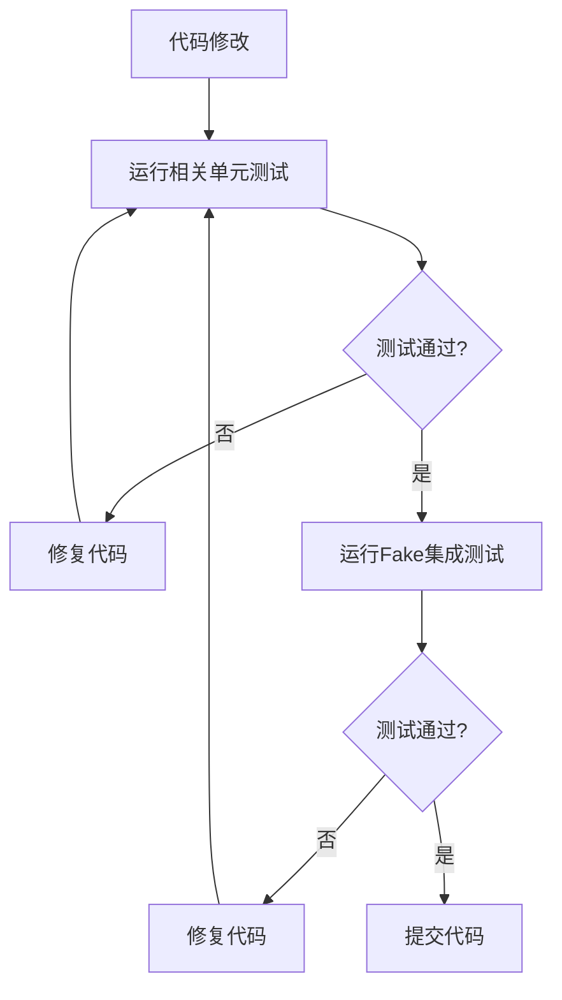
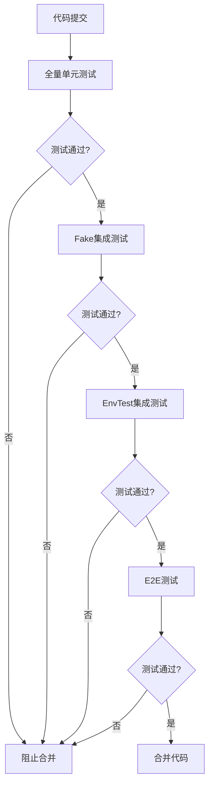

# ETCD Operator 重构计划

**文档版本**: v1.0  
**创建时间**: 2025-08-09  
**目标**: 通过测试驱动开发重构etcd动态扩缩容功能，确保100%可靠性

## 📋 背景分析

### 当前状况
- ✅ **功能已实现**: etcd动态扩缩容功能基本完成
- ❌ **测试不稳定**: 只能在特定情况下执行，修复困难
- 🔧 **代码质量**: 单元测试覆盖率仅24.2%，集成测试刚刚建立
- 🎯 **重构目标**: 通过TDD确保功能100%可靠和健壮

### 核心问题
1. **测试覆盖不足**: 资源管理器覆盖率0%，扩缩容逻辑测试缺失
2. **集成测试不完整**: 多节点集群创建功能未实现
3. **E2E测试不稳定**: 依赖外部环境，难以调试和修复

## 🎯 重构目标

### 主要目标
1. **100%功能可靠性**: 扩缩容功能在任何情况下都能正常工作
2. **高测试覆盖率**: 核心功能单元测试覆盖率达到90%+
3. **稳定的集成测试**: 完整验证组件协作和业务流程
4. **可靠的E2E测试**: 真实环境下的端到端验证

### 质量标准
- **单元测试**: 覆盖率90%+，执行时间<5秒
- **集成测试**: 覆盖核心业务场景，执行时间<30秒
- **E2E测试**: 覆盖用户关键场景，执行时间<10分钟
- **代码质量**: 通过所有静态检查，无技术债务

## 🔧 测试策略分析

### 1. Fake vs EnvTest 选择

#### **当前使用Fake的优势**
- ✅ **速度快**: 纯内存操作，秒级执行
- ✅ **可控性强**: 精确控制测试条件
- ✅ **隔离性好**: 测试间无干扰
- ✅ **调试友好**: 容易定位问题

#### **EnvTest的价值**
- ✅ **真实API**: 使用真实的K8s API Server
- ✅ **完整验证**: 验证CRD、Webhook、RBAC等
- ✅ **接近生产**: 更接近真实运行环境

#### **决策: 分层使用**
```
E2E测试 (真实K8s集群)
    ↑
EnvTest集成测试 (真实API Server)
    ↑  
Fake集成测试 (快速验证)
    ↑
单元测试 (组件隔离)
```

### 2. 测试执行策略

#### **开发阶段**
```
代码修改 → 单元测试 → Fake集成测试 → 提交
```

#### **集成阶段**  
```
合并代码 → 全量单元测试 → EnvTest集成测试 → E2E测试
```

#### **发布阶段**
```
发布候选 → 完整测试套件 → 性能测试 → 发布
```

## 📅 重构计划

### 第一阶段: 完善单元测试 (Week 1)

#### **目标**: 单元测试覆盖率达到90%+

#### **任务清单**
1. **资源管理器测试** (Day 1-2)
   - [ ] StatefulSetManager完整测试
   - [ ] ServiceManager完整测试  
   - [ ] ConfigMapManager完整测试
   - [ ] ResourceManager集成测试

2. **扩缩容逻辑测试** (Day 3-4)
   - [ ] 单节点→多节点扩容测试
   - [ ] 多节点→单节点缩容测试
   - [ ] 渐进式扩容策略测试
   - [ ] 异常情况处理测试

3. **边界条件测试** (Day 5)
   - [ ] 极限扩缩容测试 (1→100→1)
   - [ ] 并发扩缩容测试
   - [ ] 资源不足场景测试
   - [ ] 网络异常场景测试

#### **验收标准**
- [ ] 单元测试覆盖率 ≥ 90%
- [ ] 所有测试执行时间 < 5秒
- [ ] 0个测试失败
- [ ] 扩缩容核心逻辑100%覆盖

### 第二阶段: 完善集成测试 (Week 2)

#### **目标**: 建立完整的集成测试体系

#### **任务清单**
1. **Fake集成测试增强** (Day 1-2)
   - [ ] 修复ControllerReference问题
   - [ ] 实现多节点集群创建测试
   - [ ] 添加扩缩容集成测试
   - [ ] 添加故障恢复测试

2. **EnvTest集成测试** (Day 3-4)
   - [ ] 搭建EnvTest环境
   - [ ] 实现真实API Server测试
   - [ ] 验证CRD和Webhook
   - [ ] 测试RBAC权限

3. **性能和压力测试** (Day 5)
   - [ ] 大规模集群测试 (50+ nodes)
   - [ ] 并发操作测试
   - [ ] 资源使用监控
   - [ ] 内存泄漏检测

#### **验收标准**
- [ ] Fake集成测试覆盖所有业务场景
- [ ] EnvTest验证真实API交互
- [ ] 集成测试执行时间 < 30秒
- [ ] 支持并发测试执行

### 第三阶段: 重构E2E测试 (Week 3)

#### **目标**: 建立稳定可靠的E2E测试

#### **任务清单**
1. **E2E测试重构** (Day 1-3)
   - [ ] 使用Kind替代外部集群依赖
   - [ ] 实现自动化环境搭建
   - [ ] 重构测试用例结构
   - [ ] 添加详细的测试日志

2. **扩缩容E2E测试** (Day 4-5)
   - [ ] 真实etcd集群扩缩容测试
   - [ ] 数据一致性验证
   - [ ] 网络分区恢复测试
   - [ ] 滚动更新测试

#### **验收标准**
- [ ] E2E测试100%自动化
- [ ] 测试环境可重复搭建
- [ ] 扩缩容功能端到端验证
- [ ] 测试执行时间 < 10分钟

### 第四阶段: 代码重构和优化 (Week 4)

#### **目标**: 基于测试反馈重构代码

#### **任务清单**
1. **代码重构** (Day 1-3)
   - [ ] 修复测试发现的Bug
   - [ ] 优化扩缩容算法
   - [ ] 改进错误处理机制
   - [ ] 增强日志和监控

2. **性能优化** (Day 4-5)
   - [ ] 优化资源创建流程
   - [ ] 减少API调用次数
   - [ ] 改进状态同步机制
   - [ ] 优化内存使用

#### **验收标准**
- [ ] 所有测试100%通过
- [ ] 性能指标达到预期
- [ ] 代码质量检查通过
- [ ] 文档更新完整

## 🔄 测试执行流程

### 开发时测试流程


### 持续集成流程


## 📊 成功指标

### 测试指标
- **单元测试覆盖率**: ≥ 90%
- **集成测试场景覆盖**: 100%
- **E2E测试成功率**: ≥ 95%
- **测试执行时间**: 单元<5s, 集成<30s, E2E<10min

### 功能指标
- **扩缩容成功率**: 100%
- **故障恢复时间**: < 30s
- **数据一致性**: 100%
- **并发操作支持**: ≥ 10个并发

### 质量指标
- **Bug修复时间**: < 1天
- **代码审查通过率**: 100%
- **文档完整性**: 100%
- **用户满意度**: ≥ 95%

## 🚀 执行建议

### 立即开始
1. **第一优先级**: 完善单元测试，特别是资源管理器测试
2. **第二优先级**: 修复集成测试中的ControllerReference问题
3. **第三优先级**: 实现多节点集群创建功能

### 风险控制
1. **每日测试**: 确保每天所有测试都通过
2. **增量开发**: 小步快跑，避免大规模重构
3. **回滚准备**: 保持代码随时可回滚状态

### 团队协作
1. **测试优先**: 先写测试，再写实现
2. **代码审查**: 重点审查测试用例质量
3. **知识分享**: 定期分享测试经验和最佳实践

---

**下一步行动**: 开始第一阶段任务，完善资源管理器的单元测试
