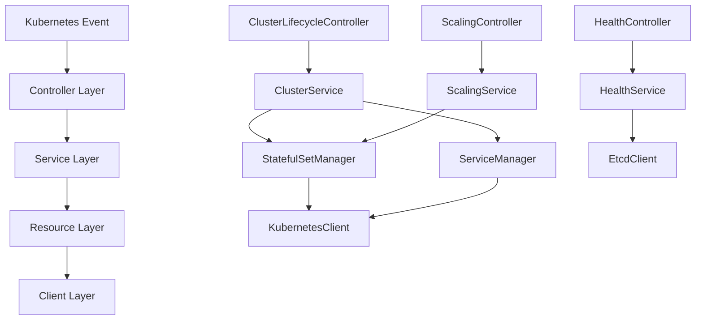

# ETCD Operator 新架构设计文档

[](https://github.com/your-org/etcd-k8s-operator)
[](https://github.com/your-org/etcd-k8s-operator)

> **设计状态**: 🚧 设计中 | **创建时间**: 2025-08-05 | **设计者**: AI Assistant

## 📋 架构概述

### 🎯 设计目标
- **清晰的分层架构**: 职责分离，易于测试和维护
- **高内聚低耦合**: 每层专注自己的职责
- **可扩展性**: 支持未来功能扩展
- **可测试性**: 每层都可以独立测试

### 🏗️ 当前架构问题

#### 现有架构问题分析
```
当前架构 (问题重重):
┌─────────────────────────────────────┐
│     EtcdClusterController           │
│  (1000+ 行，职责混乱)                │
│                                     │
│  ├─ 资源创建逻辑                     │
│  ├─ 状态机处理                       │
│  ├─ 扩缩容逻辑                       │
│  ├─ 健康检查                         │
│  ├─ 错误处理                         │
│  ├─ etcd 客户端调用                  │
│  └─ Kubernetes 资源管理             │
└─────────────────────────────────────┘
```

**主要问题**:
- ❌ 单一文件过大，难以维护
- ❌ 职责不清，违反单一职责原则
- ❌ 难以单元测试
- ❌ 代码重复，扩缩容逻辑分散
- ❌ 错误处理不统一

## 🏛️ 新架构设计

### 📐 四层架构模型

```
新架构 (清晰分层):

┌─────────────────────────────────────┐
│           控制器层 (Controller)        │  ← Kubernetes 控制器逻辑
├─────────────────────────────────────┤
│            服务层 (Service)           │  ← 业务逻辑和编排
├─────────────────────────────────────┤
│            资源层 (Resource)          │  ← Kubernetes 资源管理
├─────────────────────────────────────┤
│            客户端层 (Client)          │  ← 外部系统交互
└─────────────────────────────────────┘
```

### 🎯 各层职责定义

#### 1. 控制器层 (Controller Layer)
**职责**: Kubernetes 控制器逻辑，事件处理，状态协调

```go
// 控制器层组件
├── ClusterLifecycleController    // 集群生命周期控制器
├── ScalingController            // 扩缩容控制器  
├── HealthController             // 健康检查控制器
├── RecoveryController           // 故障恢复控制器
└── BackupController             // 备份恢复控制器
```

**特点**:
- 🎯 **单一职责**: 每个控制器专注特定功能
- 🔄 **事件驱动**: 响应 Kubernetes 事件
- 📊 **状态协调**: 协调期望状态和实际状态
- 🚫 **无业务逻辑**: 不包含复杂业务逻辑

#### 2. 服务层 (Service Layer)
**职责**: 业务逻辑实现，流程编排，决策制定

```go
// 服务层组件
├── ClusterService              // 集群管理服务
├── ScalingService             // 扩缩容服务
├── HealthService              // 健康检查服务
├── BackupService              // 备份恢复服务
├── SecurityService            // 安全管理服务
└── MonitoringService          // 监控服务
```

**特点**:
- 🧠 **业务逻辑**: 包含所有业务规则和逻辑
- 🔀 **流程编排**: 协调多个资源操作
- 🎯 **决策制定**: 根据状态做出操作决策
- 🧪 **易于测试**: 纯业务逻辑，易于单元测试

#### 3. 资源层 (Resource Layer)
**职责**: Kubernetes 资源的 CRUD 操作，资源模板管理

```go
// 资源层组件
├── StatefulSetManager         // StatefulSet 管理器
├── ServiceManager             // Service 管理器
├── ConfigMapManager           // ConfigMap 管理器
├── SecretManager              // Secret 管理器
├── PVCManager                 // PVC 管理器
└── ResourceTemplateManager    // 资源模板管理器
```

**特点**:
- 🔧 **资源操作**: 专注 Kubernetes 资源 CRUD
- 📋 **模板管理**: 管理资源创建模板
- 🔍 **状态查询**: 提供资源状态查询接口
- 🛡️ **错误处理**: 统一的资源操作错误处理

#### 4. 客户端层 (Client Layer)
**职责**: 外部系统交互，连接管理，协议适配

```go
// 客户端层组件
├── EtcdClient                 // etcd 客户端封装
├── KubernetesClient           // Kubernetes 客户端封装
├── MetricsClient              // 监控指标客户端
└── BackupStorageClient        // 备份存储客户端
```

**特点**:
- 🌐 **外部交互**: 与外部系统通信
- 🔌 **连接管理**: 管理连接池和重试
- 🔄 **协议适配**: 适配不同的通信协议
- 📊 **指标收集**: 收集操作指标

## 🔗 层间交互设计

### 📊 交互流程图



### 🔄 典型操作流程

#### 集群创建流程
```
1. ClusterLifecycleController 接收创建事件
   ↓
2. 调用 ClusterService.CreateCluster()
   ↓
3. ClusterService 编排创建流程:
   - 调用 StatefulSetManager.Create()
   - 调用 ServiceManager.Create()
   - 调用 ConfigMapManager.Create()
   ↓
4. 各 Manager 通过 KubernetesClient 创建资源
   ↓
5. 返回创建结果给控制器
```

#### 扩缩容流程
```
1. ScalingController 检测到规模变化
   ↓
2. 调用 ScalingService.Scale()
   ↓
3. ScalingService 执行扩缩容逻辑:
   - 通过 EtcdClient 检查集群状态
   - 调用 StatefulSetManager.Scale()
   - 更新集群成员信息
   ↓
4. 返回扩缩容结果
```

## 📦 包结构设计

### 🗂️ 新的目录结构

```
pkg/
├── controller/                 # 控制器层
│   ├── cluster/               # 集群生命周期控制器
│   ├── scaling/               # 扩缩容控制器
│   ├── health/                # 健康检查控制器
│   ├── recovery/              # 故障恢复控制器
│   └── backup/                # 备份控制器
├── service/                   # 服务层
│   ├── cluster/               # 集群管理服务
│   ├── scaling/               # 扩缩容服务
│   ├── health/                # 健康检查服务
│   ├── backup/                # 备份服务
│   ├── security/              # 安全服务
│   └── monitoring/            # 监控服务
├── resource/                  # 资源层
│   ├── statefulset/           # StatefulSet 管理器
│   ├── service/               # Service 管理器
│   ├── configmap/             # ConfigMap 管理器
│   ├── secret/                # Secret 管理器
│   ├── pvc/                   # PVC 管理器
│   └── template/              # 资源模板管理器
├── client/                    # 客户端层
│   ├── etcd/                  # etcd 客户端
│   ├── kubernetes/            # Kubernetes 客户端
│   ├── metrics/               # 监控客户端
│   └── storage/               # 存储客户端
└── common/                    # 公共组件
    ├── types/                 # 公共类型定义
    ├── errors/                # 错误定义
    ├── utils/                 # 工具函数
    └── constants/             # 常量定义
```

## 🔌 接口设计原则

### 📋 接口定义规范

#### 1. 服务层接口示例
```go
// ClusterService 集群管理服务接口
type ClusterService interface {
    CreateCluster(ctx context.Context, cluster *v1alpha1.EtcdCluster) error
    DeleteCluster(ctx context.Context, cluster *v1alpha1.EtcdCluster) error
    UpdateCluster(ctx context.Context, cluster *v1alpha1.EtcdCluster) error
    GetClusterStatus(ctx context.Context, cluster *v1alpha1.EtcdCluster) (*ClusterStatus, error)
}

// ScalingService 扩缩容服务接口
type ScalingService interface {
    ScaleUp(ctx context.Context, cluster *v1alpha1.EtcdCluster, targetSize int32) error
    ScaleDown(ctx context.Context, cluster *v1alpha1.EtcdCluster, targetSize int32) error
    ScaleToZero(ctx context.Context, cluster *v1alpha1.EtcdCluster) error
    RestartFromZero(ctx context.Context, cluster *v1alpha1.EtcdCluster) error
}
```

#### 2. 资源层接口示例
```go
// StatefulSetManager StatefulSet 管理器接口
type StatefulSetManager interface {
    Create(ctx context.Context, cluster *v1alpha1.EtcdCluster) error
    Update(ctx context.Context, cluster *v1alpha1.EtcdCluster) error
    Delete(ctx context.Context, cluster *v1alpha1.EtcdCluster) error
    Get(ctx context.Context, cluster *v1alpha1.EtcdCluster) (*appsv1.StatefulSet, error)
    Scale(ctx context.Context, cluster *v1alpha1.EtcdCluster, replicas int32) error
}
```

### 🎯 接口设计原则
- **单一职责**: 每个接口专注一个领域
- **依赖倒置**: 高层模块不依赖低层模块
- **接口隔离**: 客户端不应依赖不需要的接口
- **开闭原则**: 对扩展开放，对修改关闭

## 📊 架构优势

### ✅ 新架构优势

#### 1. **可维护性提升**
- 🎯 **职责清晰**: 每层专注自己的职责
- 📦 **模块化**: 功能模块化，易于理解和修改
- 🔧 **低耦合**: 层间通过接口交互，降低耦合度

#### 2. **可测试性提升**
- 🧪 **单元测试**: 每层可独立进行单元测试
- 🎭 **Mock 友好**: 接口设计便于 Mock 测试
- 📊 **测试覆盖**: 更容易达到高测试覆盖率

#### 3. **可扩展性提升**
- 🔌 **插件化**: 新功能可以作为新的服务插入
- 🔄 **接口稳定**: 接口稳定，实现可以灵活变更
- 📈 **水平扩展**: 支持功能的水平扩展

#### 4. **性能提升**
- ⚡ **专门优化**: 每层可以针对性优化
- 🔄 **并发友好**: 更好的并发处理能力
- 📊 **监控友好**: 更容易添加监控和指标

## 🚀 下一步行动

### 📋 实施计划
1. **接口定义** - 定义各层详细接口
2. **核心实现** - 实现核心服务和管理器
3. **渐进迁移** - 逐步迁移现有功能
4. **测试验证** - 全面测试新架构

### 🎯 成功标准
- ✅ 代码行数减少 30% 以上
- ✅ 单元测试覆盖率达到 80% 以上
- ✅ 构建时间减少 50%
- ✅ 扩缩容功能稳定性提升

---

**下一步**: 开始详细的接口定义文档编写
