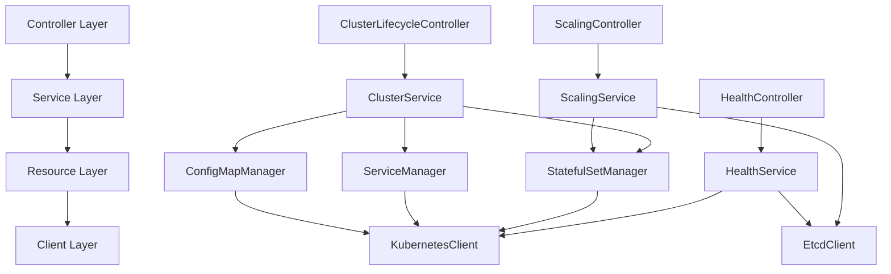

# ETCD Operator 接口定义文档

[](https://github.com/your-org/etcd-k8s-operator)
[](https://github.com/your-org/etcd-k8s-operator)

> **定义状态**: 🚧 定义中 | **创建时间**: 2025-08-05 | **设计者**: AI Assistant

## 📋 接口概述

### 🎯 设计原则
- **单一职责**: 每个接口专注一个领域
- **依赖倒置**: 高层模块不依赖低层模块
- **接口隔离**: 客户端不应依赖不需要的接口
- **开闭原则**: 对扩展开放，对修改关闭

## 🏛️ 服务层接口定义

### 1. 集群管理服务 (ClusterService)

```go
package service

import (
    "context"
    "github.com/your-org/etcd-k8s-operator/api/v1alpha1"
)

// ClusterService 集群管理服务接口
type ClusterService interface {
    // 集群生命周期管理
    CreateCluster(ctx context.Context, cluster *v1alpha1.EtcdCluster) error
    DeleteCluster(ctx context.Context, cluster *v1alpha1.EtcdCluster) error
    UpdateCluster(ctx context.Context, cluster *v1alpha1.EtcdCluster) error
    
    // 集群状态管理
    GetClusterStatus(ctx context.Context, cluster *v1alpha1.EtcdCluster) (*ClusterStatus, error)
    UpdateClusterStatus(ctx context.Context, cluster *v1alpha1.EtcdCluster, status *ClusterStatus) error
    
    // 集群验证
    ValidateClusterSpec(cluster *v1alpha1.EtcdCluster) error
    ValidateClusterUpdate(old, new *v1alpha1.EtcdCluster) error
}

// ClusterStatus 集群状态信息
type ClusterStatus struct {
    Phase           string
    ReadyReplicas   int32
    Members         []MemberInfo
    LeaderID        string
    ClusterID       string
    ClientEndpoints []string
    Conditions      []Condition
}

// MemberInfo etcd 成员信息
type MemberInfo struct {
    Name      string
    ID        string
    PeerURL   string
    ClientURL string
    Ready     bool
    Role      string
}
```

### 2. 扩缩容服务 (ScalingService)

```go
package service

// ScalingService 扩缩容服务接口
type ScalingService interface {
    // 扩容操作
    ScaleUp(ctx context.Context, cluster *v1alpha1.EtcdCluster, targetSize int32) error
    
    // 缩容操作
    ScaleDown(ctx context.Context, cluster *v1alpha1.EtcdCluster, targetSize int32) error
    
    // 特殊操作：缩容到0（停止集群）
    ScaleToZero(ctx context.Context, cluster *v1alpha1.EtcdCluster) error
    
    // 特殊操作：从0重启（重启集群）
    RestartFromZero(ctx context.Context, cluster *v1alpha1.EtcdCluster) error
    
    // 扩缩容状态检查
    GetScalingStatus(ctx context.Context, cluster *v1alpha1.EtcdCluster) (*ScalingStatus, error)
    
    // 扩缩容验证
    ValidateScaling(cluster *v1alpha1.EtcdCluster, targetSize int32) error
}

// ScalingStatus 扩缩容状态
type ScalingStatus struct {
    CurrentSize    int32
    TargetSize     int32
    ReadyReplicas  int32
    Phase          string
    Progress       float64
    EstimatedTime  int64
}
```

### 3. 健康检查服务 (HealthService)

```go
package service

// HealthService 健康检查服务接口
type HealthService interface {
    // 集群健康检查
    CheckClusterHealth(ctx context.Context, cluster *v1alpha1.EtcdCluster) (*HealthStatus, error)
    
    // 成员健康检查
    CheckMemberHealth(ctx context.Context, cluster *v1alpha1.EtcdCluster, memberName string) (*MemberHealth, error)
    
    // 连续健康监控
    StartHealthMonitoring(ctx context.Context, cluster *v1alpha1.EtcdCluster) error
    StopHealthMonitoring(ctx context.Context, cluster *v1alpha1.EtcdCluster) error
    
    // 健康状态更新
    UpdateHealthStatus(ctx context.Context, cluster *v1alpha1.EtcdCluster, status *HealthStatus) error
}

// HealthStatus 健康状态
type HealthStatus struct {
    Overall     string
    Members     []MemberHealth
    LastCheck   int64
    Issues      []HealthIssue
}

// MemberHealth 成员健康状态
type MemberHealth struct {
    Name        string
    Status      string
    LastSeen    int64
    Errors      []string
}
```

## 🔧 资源层接口定义

### 1. StatefulSet 管理器

```go
package resource

import (
    "context"
    appsv1 "k8s.io/api/apps/v1"
    "github.com/your-org/etcd-k8s-operator/api/v1alpha1"
)

// StatefulSetManager StatefulSet 管理器接口
type StatefulSetManager interface {
    // 基础 CRUD 操作
    Create(ctx context.Context, cluster *v1alpha1.EtcdCluster) error
    Update(ctx context.Context, cluster *v1alpha1.EtcdCluster) error
    Delete(ctx context.Context, cluster *v1alpha1.EtcdCluster) error
    Get(ctx context.Context, cluster *v1alpha1.EtcdCluster) (*appsv1.StatefulSet, error)
    
    // 扩缩容操作
    Scale(ctx context.Context, cluster *v1alpha1.EtcdCluster, replicas int32) error
    
    // 状态查询
    GetStatus(ctx context.Context, cluster *v1alpha1.EtcdCluster) (*StatefulSetStatus, error)
    
    // 模板生成
    GenerateTemplate(cluster *v1alpha1.EtcdCluster) (*appsv1.StatefulSet, error)
}

// StatefulSetStatus StatefulSet 状态
type StatefulSetStatus struct {
    Replicas        int32
    ReadyReplicas   int32
    CurrentReplicas int32
    UpdatedReplicas int32
    Conditions      []Condition
}
```

### 2. Service 管理器

```go
package resource

import (
    corev1 "k8s.io/api/core/v1"
)

// ServiceManager Service 管理器接口
type ServiceManager interface {
    // 基础 CRUD 操作
    CreateHeadlessService(ctx context.Context, cluster *v1alpha1.EtcdCluster) error
    CreateClientService(ctx context.Context, cluster *v1alpha1.EtcdCluster) error
    UpdateService(ctx context.Context, cluster *v1alpha1.EtcdCluster, serviceType string) error
    DeleteService(ctx context.Context, cluster *v1alpha1.EtcdCluster, serviceType string) error
    GetService(ctx context.Context, cluster *v1alpha1.EtcdCluster, serviceType string) (*corev1.Service, error)
    
    // 服务发现
    GetServiceEndpoints(ctx context.Context, cluster *v1alpha1.EtcdCluster) ([]string, error)
    
    // 模板生成
    GenerateHeadlessServiceTemplate(cluster *v1alpha1.EtcdCluster) (*corev1.Service, error)
    GenerateClientServiceTemplate(cluster *v1alpha1.EtcdCluster) (*corev1.Service, error)
}
```

### 3. ConfigMap 管理器

```go
package resource

import (
    corev1 "k8s.io/api/core/v1"
)

// ConfigMapManager ConfigMap 管理器接口
type ConfigMapManager interface {
    // 基础 CRUD 操作
    Create(ctx context.Context, cluster *v1alpha1.EtcdCluster) error
    Update(ctx context.Context, cluster *v1alpha1.EtcdCluster) error
    Delete(ctx context.Context, cluster *v1alpha1.EtcdCluster) error
    Get(ctx context.Context, cluster *v1alpha1.EtcdCluster) (*corev1.ConfigMap, error)
    
    // 配置生成
    GenerateEtcdConfig(cluster *v1alpha1.EtcdCluster) (map[string]string, error)
    GenerateInitScript(cluster *v1alpha1.EtcdCluster) (string, error)
    
    // 模板生成
    GenerateTemplate(cluster *v1alpha1.EtcdCluster) (*corev1.ConfigMap, error)
}
```

## 🌐 客户端层接口定义

### 1. Etcd 客户端

```go
package client

import (
    "context"
    clientv3 "go.etcd.io/etcd/client/v3"
)

// EtcdClient etcd 客户端接口
type EtcdClient interface {
    // 连接管理
    Connect(ctx context.Context, endpoints []string) error
    Disconnect() error
    IsConnected() bool
    
    // 集群管理
    AddMember(ctx context.Context, peerURL string) (*clientv3.MemberAddResponse, error)
    RemoveMember(ctx context.Context, memberID uint64) (*clientv3.MemberRemoveResponse, error)
    ListMembers(ctx context.Context) (*clientv3.MemberListResponse, error)
    
    // 健康检查
    Status(ctx context.Context, endpoint string) (*clientv3.StatusResponse, error)
    
    // 数据操作
    Put(ctx context.Context, key, value string) error
    Get(ctx context.Context, key string) (*clientv3.GetResponse, error)
    
    // 集群状态
    GetClusterStatus(ctx context.Context) (*EtcdClusterStatus, error)
}

// EtcdClusterStatus etcd 集群状态
type EtcdClusterStatus struct {
    Members     []EtcdMember
    Leader      *EtcdMember
    ClusterID   string
    Version     string
    IsHealthy   bool
}

// EtcdMember etcd 成员信息
type EtcdMember struct {
    ID        uint64
    Name      string
    PeerURLs  []string
    ClientURLs []string
    IsLeader  bool
    IsHealthy bool
}
```

### 2. Kubernetes 客户端

```go
package client

import (
    "context"
    "k8s.io/apimachinery/pkg/runtime"
    "sigs.k8s.io/controller-runtime/pkg/client"
)

// KubernetesClient Kubernetes 客户端接口
type KubernetesClient interface {
    // 基础操作
    Create(ctx context.Context, obj client.Object) error
    Update(ctx context.Context, obj client.Object) error
    Delete(ctx context.Context, obj client.Object) error
    Get(ctx context.Context, key client.ObjectKey, obj client.Object) error
    List(ctx context.Context, list client.ObjectList, opts ...client.ListOption) error
    
    // 状态更新
    UpdateStatus(ctx context.Context, obj client.Object) error
    
    // 事件记录
    RecordEvent(obj runtime.Object, eventType, reason, message string)
    
    // 资源查询
    GetPods(ctx context.Context, namespace, labelSelector string) ([]PodInfo, error)
    GetPVCs(ctx context.Context, namespace, labelSelector string) ([]PVCInfo, error)
}

// PodInfo Pod 信息
type PodInfo struct {
    Name      string
    Namespace string
    Phase     string
    Ready     bool
    IP        string
}

// PVCInfo PVC 信息
type PVCInfo struct {
    Name      string
    Namespace string
    Phase     string
    Size      string
}
```

## 🔄 控制器层接口定义

### 1. 集群生命周期控制器

```go
package controller

import (
    "context"
    ctrl "sigs.k8s.io/controller-runtime"
    "github.com/your-org/etcd-k8s-operator/api/v1alpha1"
)

// ClusterLifecycleController 集群生命周期控制器接口
type ClusterLifecycleController interface {
    // 控制器生命周期
    SetupWithManager(mgr ctrl.Manager) error
    
    // 事件处理
    Reconcile(ctx context.Context, req ctrl.Request) (ctrl.Result, error)
    
    // 状态处理
    HandleInitialization(ctx context.Context, cluster *v1alpha1.EtcdCluster) (ctrl.Result, error)
    HandleCreating(ctx context.Context, cluster *v1alpha1.EtcdCluster) (ctrl.Result, error)
    HandleRunning(ctx context.Context, cluster *v1alpha1.EtcdCluster) (ctrl.Result, error)
    HandleFailed(ctx context.Context, cluster *v1alpha1.EtcdCluster) (ctrl.Result, error)
}
```

### 2. 扩缩容控制器

```go
package controller

// ScalingController 扩缩容控制器接口
type ScalingController interface {
    // 控制器生命周期
    SetupWithManager(mgr ctrl.Manager) error
    
    // 扩缩容处理
    HandleScaling(ctx context.Context, cluster *v1alpha1.EtcdCluster) (ctrl.Result, error)
    HandleScaleUp(ctx context.Context, cluster *v1alpha1.EtcdCluster) (ctrl.Result, error)
    HandleScaleDown(ctx context.Context, cluster *v1alpha1.EtcdCluster) (ctrl.Result, error)
    HandleScaleToZero(ctx context.Context, cluster *v1alpha1.EtcdCluster) (ctrl.Result, error)
    
    // 扩缩容验证
    ValidateScalingOperation(cluster *v1alpha1.EtcdCluster) error
}
```

## 🔗 接口依赖关系

### 📊 依赖关系图



## 🎯 接口实现指导

### 📋 实现原则
1. **接口优先**: 先定义接口，再实现具体逻辑
2. **依赖注入**: 通过构造函数注入依赖
3. **错误处理**: 统一的错误处理策略
4. **上下文传递**: 所有方法都接受 context.Context
5. **可测试性**: 接口设计便于单元测试

### 🧪 测试友好设计
- 所有接口都可以轻松 Mock
- 方法签名简洁明确
- 返回值包含足够的错误信息
- 支持超时和取消操作

---

**下一步**: 开始实现核心接口的具体实现
