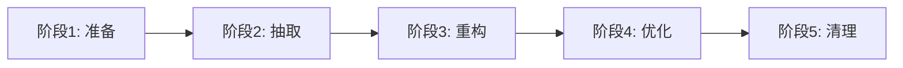

# ETCD Operator 重构策略文档

[](https://github.com/your-org/etcd-k8s-operator)
[](https://github.com/your-org/etcd-k8s-operator)

> **策略状态**: 🚧 制定中 | **创建时间**: 2025-08-05 | **制定者**: AI Assistant

## 📋 重构策略概述

### 🎯 重构目标
- **渐进式重构**: 分阶段进行，确保系统稳定性
- **向后兼容**: 保持 API 兼容性，不破坏现有功能
- **风险控制**: 最小化重构风险，确保可回滚
- **质量提升**: 提升代码质量、测试覆盖率和可维护性

### 🚨 重构挑战
- ❌ **代码耦合度高**: 控制器代码超过1000行，职责混乱
- ❌ **测试覆盖不足**: 扩缩容功能测试不理想
- ❌ **依赖复杂**: Shell脚本与Go测试框架混用
- ❌ **文档滞后**: 技术文档与实际代码不同步

## 🔄 渐进式重构策略

### 📊 重构阶段规划



### 🎯 阶段1: 准备阶段 (第1周)

#### 目标
- 建立新的架构基础
- 创建接口定义
- 建立测试框架

#### 具体任务
```
1. 架构设计
   ├── 完成分层架构设计
   ├── 定义各层接口契约
   └── 制定重构实施计划

2. 基础设施准备
   ├── 创建新的包结构
   ├── 建立接口定义文件
   └── 准备测试框架基础

3. 风险评估
   ├── 识别重构风险点
   ├── 制定回滚策略
   └── 建立质量门禁
```

#### 成功标准
- ✅ 架构设计文档完成
- ✅ 接口定义文档完成
- ✅ 新包结构创建完成
- ✅ 测试框架基础建立

### 🎯 阶段2: 抽取阶段 (第2周前半)

#### 目标
- 从现有控制器中抽取服务层
- 创建资源管理器
- 建立客户端封装

#### 具体任务
```
1. 服务层抽取
   ├── 抽取 ClusterService
   ├── 抽取 ScalingService
   └── 抽取 HealthService

2. 资源层创建
   ├── 创建 StatefulSetManager
   ├── 创建 ServiceManager
   └── 创建 ConfigMapManager

3. 客户端层封装
   ├── 重构 EtcdClient
   └── 封装 KubernetesClient
```

#### 重构策略
- **并行开发**: 新旧代码并存，逐步替换
- **接口适配**: 保持现有接口不变，内部重构
- **增量测试**: 每个组件都有对应的单元测试

### 🎯 阶段3: 重构阶段 (第2周后半 + 第3周前半)

#### 目标
- 重构控制器逻辑
- 实现新的分层架构
- 迁移核心功能

#### 具体任务
```
1. 控制器重构
   ├── 拆分 EtcdClusterController
   ├── 创建 ClusterLifecycleController
   ├── 创建 ScalingController
   └── 创建 HealthController

2. 功能迁移
   ├── 迁移集群创建逻辑
   ├── 迁移扩缩容逻辑
   └── 迁移健康检查逻辑

3. 集成测试
   ├── 建立集成测试框架
   ├── 测试核心功能
   └── 验证兼容性
```

#### 重构原则
- **功能对等**: 确保新实现功能完全对等
- **性能不降**: 新实现性能不能低于原实现
- **错误处理**: 统一错误处理策略

### 🎯 阶段4: 优化阶段 (第3周后半)

#### 目标
- 性能优化
- 测试完善
- 文档更新

#### 具体任务
```
1. 性能优化
   ├── 并发处理优化
   ├── 资源使用优化
   └── 响应时间优化

2. 测试完善
   ├── 提升单元测试覆盖率到80%+
   ├── 完善集成测试
   └── 建立端到端测试

3. 文档同步
   ├── 更新技术文档
   ├── 更新API文档
   └── 更新开发指南
```

### 🎯 阶段5: 清理阶段 (第4周)

#### 目标
- 清理旧代码
- 移除Shell脚本依赖
- 最终验证

#### 具体任务
```
1. 代码清理
   ├── 删除旧的控制器代码
   ├── 移除Shell测试脚本
   └── 清理无用依赖

2. 最终验证
   ├── 完整功能测试
   ├── 性能基准测试
   └── 兼容性验证

3. 发布准备
   ├── 版本标记
   ├── 发布说明
   └── 迁移指南
```

## 🛡️ 风险控制策略

### ⚠️ 主要风险识别

#### 1. **功能回归风险**
- **风险**: 重构过程中功能丢失或行为改变
- **控制**: 
  - 建立完整的回归测试套件
  - 每个阶段都进行功能验证
  - 保持旧代码作为参考

#### 2. **性能下降风险**
- **风险**: 新架构可能导致性能下降
- **控制**:
  - 建立性能基准测试
  - 每个阶段都进行性能对比
  - 及时优化性能瓶颈

#### 3. **兼容性破坏风险**
- **风险**: API 或行为变更导致兼容性问题
- **控制**:
  - 严格保持 API 兼容性
  - 建立兼容性测试
  - 提供迁移指南

#### 4. **时间延期风险**
- **风险**: 重构时间超出预期
- **控制**:
  - 分阶段实施，可独立交付
  - 设置里程碑检查点
  - 准备应急方案

### 🔄 回滚策略

#### 快速回滚机制
```
1. 版本控制
   ├── 每个阶段都有独立的分支
   ├── 重要节点都有标签
   └── 可以快速切换到任意版本

2. 功能开关
   ├── 新旧功能通过配置切换
   ├── 可以动态启用/禁用新功能
   └── 支持灰度发布

3. 数据兼容
   ├── 确保数据格式向后兼容
   ├── 提供数据迁移工具
   └── 支持数据回滚
```

## 📊 质量保证策略

### 🧪 测试策略

#### 1. **单元测试**
- **目标覆盖率**: 80%+
- **测试范围**: 所有新创建的服务和管理器
- **测试工具**: Go 原生测试框架 + testify
- **Mock策略**: 使用接口Mock，隔离外部依赖

#### 2. **集成测试**
- **测试范围**: 各层之间的集成
- **测试环境**: 使用 testcontainers 创建隔离环境
- **测试场景**: 覆盖主要业务流程
- **自动化**: 集成到 CI/CD 流程

#### 3. **端到端测试**
- **测试范围**: 完整的用户场景
- **测试环境**: Kind 集群
- **测试工具**: Ginkgo + Gomega
- **测试数据**: 使用真实的 etcd 集群

### 📋 代码质量标准

#### 1. **代码规范**
```go
// 示例：服务层实现规范
type clusterService struct {
    statefulSetManager StatefulSetManager
    serviceManager     ServiceManager
    configMapManager   ConfigMapManager
    etcdClient        EtcdClient
    logger            logr.Logger
}

func NewClusterService(
    statefulSetManager StatefulSetManager,
    serviceManager ServiceManager,
    configMapManager ConfigMapManager,
    etcdClient EtcdClient,
    logger logr.Logger,
) ClusterService {
    return &clusterService{
        statefulSetManager: statefulSetManager,
        serviceManager:     serviceManager,
        configMapManager:   configMapManager,
        etcdClient:        etcdClient,
        logger:            logger,
    }
}
```

#### 2. **错误处理规范**
```go
// 统一的错误处理
func (s *clusterService) CreateCluster(ctx context.Context, cluster *v1alpha1.EtcdCluster) error {
    if err := s.validateCluster(cluster); err != nil {
        return fmt.Errorf("cluster validation failed: %w", err)
    }
    
    if err := s.statefulSetManager.Create(ctx, cluster); err != nil {
        return fmt.Errorf("failed to create StatefulSet: %w", err)
    }
    
    return nil
}
```

#### 3. **日志规范**
```go
// 结构化日志
logger.Info("Creating cluster", 
    "cluster", cluster.Name, 
    "namespace", cluster.Namespace,
    "size", cluster.Spec.Size)
```

## 📈 进度监控

### 📊 关键指标

#### 1. **代码质量指标**
- 代码行数减少比例: 目标 30%+
- 单元测试覆盖率: 目标 80%+
- 代码复杂度: 目标降低 50%+
- 重复代码比例: 目标 < 5%

#### 2. **功能质量指标**
- 功能回归数量: 目标 0
- 性能下降比例: 目标 < 10%
- 构建时间: 目标减少 50%
- 测试执行时间: 目标减少 30%

#### 3. **项目进度指标**
- 里程碑完成率: 实时跟踪
- 任务完成率: 每日更新
- 风险问题数量: 实时监控
- 技术债务减少: 每周评估

### 🎯 检查点设置

#### 每日检查
- 代码提交质量
- 测试通过率
- 构建状态

#### 每周检查
- 里程碑进度
- 质量指标
- 风险评估

#### 阶段检查
- 功能完整性验证
- 性能基准对比
- 兼容性测试

## 🚀 实施计划

### 📅 详细时间表

```
第1周 (2025-08-05 ~ 2025-08-11):
├── Day 1-2: 架构设计和接口定义
├── Day 3-4: 基础设施准备
├── Day 5-6: 风险评估和策略制定
└── Day 7: 第一阶段验收

第2周 (2025-08-12 ~ 2025-08-18):
├── Day 1-3: 服务层抽取
├── Day 4-5: 资源层创建
├── Day 6-7: 客户端层封装

第3周 (2025-08-19 ~ 2025-08-25):
├── Day 1-3: 控制器重构
├── Day 4-5: 功能迁移
├── Day 6-7: 集成测试

第4周 (2025-08-26 ~ 2025-09-01):
├── Day 1-2: 性能优化
├── Day 3-4: 测试完善
├── Day 5-6: 文档更新
└── Day 7: 最终验收
```

### 🎯 成功标准
- ✅ 所有功能测试通过
- ✅ 性能不低于原实现
- ✅ 代码覆盖率达到80%+
- ✅ 文档完整更新
- ✅ 零功能回归

---

**下一步**: 开始实施第一阶段的基础设施准备工作
